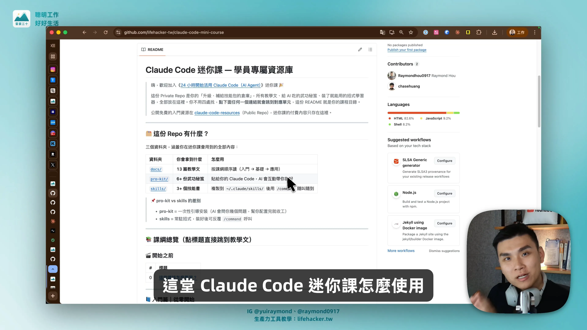
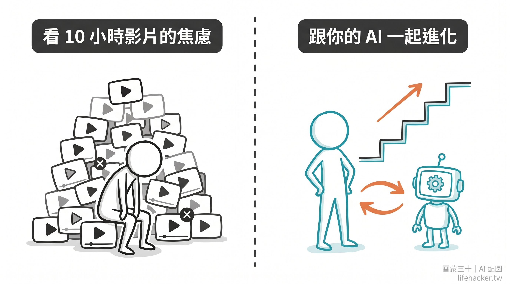
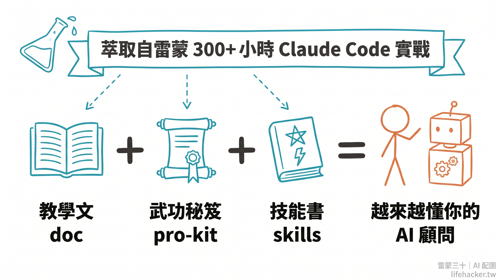

## 這堂課的正確使用說明：打通你跟 AI 協作的能力！

> 🎬 **完整說明影片**（點圖看影片）

  

---

我想在開始之前，先跟你講清楚這堂課的**設計理念**。

理解這點，會直接影響你能從這堂課拿到多少價值。

先說結論：

**這不是一堂傳統課程，是一個精心整理的「升級補給包」。**

  

傳統課程的設計是「老師教 → 學生聽 → 自己整理資料」。

這堂迷你課不是這個模式。它的產品形態共三種是：

- `doc`：**教學文**，讓你理解 AI Agent 協作的底層邏輯（入門 → 基礎 → 應用）
- `pro-kit`：**武功秘笈**，貼給你的 Claude Code，AI 會互動帶你裝好
- `skills`：**技能書**，讓你的 AI Agent 快速擁有問題解決能力

你把這些材料餵給你自己的 Claude Code，**你的 AI 就是你的最好的顧問**。

  

這個刻意的設計，其實比直接拍影片來累人。
影片我只要拍完我怎麼做的就結束了，但打磨這些經驗包，還需要反覆測試，不斷更新。

> [!TIP]
> **好奇實際跑起來的樣子？** 直接到 [Pro-Kit 01](../pro-kit/01-agent-folder-setup.md) 看截圖和學員的成果對比，10 秒看懂這份「升級補給包」的價值。

加上我特別知道，這個時代，大家已經買了太多線上課，看到 10 幾個小時的影片，已經有種 PTSD，擔心又焦慮，會不會買了又沒時間看...

我自己走過一遍 AI Agent 的養成之路後發現：

- **最有效的學習不是聽老師講，是遇到問題時能跟自己的 AI 一來一往把問題解掉，持續進化**。
- 既然未來你也是用「文字」跟 AI 溝通、交付任務，那就應該讓你養成「**文字的協作習慣**」。

每一篇文檔，都是在幫你累積「跟 AI 協作」的能力，這是 2026 年之後，最值錢的關鍵技能。

我相信在未來，或者說現在 ——
**怎麼讓你的 AI 助手來協助引導你，比我直接給你模版，還更有幫助。**

---

### 這堂迷你課，學員支援結構長這樣

| 你遇到什麼狀況                                          | 應該去哪解決                                                                                                     |
| :----------------------------------------------- | :--------------------------------------------------------------------------------------------------------- |
| **90% 的技術問題**（安裝失敗、設定卡住、指令不懂、某個 pro-kit 跑到一半出錯⋯） | **直接問你的 Claude Code**，把錯誤訊息或卡住的段落複製貼上，它會比雷蒙更快、更準地幫你解決。1-3 整篇都在教你怎麼把問題問對                                    |
| **觀念不清、概念想再深入**                                  | **先翻教學文的對應段落讀第二次**。每一篇都藏著第一次讀會漏掉的脈絡                                                                        |
| **想看別人的做法、跟同期學員交流**                              | 加入 [Lifehacker Premium 訂閱會員](https://community.lifehacker.tw/) 進我們的 Discord 社群，那裡有一群跟你一樣在實戰的超級個體、雷蒙也在裡面看發言 |
| **想要雷蒙親自帶陪跑？**                                   | Q3/Q4，若有空，計劃會開「進階訓練營」（系統性學習 + 每月直播 + 作品交流）。這堂迷你課的學員會優先收到開課通知                                               |

---

### 為什麼雷蒙不直接回你的技術問題？

**因為如果讓我來幫你解決每個問題 = 親手破壞這堂課的價值。**

這堂課真正在教的**不是**「Claude Code 怎麼用」，那是結果，不是目的。
**真正的課題是：遇到不會的東西時，你能不能跟 AI 一起把它搞懂**。
這是一個可以帶著走一輩子的能力，比任何單一工具都值錢。

每次你被卡住，先忍住不找雷蒙，先轉頭去問你的 Claude Code，然後跟它一起把問題解掉——**這幾個當下，你累積的能力，比上十堂課還有用**。

**不回你的技術問題，不是因為不想，是因為太想你真的學會。**

---

### 三個來自雷蒙的承諾

1. **內容會持續更新**：Claude Code 版本改、工具改、我有踩到新坑？我會持續在我的部落格、電子報，或者 YouTube 影片上更新；你一次付費，拿到的是「會成長的教材」，我也不喜歡做容易過時的內容，所以教給你的，都是我仔細評估，至少 2-3 年內的核心思路和原則。
2. **你用這份教材做出來的東西，雷蒙會在社群看到並回應**：把成果丟到社群媒體（FB, Threads, IG……等），雷蒙會看、會點讚、會幫你轉分享
3. **你的踩坑、回饋，可能會變成下一版的內容**：在社群分享「我卡在哪、怎麼解掉」的經驗，會被吸收進下一版教材。當然，這份教材的配置檔（Pro-kit）是開放大家回饋和持續迭代的，希望你不只是學員，也可以是共筆作者。

---

### 小結語

**這堂課真正的價值不在「你看完所有材料」，而在「你的 AI 分身開始被你訓練出一個樣子」。**

如果你買完之後跑過「AI 分身起始助手」、跟你的 Claude Code 對話了幾次、它開始記得你的工作方式，這個時刻這堂課就已經回本了。

> [!IMPORTANT]
> **如果看到這邊，你開始覺得「這好像不是我要的課程形式」⋯**
>
> **先別急著退，相信我，先做一件事**：
> 花 10 分鐘跑完 [Pro-Kit 01「AI 分身起始助手」](../pro-kit/01-agent-folder-setup.md) 的流程。
>
> 你會發現，原來這是一種新型態線上課程的樣子。
>
> 跑完還是覺得不適合，再退費，我尊重你的決定。
> **但大多數人跑完那 10 分鐘後，會發現「啊原來可以這樣」**。

我做這堂迷你課的終極目標是：
- 讓你把這堂課當成「送給你自己 AI 分身」的一份「升級經驗包」。
- 讓你的 AI 擁有引導你的能力，然後**一起進化成最適合你需要的樣子**。

---

收到教材的那一刻，**請把「`雷蒙會幫我解決問題`」的預期收起來**，換成：

> 「我手上有一套超完整的材料 + 一個越來越懂我的 AI + 我要開始練這時代最重要的能力」

這個才是正確預期，預期和觀念對了，才是你將獲得真正價值的開始。

By Raymond Hou（侯智薰, 雷蒙）, 2026-04