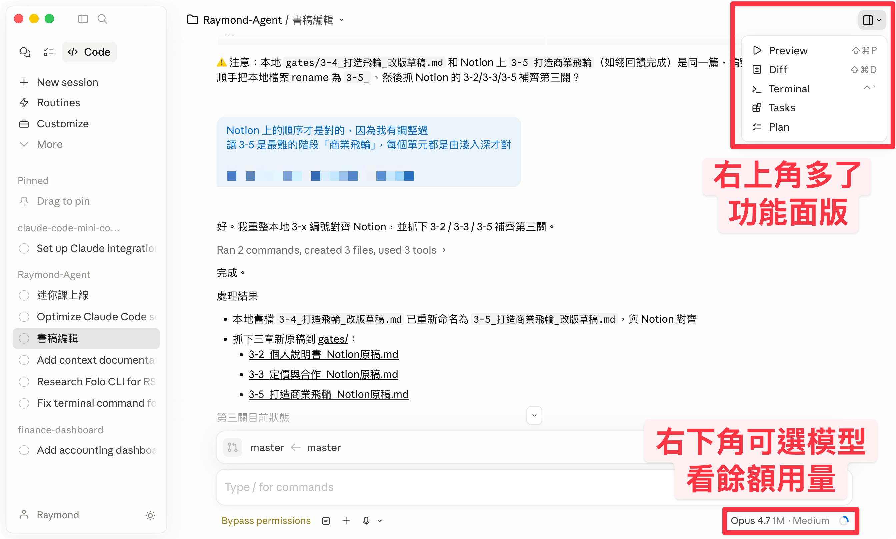
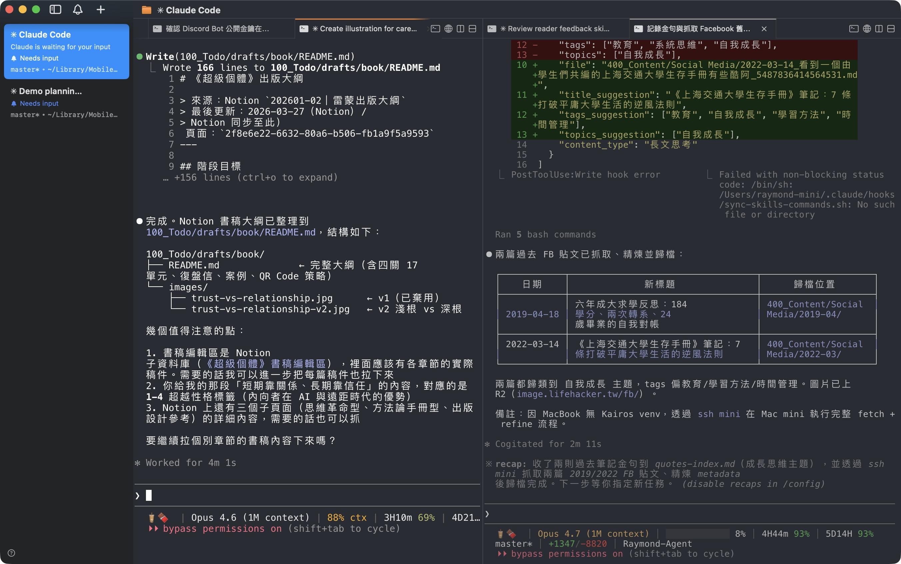
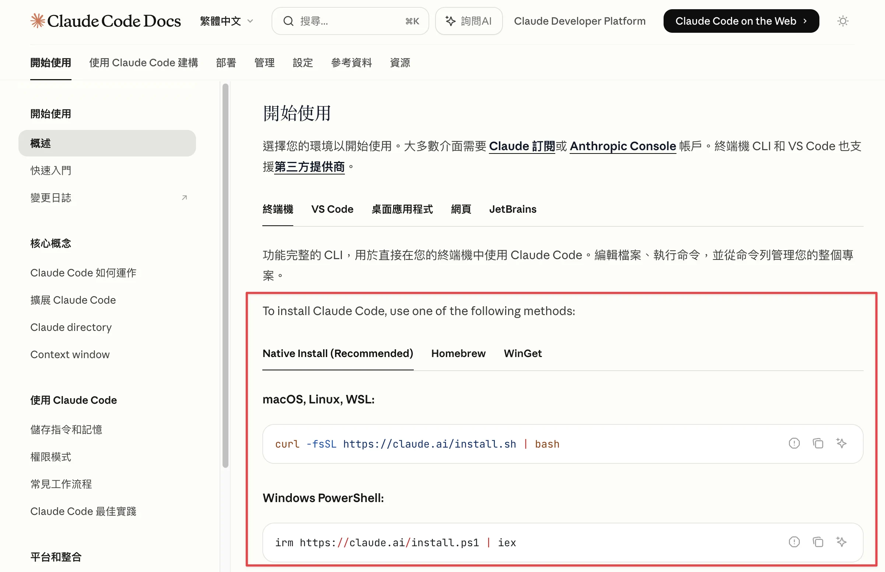
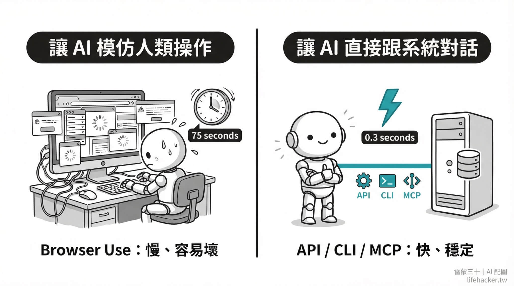
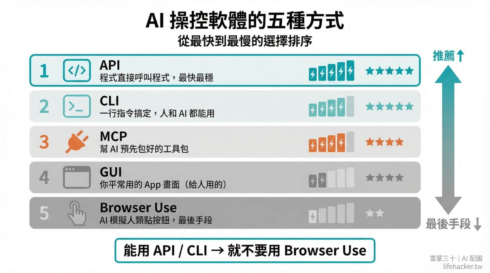
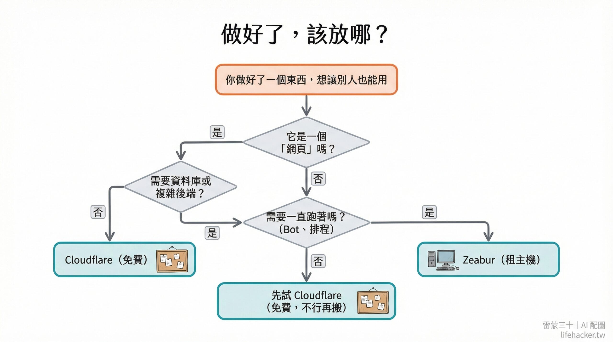
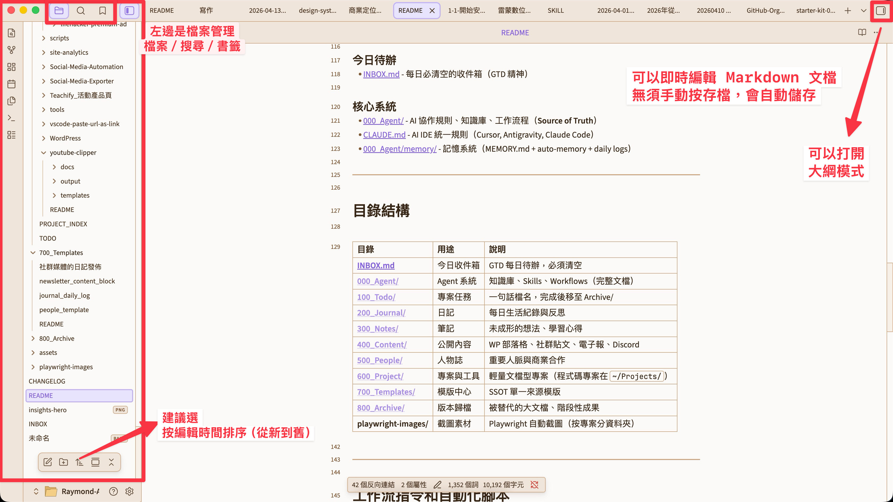

# 開始安裝、配置你的 Claude Code

> 迷你課第 1-1 單元｜入門篇
> 
> 這篇是 70 分鐘完整教學影片的分段導讀。每一段告訴你「這段在學什麼」「為什麼要做這件事」，讓你可以按自己的節奏跟著做。

---

## 🚨 開始之前，請務必先看這兩個資源

這兩個東西是整個迷你課的地基，**強烈建議所有新學員都要完整看過**，再回來跟著這篇文章把 Claude Code 裝好。跳過它們直接安裝，你會在很多地方卡關。

> [!TIP]
> **點連結時，記得另開分頁**
> 我的教學文章會補充一些外站連結，只要你看到連結後面有 `↗` 符號，建議你手動另開新分頁，怎麼做：
> - **Mac**：按住 `Cmd` 再點擊左鍵
> - **Windows**：按住 `Ctrl` 再點擊左鍵
>
> 這樣會在瀏覽器新分頁打開，不會讓你離開這篇文章、找不到路回來。

### 🎬 70 分鐘完整教學影片 ↗（必看）

  

點上面的縮圖直接跳到 YouTube。這支影片是我錄的完整安裝 + 使用教學，**下面這篇文章就是這支影片的分段導讀**——你會邊看影片邊對照文章，需要回顧某一段直接滑到對應章節。

### 📖 桌面版 vs 終端機完整比較 ↗（必讀）

  

點上面的封面圖跳到文章。**不確定該用終端機還是桌面版？這篇先看完。** 我在裡面完整拆解了兩個版本的差異、各自的適合情境，看完你就知道自己該從哪個開始。

> [!IMPORTANT]
> **看完上面兩個資源再往下**。影片 + 文章看完大約 1.5 小時，但這是你整個學習過程中投資報酬率最高的 90 分鐘——省下你之後踩坑、選錯方向、重裝的時間。

---

## 開始之前：決定你要怎麼使用 Claude Code？

Claude Code 目前有 3 種使用方式，先搞懂差別再開始裝：

| 版本         | 長什麼樣                    | 適合誰                    | 建議                  |
| :--------- | :---------------------- | :--------------------- | :------------------ |
| **桌面 App** | 有視窗介面、可以拖檔案進去           | 覺得終端機太有壓力、想要圖形介面       | ✅ 小白友善；雷蒙另一個帳號用     |
| **終端機版**   | 黑底白字的文字介面               | 想要完整功能、願意學一點終端機操作，自由度高 | ✅ 雷蒙主力用             |
| **IDE 整合** | VS Code / Cursor 裡面的側邊欄 | 已經在用這些編輯器的人            | 如果你不知道 IDE 是什麼，建議跳過 |

**終端機版和桌面 App 都推薦。** 這堂課主要以終端機和桌面版做示範；桌面 App 對新手來說也很好用，有圖形介面、可以直接拖檔案進去、操作更直覺；兩個可以並行使用，看個人偏好哪個順手就用哪個。

>  📍 不確定怎麼選？看這篇完整比較：
> 👉 [Claude Code 桌面版 vs 終端機完整比較 ↗](https://raymondhouch.com/lifehacker/digital-workflow/claude-code-desktop-vs-terminal/)

> [!TIP]
> **🆕 2026/04/15 桌面版大更新**（[點此前往官方展示影片 ↗](https://x.com/felixrieseberg/status/2044128194647994585)）
> Claude 桌面版大幅優化右側面板，幾乎覆蓋了終端機有的功能 —— 可以同時開 Terminal、程式碼預覽（Preview）、變更比對（Diff）、Tasks 和 Plan 面板，每個面板還能自由拖拉排列。做比較大的專案時，視覺化管理更方便了。

下面兩張圖讓你快速比對「桌面版 vs 終端機（cmux）」兩種介面的實際樣子：

<table>
  <tr>
    <td width="50%"></td>
    <td width="50%"></td>
  </tr>
  <tr>
    <td align="center">① <b>Claude 桌面版</b>：左側對話、右側可拖拉 Terminal / Preview / Diff / Tasks 面板</td>
    <td align="center">② <b>cmux 終端機</b>：多視窗分割、純文字操作、自由度最高</td>
  </tr>
</table>

我現在有兩個 MAX 100 方案，剛好終端機用團隊帳號＆桌面版用個人帳號。這也是 Claude Code 的好處，因為所有的檔案都在自己本機，所以切換訂閱帳號不會影響到任何的能力，也不會有團隊共用一個帳號記憶錯亂的問題。

---

## 下載網址與終端機推薦

### 終端機

終端機就是一個讓你用「文字命令」來操作電腦的 App。你的電腦其實都已經內建了一個，但下面這些更好用：

| 平台      | 工具                                              | 一句話介紹                                                                                                                                    |
| :------ | :---------------------------------------------- | :--------------------------------------------------------------------------------------------------------------------------------------- |
| macOS   | [cmux ↗](https://cmux.com/zh-TW)                  | 我自己在使用的，一款基於 [Ghostty ↗](https://ghostty.org/download) 開發的終端機，能支援多視窗分割（[影片安裝設定教學 ↗](https://youtu.be/xo7dE80ktu4?si=w3HD5t5kGDFe4QYN&t=940)） |
| macOS   | [Warp ↗](https://www.warp.dev/download)           | 介面漂亮、對新手友善，支援用滑鼠操作                                                                                                                       |
| macOS   | [iTerm2.com ↗](https://iterm2.com/downloads.html) | 老牌穩定，工程師愛用                                                                                                                               |
| macOS   | 內建 Terminal                                     | 陽春但堪用，零安裝成本，不用裝，Spotlight 搜尋「Terminal」                                                                                                   |
| Windows | Windows Terminal                                | Win 11 已內建，Win 10 從商店裝                                                                                                                   |
| Windows | [WMUX ↗](https://github.com/amirlehmam/wmux)      | Windows 版 CMUX，分割視窗、多 session 並排、活動指示燈                                                                                                   |
| Windows | [Tabby ↗](https://tabby.sh/)                      | 免費開源，視覺效果好看，支援分割視窗                                                                                                                       |

### Claude Code 桌面 App（推薦新手）

不想碰終端機？直接下載桌面 App，有圖形介面、可以拖檔案進去：
- 👉 [claude.com/download ↗](https://claude.com/download)（macOS / Windows 都有）

### IDE 整合

IDE 是寫程式用的編輯器。如果你已經在用，可以直接在裡面使用 Claude Code：
- [VS Code ↗](https://code.visualstudio.com/download) — 免費，最多人用的程式碼編輯器（PAPAYA 老師有拍[教學影片 ↗](https://www.youtube.com/watch?v=2pM-7fBXc_M)）
- [Cursor ↗](https://cursor.com/download) — 基於 VS Code，內建更多 AI 功能
- [Antigravity ↗](https://antigravityide.online/) — Google 推出的 AI 原生 IDE，基於 VS Code，支援多 AI 模型

> [!TIP]
> **唯一要注意的是**：部分進階功能（像自訂狀態列……等個人化）只有終端機版支援。但這些是基礎篇之後才會碰到的東西，入門階段不影響。

---

## 影片重點分段導讀

> **這篇搭配 [70 分鐘完整教學影片 ↗](https://youtu.be/xo7dE80ktu4?si=NDiWaI06zZU7uVdW&t=588) 一起服用效果最佳 🎬**

看完影片了嗎？
無論看完還是沒看完，都能透過以下重點精華部分，快速引導你安裝配置、環境設定。

### 安裝 Claude Code

在你的電腦上裝好終端機後，打開它來用[一行指令安裝 Claude Code ↗](https://code.claude.com/docs/zh-TW/overview)（Windows 稍微麻煩，不過你可以搭配下方 Tip 來解決）

  

第一次啟動，也會需要登入你的 Anthropic 付費訂閱帳號（Pro 或 Max），授權完畢就可以開始使用了（[觀看影片說明 ↗](https://youtu.be/xo7dE80ktu4?si=dDpmFhkvWIaracC_&t=688)） 🚀

> [!TIP]
> 安裝過程中如果遇到錯誤訊息，別慌！把畫面截圖，丟給 [Claude ↗](https://claude.ai)、[Gemini ↗](https://gemini.google.com)、[ChatGPT ↗](https://chatgpt.com) 任何一個都能幫你判斷問題。推薦用 Claude，畢竟 Claude Code 是它自家的產品，回答最精準。

---

### 如果你選終端機？建議的優化設定

原始的終端機體驗不太好，畫面會閃、不能用滑鼠選字、打長文很痛苦，底部也沒資訊可看。下面這三個升級包，就是要把這些問題一次補齊——**三件事建議一起做**：

1. **終端機本體優化**（starter-kit 01）— `cc` 快速啟動、NO_FLICKER 不閃爍
2. **外部編輯器**（starter-kit 02）— 長文不用在終端機硬打
3. **狀態列**（starter-kit 06）— 底部顯示目前模型、剩餘額度等資訊

> [!IMPORTANT]
> **升級包（終端機三件組，建議一起裝）**
> - 🆓 [starter-kit 01：終端機設定 ↗](https://github.com/Raymondhou0917/claude-code-resources/blob/master/starter-kit/01-terminal-setup.md)
> - 🆓 [starter-kit 02：外部編輯器設定 ↗](https://github.com/Raymondhou0917/claude-code-resources/blob/master/starter-kit/02-external-editor.md)
> - 🆓 [starter-kit 06：狀態列 ↗](https://github.com/Raymondhou0917/claude-code-resources/blob/master/starter-kit/06-statusline.md)
>
> **裝法**：點開連結 → 複製整份內容或 github 網址 → 貼給你的 Claude Code → 跟它說「照這個設定」，它會自動幫你裝好。

#### 外部編輯器長什麼樣子？

在終端機裡打長文很痛苦，尤其語音轉錄後（不能換行、不好修改）。裝好 starter-kit 02 之後，按 `Ctrl+G` 就會跳出一個輕量編輯器，打完再送出：

  

> 點上面的圖跳到影片示範段落。

---

### 安全設定（桌面版也適用）

> 這一段跟上面的「終端機優化」無關——**不管你用終端機還是桌面版都該做**。

AI 能直接操作你的檔案，這是它強大的地方，但也代表它可能不小心刪錯東西。安全設定就像幫它裝一個「安全鎖」，避免 AI 不小心刪掉你的重要檔案。

> [!IMPORTANT]
> **升級包**
> - 🆓 [starter-kit 03：安全刪除 ↗](https://github.com/Raymondhou0917/claude-code-resources/blob/master/starter-kit/03-safe-delete.md)（把 rm 改成移到垃圾桶、危險指令黑名單）

---

### MCP、API、CLI：讓 AI 連上外部工具

  

沒有 MCP（Model Context Protocol），AI 只能看到你電腦上的檔案。裝了 MCP，它就像多了好幾雙手，能幫你讀信、查日曆、甚至操作 Notion、抓網頁內容。

  

> 推薦閱讀：
> 👉 [AI 怎麼幫你動手做事？API、CLI、MCP 白話文解釋 ↗](https://raymondhouch.com/lifehacker/digital-workflow/how-ai-controls-software-api-cli-mcp-browser-use/)

> [!IMPORTANT]
> **升級包**
> - 🆓 [starter-kit 04：MCP 必裝四件組 ↗](https://github.com/Raymondhou0917/claude-code-resources/blob/master/starter-kit/04-mcp-essentials.md)（Gmail + Calendar + Firecrawl + Notion）

> [!IMPORTANT]
> **升級包（武功秘笈）**
> 🔒 pro-kit「外部工具整合包」— AI 會先問你用什麼工具，照 CLI → API → MCP 的優先順序幫你整合（而不是無腦推你裝 MCP）。含三路線決策、工具清單作業、踩坑排錯速查。→ 基礎篇 2-3 會教怎麼用

---
### 部署上線

你花了一個下午跟 Claude Code 做出一個品牌介紹頁，興奮地把網址複製給朋友，結果對方打開是一片空白。

因為 `localhost:3000` 只活在你的電腦裡。電腦一關，它就消失了。

把東西「放上網」這件事，叫做**部署**（Deploy）。白話文就是：把程式碼搬到一台 24 小時開著的雲端電腦上，給它一個真正的網址，讓任何人都能打開。

這裡簡單用表格列出我最常用的 2 個平台，大部分操作都只要跟 Claude Code 說一句話就好：

  

|                               | **Cloudflare**                  | **Zeabur**                    |
| ----------------------------- | ------------------------------- | ----------------------------- |
| **費用**                        | 免費（額度很大）                        | 需購買主機（月費起跳）                   |
| **適合的東西**                     | 靜態網站、Landing Page、簡易 CMS、輕量 API | Bot、Dashboard、資料庫、24/7 背景服務   |
| **白話比喻**                      | 免費的公佈欄，你把海報貼上去，全世界都看得到          | 租一台雲端電腦，什麼都能跑，但要付租金           |
| **部署方式**                      | `npx wrangler deploy`（CLI 一行指令） | `npx zeabur deploy`（CLI 一行指令） |
| **需要的技術門檻**                   | 低                               | 低                             |
| **有沒有資料庫**                    | 有，D1（免費 5GB）                    | 有，一鍵裝 PostgreSQL / MongoDB    |
| **能跑 Python / Node.js 長駐程式嗎** | 不行（只能跑短暫的 request）              | 可以（Docker 容器，想跑什麼都行）          |

> 不確定怎麼選？什麼情況用哪個？請查看這篇完整比較：
> 👉 [Zeabur 與 Cloudflare 兩條部署路線完整指南 ↗](https://raymondhouch.com/lifehacker/digital-workflow/zeabur-cloudflare-deploy-guide/)

下面這個升級包會教你怎麼一鍵上線，把你做出來的東西放到網路上，讓別人也能看到。

> [!IMPORTANT]
> **升級包**
> - 🆓 [starter-kit 05：一鍵部署 ↗](https://github.com/Raymondhou0917/claude-code-resources/blob/master/starter-kit/05-deploy-online.md)（Zeabur + Cloudflare）

---

## 裝完 starter-kit 之後：安裝你的第一個武功秘笈

如果你已經跟著 70 分鐘的教學影片把 starter-kit 裝好了，恭喜！
你的 AI 助理已經從「裸機」升級到了「基本配備」。

現在是時候讓師傅傳功了。
### 安裝「AI 分身起始助手 by 雷小蒙」

這是迷你課的第一個 pro-kit（武功秘笈），雷小蒙會教會你的 AI Agent 來引導你：
1. 先問你幾個問題（你的工作角色、常用平台、AI 幫你做什麼）
2. 根據你的回答，自動建立客製化的資料夾結構
3. 生成一份屬於你的 CLAUDE.md（AI 的個人說明書）
4. 建立記憶系統（讓 AI 越用越懂你）
5. 給你一份「明天的作業清單」

**如何安裝？**
1. 打開迷你課的 [pro-kit 01「AI 分身起始助手」](<../pro-kit/01-agent-folder-setup.md>)
2. 把整份內容貼給 Claude Code
3. 跟它說：「幫我執行這份文件」
4. 照著它的問題回答就好，全程約 10 分鐘

> [!IMPORTANT]
> **升級包（武功秘笈）**
> 🔒 [pro-kit 01「AI 分身起始助手」](<../pro-kit/01-agent-folder-setup.md>) — 會先訪談你，再根據你的工作角色自動生成個人化的 CLAUDE.md + 記憶系統 + 資料夾結構。10 分鐘完成，不用自己從空白開始寫。→ 基礎篇 2-1 會深度說明

---

## 常見問題

**Q：我在 Finder / 檔案總管裡看不到 .claude 資料夾？**

> Claude Code 的一些設定檔放在隱藏資料夾裡（名字前面有一個 `.`），如何顯示：
>
> **macOS（Finder）**：按 `Cmd + Shift + .`（句號鍵），隱藏資料夾就會出現（再按一次隱藏回去）
>
> **Windows（檔案總管）**：點上方的「檢視」→ 勾選「隱藏的項目」
>
> **但其實你不太需要去看它。** 我在 pro-kit「AI 分身起始助手」裡做了一個設計：把 skills 資料夾用 symlink 連到你看得到的地方。所以你的 Skill 檔案會出現在專案資料夾裡，不用去翻隱藏目錄。

**Q：終端機 vs 桌面版，我之後可以換嗎？**

> 可以，隨時換。你的設定（CLAUDE.md、記憶、Skills）都存在專案資料夾裡，不管用哪個版本都能讀到。

**Q：我用 Windows，跟得上嗎？**

> 可以。Claude Code 支援 Windows（透過 WSL）。安裝步驟稍微不同，但 AI 會引導你。所有的 starter-kit 和 pro-kit 都支援 macOS / Linux / Windows WSL。

**Q：裝了 starter-kit 之後，可以再裝 pro-kit 嗎？會衝突嗎？**

> 完全不會衝突。starter-kit 和 pro-kit 是疊加關係，pro-kit 是在 starter-kit 的基礎上再加東西，不會覆蓋你已經裝好的設定。

**Q：我想一邊跟 AI 對話，一邊看到文檔、甚至編輯文檔，怎麼做？**

> 我自己目前的組合是：**終端機（或 Claude 桌面 App）+ Obsidian**。
>
> [Obsidian ↗](https://obsidian.md) 是一個免費的 Markdown 編輯器，你可以把它想成一個「可以即時看到 AI 幫你改了什麼」的視窗。AI 在終端機裡改檔案，你在 Obsidian 裡同步看到變化，不用手動存檔，改了就看到。
>
> 
>
> **為什麼推薦 Obsidian？**
> - 免費下載，macOS / Windows / Linux 都有
> - 左邊是檔案目錄，右邊即時顯示 Markdown 內容
> - AI 改的檔案會自動更新，不用手動重新整理
> - 支援大綱模式，方便瀏覽長文件的結構
>
> **下載方式**：到 [obsidian.md ↗](https://obsidian.md) → Download → 選你的作業系統 → 安裝後「Open folder as vault」指向你的專案資料夾就好。

> [!TIP]
> 如果你不想開兩個 APP，也可以試試 [Warp ↗](https://www.warp.dev/terminal)，一款介面很現代的終端機 App，有終端機的完整功能，又可以像 VS Code 一樣直接看到檔案，但又比一般 IDE 簡單好看很多。

---

## 複習一下，這個章節你學到了哪些？

- ✅ Claude Code 安裝完成，能正常啟動
- ✅ 終端機設定好（不閃爍、有滑鼠、`cc` 快速啟動）
- ✅ 外部編輯器設定好（`Ctrl+G` 叫出編輯器）
- ✅ 安全防線就位（刪除改成移到垃圾桶）
- ✅ CLAUDE.md 建立完成（AI 認識你了）
- ✅ MCP 連上外部工具（能讀信、查日曆）
- ✅ 知道怎麼看隱藏資料夾
- ✅ （重要）安裝了第一個武功秘笈「AI 分身起始助手」

---

➡️ 下一章節：[1-2 GitHub 與 Git 入門](1-2%20GitHub%20%E8%88%87%20Git%20%E5%85%A5%E9%96%80.md)
