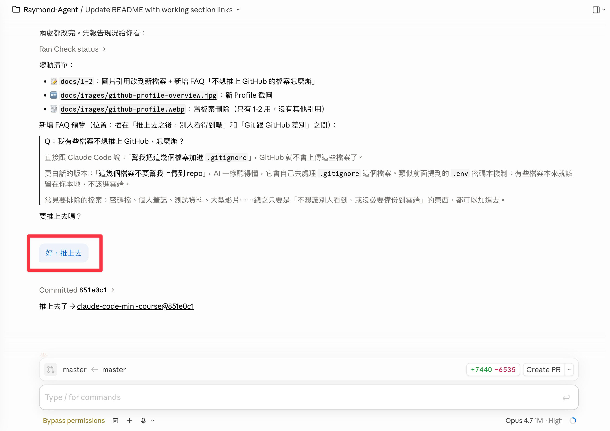
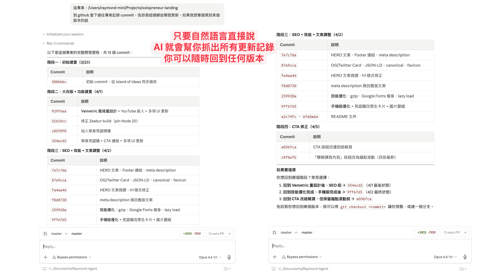
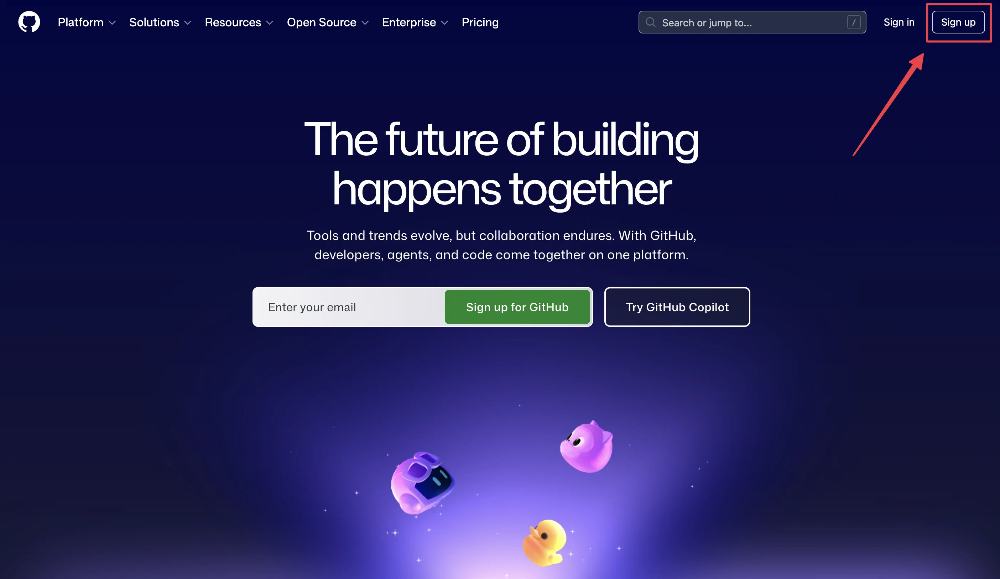
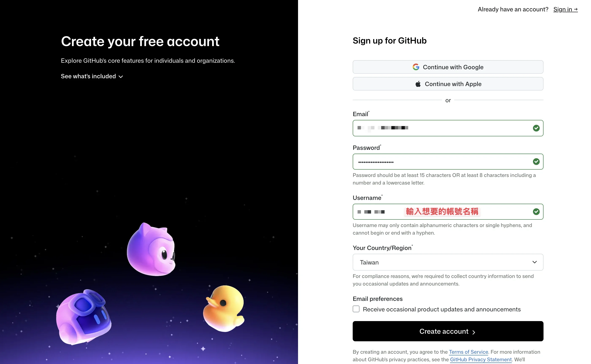
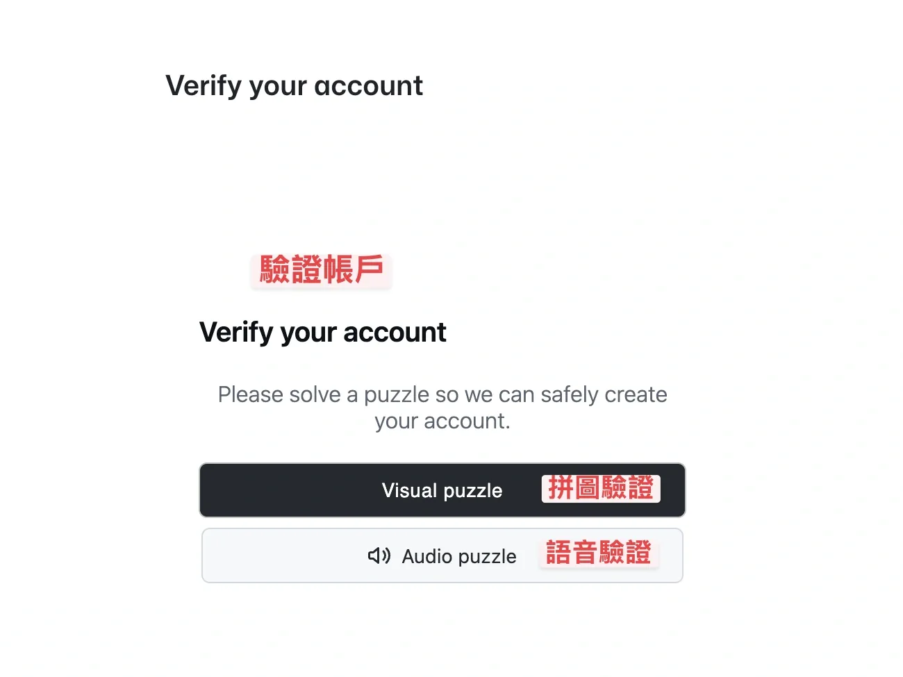
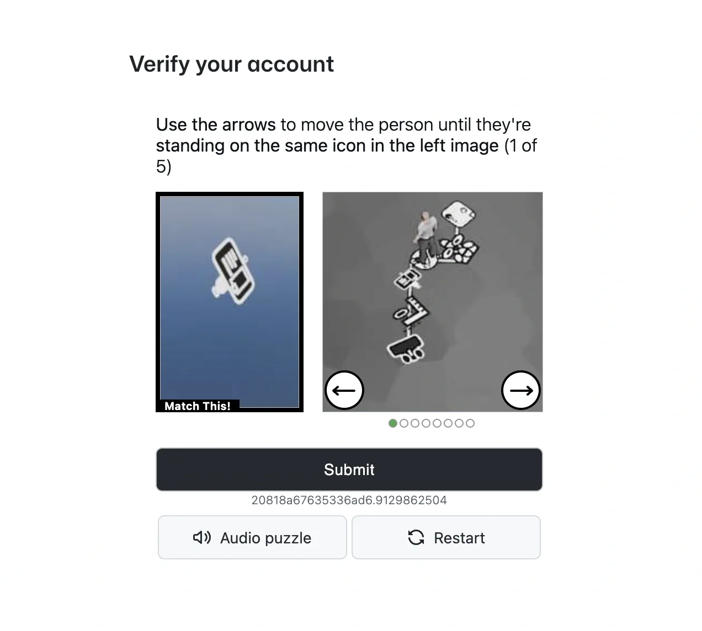
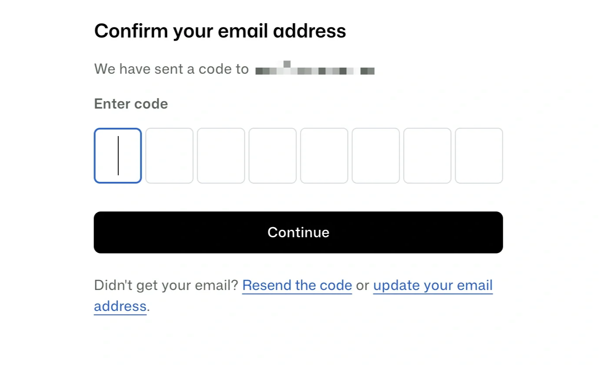
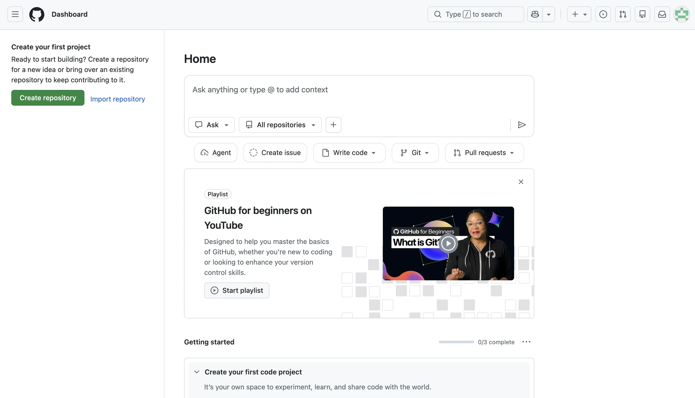
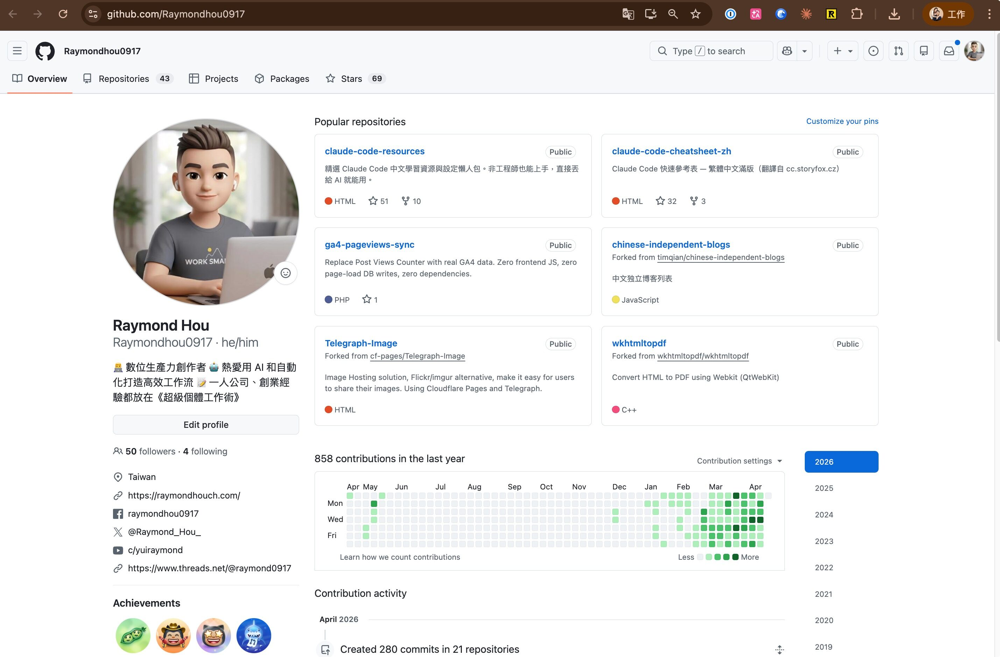

# 怎麼使用這堂迷你課：GitHub 帳號 + Git 你只需要知道這些

> 迷你課第 1-2 單元｜入門篇
> 
> 這堂課的素材都放在 GitHub 上，但別擔心，你不需要「學會 Git」，你只需要知道怎麼讓 AI 幫你搞定。

---

## GitHub 是什麼？想成 Google Drive 就好

相信你一定知道怎麼用 Google Drive，對吧？

- Google Drive = 你手動把檔案存在雲端備份，到哪台電腦都能開
- **GitHub = 你把專案（文件、程式碼）存在雲端，到哪台電腦都能用**

差別在哪？Google Drive 你得自己拖拉、存檔、下載。
但讓 Claude Code 來控制 GitHub ，你直接跟 AI **說話交代需求就好**。

> [!TIP]
> 以後你會常聽到「**Repo**」這個詞，它就是 GitHub 上的一個專案資料夾（**Repositories**）。就像我們會在 Google Drive 上開一個資料夾，來放某個專案的所有檔案，GitHub 上的每個 repo 就是一個這樣的資料夾。你的迷你課教材就放在一個 repo 裡。

---

## Git 命令好複雜？你只需要會這五句話

用 Claude Code 操作 Git，就像跟助理說中文一樣簡單。以下是你會用到的所有「口令」：

| 你跟 AI 說             | AI 幫你做的事       | 類比                      |
| :------------------ | :------------- | :---------------------- |
| 「幫我把這個推上 GitHub」    | 把你改的東西存到雲端     | 把本機檔案拉到 Google Drive 上傳 |
| 「同步一下、拉下來」          | 把雲端最新版拉下來      | 把 Drive 檔案抓下來更新         |
| 「剛剛改了什麼？」           | 列出你改過哪些檔案      | 查看「最近修改」                |
| 「這東西改壞了，退回去」        | 復原、回到上一個版本     | ❌ Drive 做不到，刪掉就完了       |
| 「幫我下載這個 repo、Skill」 | 把別人分享的專案複製到你電腦 | 從別人的 Google Drive 下載資料夾 |

**就這樣，很簡單直覺吧！** 

這五句話涵蓋了你 90% 的 Git 使用情境。Claude Code 聽得懂中文，它會自動幫你執行對應的 git 指令。

---

## 背後發生了什麼？（知道就好，不用背）

當你說「幫我推上 GitHub」，AI 其實幫你做了三步：

```
你的電腦（正在改的檔案）
    ↓  ① AI 或你選擇要存的檔案（git add）
打包區（準備上傳的東西）
    ↓  ② 寫一句備忘錄（git commit）
你的 GitHub（雲端版本庫）
    ↓  ③ 上傳（git push）
```

用搬家來比喻：
1. **選擇（Add）**：從散落在家裡的東西中，挑出要帶走的放進紙箱
2. **封箱（Commit）**：在紙箱上貼標籤寫「這箱是什麼？」
3. **搬走（Push）**：把紙箱送到倉庫

但這三步 **AI 現在能全部幫你做完**。

你只需要說那一句話：幫我推上去（或是只講 push，它都聽得懂）

AI 就會自動幫你，**把你現在正在編輯的檔案、這段時間編輯了什麼的說明，以及幫你直接儲存到對應的 repo 裡面**。

---

## 養成一個小習慣：做完就「存檔」

這堂課最重要的不是學 Git，是養成一個習慣：

> **每次做完一段進度，就跟 AI 說「幫我推上去」。**

<p align="center">
  
</p>

為什麼？因為意外隨時會發生：

1. **手滑按錯**：寫得太起勁，不小心刪錯檔案，沒存檔的話，就真的全沒了
2. **越改越糟**：網站本來好好的，改著改著越來越醜，想回到之前的版本卻回不去
3. **AI 搞砸了**：AI 幫你改東西，結果把重要的內容覆蓋掉了

只要你有推上 GitHub，**這些問題通通可以救回來。** 
你甚至不用自己手動挑版本，直接問 AI：

> 「幫我看一下之前做了哪些改動，我想回到上一個版本」

AI 會幫你列出所有的「存檔紀錄」，你選一個就能回去。



> [!IMPORTANT]
> **就像打遊戲要存檔一樣。** 你不會打完一整關都不存檔吧？每次設定好一個東西、完成一個階段，就跟 AI 說「幫我推上去」。這個習慣會在你整個學習過程中保護你。

---

## 第一步：註冊 GitHub 帳號

> [!TIP]
> 🎬 這段我會在「迷你課說明影片」（待拍攝）裡手把手帶你操作，以下是文字版快速參考。

前往 [github.com](https://github.com) → 點「Sign up」

<p align="center">
  
</p>

用你的 Email 註冊（建議不要用 Google 登入，稍後綁定即可，成功率較高），填入你想要的帳號名稱（之後設定 Claude Code 會用到）

<p align="center">
  
</p>

為了防止機器人大量註冊，GitHub 在註冊過程中會要求你完成驗證，包含：**拼圖驗證**、**語音驗證**。推薦「拼圖驗證」比較簡單，不斷旋轉右邊圖片，直到右邊的小人正確站在跟左邊一樣的圖上：

<table>
  <tr>
    <td width="50%"></td>
    <td width="50%"></td>
  </tr>
  <tr>
    <td align="center">① 選驗證方式</td>
    <td align="center">② 旋轉拼圖到對的位置</td>
  </tr>
</table>

完成驗證之後，github 會寄送驗證碼到你的信箱裡，輸入正確的數字後就成功註冊。註冊完登入之後，看到右邊這個頁面就代表可以使用 GitHub 了！

<table>
  <tr>
    <td width="50%"></td>
    <td width="50%"></td>
  </tr>
  <tr>
    <td align="center">③ 輸入信箱驗證碼</td>
    <td align="center">④ 看到首頁就完成了</td>
  </tr>
</table>

---

## 第二步：讓 Claude Code 認識你的 GitHub

打開 Claude Code，跟它說：

> 幫我設定 Git，我的 GitHub 帳號是 [你的帳號名稱]（或者複製你的 GitHub Profile 網址）

**帳號名稱在哪裡找？**

登入 [github.com](https://github.com) 後，點右上角你的頭像，會彈出選單，點擊「Profile」，就會前往你的 Profile 主頁，複製網址給 AI。

例如我的 Profile 主頁網址是：[https://github.com/Raymondhou0917](https://github.com/Raymondhou0917)，`Raymondhou0917` 就是我的 GitHub 帳號。

<p align="center">
  
</p>

AI 會引導你完成設定。過程中可能會跳出一個瀏覽器頁面讓你登入授權，按「Authorize」就好。

只要設定完一次，以後就不用再設了。

---

## 常見問題

**Q：我需要學 Git 指令嗎？**

> 不用。Claude Code 聽得懂中文。
> 你說「推上去」它就幫你推上去。真正的指令讓 AI 去記就好。

**Q：推上去之後，別人看得到嗎？**

> 看你的 repo 設定。Private（私人）只有你看得到，Public（公開）才會讓別人看到。迷你課的素材你放 Private 就好。

**Q：我有些檔案不想推上 GitHub，怎麼辦？**

> 直接跟 Claude Code 說：「**幫我把這幾個檔案加進 `.gitignore`**」，GitHub 就不會上傳這些檔案了。
>
> 更白話的版本：「**這幾個檔案不要幫我上傳到 repo**」，AI 一樣聽得懂，它會自己去處理 `.gitignore` 這個檔案。類似前面提到的 `.env` 密碼本機制：有些檔案本來就該留在你本地，不該進雲端。
>
> 常見要排除的檔案：密碼檔、個人筆記、測試資料、大型影片⋯⋯總之只要是「不想讓別人看到、或沒必要備份到雲端」的東西，都可以加進去。

**Q：Git 跟 GitHub 有什麼差別？**

> Git 是「版本管理工具」（像是檔案的時光機），GitHub 是「放 Git 倉庫的雲端平台」（像是 Google Drive）。但你只要知道 GitHub 就好，剩下的讓 AI 處理。

**Q：如果我想深入了解 Git 的完整知識？**

> 下面有整理一個[延伸資源區塊](#想學好-git-版本管理的完整知識)，三個我推薦的免費教材都列在那。不過老實說——**現階段你只要理解觀念，之後直接跟 AI 下指令就好**，AI 都有完整的 git 指令知識，連「這種情況該怎麼做」的建議都會給你。

> [!WARNING]
> **注意：不要把密碼推上 GitHub。** 如果你的 repo 是 Public（公開），任何人都看得到裡面的檔案。
>
> 什麼是密碼檔？當你的 AI 幫你連接外部服務（例如 Gmail、Notion），會需要一組「通行證」來證明是你本人授權的，這組通行證叫做 API Key。這些 Key 通常會被存在一個叫 `.env` 的檔案裡（你可以把它想成是一個「密碼本」）。
>
> 好消息是，AI 通常會自動幫你排除這個檔案，不會推上去，但養成習慣自己留意一下比較安全。

---

### 想學好 Git 版本管理的完整知識？

老實說，現在有 AI 幫你，你**不需要把 Git 指令背起來**——理解觀念（備份、版本、分支）就夠了，剩下的直接跟 AI 下指令，它不只會幫你執行，還會主動給你建議做法。

但如果你想打下更紮實的基礎、或單純對 Git 有興趣，下面這三份是我推薦的免費教材：

- 🎬 [PAPAYA 電腦教室：Git 教學 ↗](https://www.youtube.com/watch?v=FKXRiAiQFiY)：用清楚、簡單的影片講完 Git 核心觀念，節奏舒服、比喻易懂
- 🎓 [六角學院：Git 免費課 ↗](https://w3c.hexschool.com/git/cfdbd310)：工程師視角從零到會的系統性免費影片，有互動練習
- 📖 [為你自己學 Git ↗](https://gitbook.tw)：工程師前輩高見龍（龍哥）寫的，台灣寫得最清楚的 Git 線上書

三個選一個跟著做一輪，Git 的基礎就有了。

---

## 這堂課你唯一要記住的事

**你不需要學 Git，需要學的是怎麼跟 AI 說話跟備份、版本控制的觀念。**

Git 只是其中一個 AI 會幫你操作的工具。之後你會發現，不管是推程式碼、讀 Email、排行程、做網頁，模式都一樣：**你說中文，AI 去執行。**

---

⬅️ 上一章節：[1-1 開始安裝配置你的 Claude Code](1-1%20%E9%96%8B%E5%A7%8B%E5%AE%89%E8%A3%9D%E9%85%8D%E7%BD%AE%E4%BD%A0%E7%9A%84%20Claude%20Code.md) ｜ ➡️ 下一章節：[1-3 怎麼跟 Claude Code 提問／協作最有效？](1-3%20%E6%80%8E%E9%BA%BC%E8%B7%9F%20Claude-Code%20%E6%8F%90%E5%95%8F%EF%BC%8F%E5%8D%94%E4%BD%9C%E6%9C%80%E6%9C%89%E6%95%88%EF%BC%9F.md)
