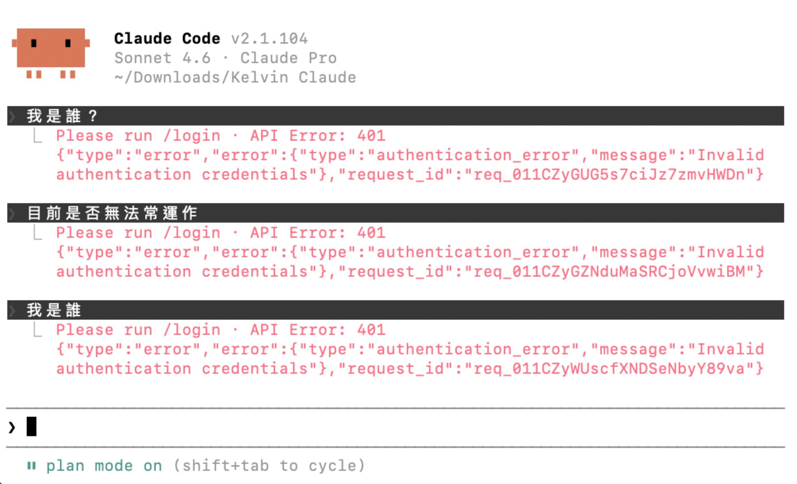
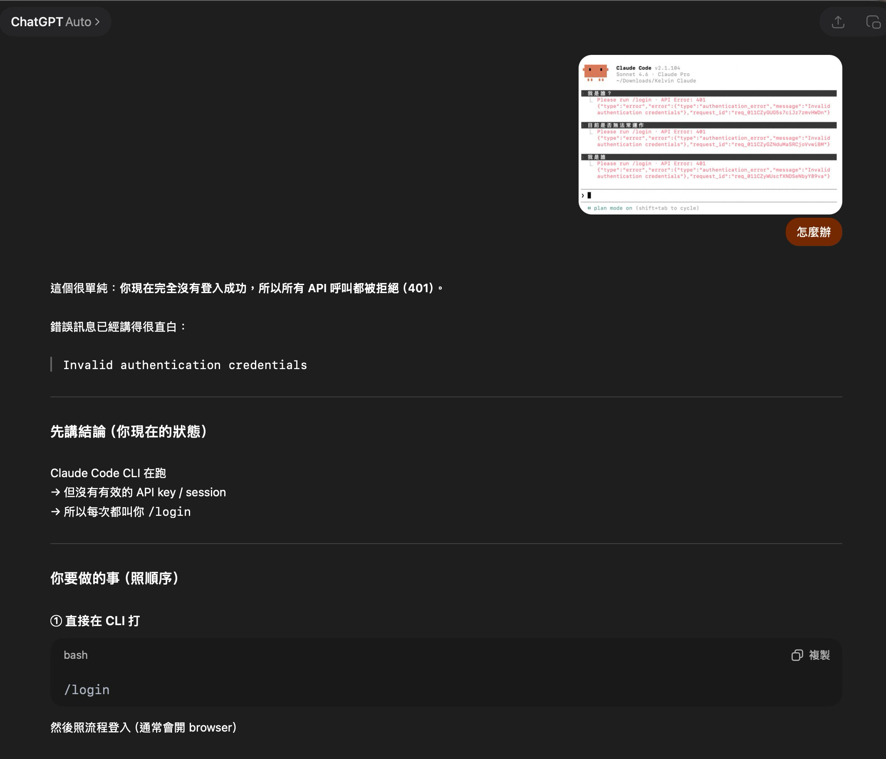

# 怎麼跟 Claude Code 提問／協作最有效？

> 迷你課第 1-3 單元｜入門篇
> 
> Claude Code 不是 ChatGPT，它不只回答你的問題，也會動手幫你做事。
> 這篇教你怎麼跟它聊天、下指令，讓它真的幫助到你。

---

## 先教你第一招：遇到問題，截圖問 AI

在開始之前，先教你一個未來會一直用到的技巧。

前陣子有同學問我：「雷蒙，我的 Claude Code 卡住了，打什麼它都不理我，怎麼辦？」然後附了這張截圖：



看到滿螢幕的英文紅字，會緊張很正常。但其實畫面上已經寫得很清楚了。

`Please run /login`、`Invalid authentication credentials`（代表沒有登入、授權）。

問題是，大部分人看到英文就慌了，不知道該怎麼辦。

**其實最簡單的方法：截圖，丟給你手上的任何一個 AI。** 不管是 [Claude Chat](https://claude.ai)、[ChatGPT](https://chatgpt.com) 還是 [Gemini](https://gemini.google.com)，把截圖貼上去，問它「怎麼辦」，它就會告訴你：



看到了嗎？
AI 一秒就看懂問題，直接告訴你：「在 CLI 打 `/login`，然後跟著瀏覽器完成登入。」搞定！

> [!IMPORTANT]
> 這也是整堂課最重要的思維：你手上有一堆 AI 工具， 當一個 AI 沒辦法回你的時候，截圖去問另一個。Claude Code 卡住了？截圖丟 Claude Chat。Claude Chat 也不行？丟 ChatGPT，永遠有備案。

這個思維搞懂了，接下來遇到的 90% 問題你都能自己解決。

---

## 最重要的一件事：當個好奇寶寶

學會使用 Claude Code 的秘訣，不是背指令，是**養成直接問它的習慣**。

遇到任何問題，不管是「這個錯誤訊息什麼意思」、「幫我改一下這段文字」還是「我想做一個記帳工具但不知道從哪開始」，你的第一反應應該是：

> 直接打字問 Claude Code。

它不會笑你問笨問題，也不會不耐煩。而且大部分的問題，它都能協助你解決。

---

## Claude Code ≠ ChatGPT：3 個關鍵差異

你可能已經很習慣用 ChatGPT 了，但 Claude Code 的工作方式不太一樣：

|           | ChatGPT  | Claude Code          |
| :-------- | :------- | :------------------- |
| **它在哪裡**  | 瀏覽器裡的對話框 | 住在你的電腦裡（終端機/桌面 App）  |
| **它能做什麼** | 回答問題、寫文字 | 回答問題 + **直接動手改你的檔案** |
| **它知道什麼** | 你貼給它的內容  | **你整個專案資料夾的所有檔案**    |

簡單用一句話來說：**ChatGPT 是顧問（只出嘴），Claude Code 是助理（能動手）。**

所以你跟它的對話方式也不一樣，你不只是在「問問題」，你是在「派任務」！

---

## 三種協作姿態

根據你想做的事，切換不同的說話方式：

### 問問題（探索模式）

> 「這個 CLAUDE.md 是什麼？」
> 「MCP 跟 API 有什麼差別？」
> 「我剛才那個設定是不是寫錯了？」

❓**什麼時候用**：你不確定、想了解、需要解釋的時候。

🙋 **技巧**：問得越具體，答案越有用，使用「這個錯誤訊息是什麼意思，我該怎麼修」得到的答案，會比「這是什麼」來的更具體有方向。

### 下任務（執行模式）

> 「幫我建一個資料夾叫 drafts」
> 「把這篇文章的標題改成繁體中文」
> 「幫我推上 GitHub」

❓ **什麼時候用**：你知道要做什麼，只是不想自己動手。

🙋 **技巧**：像跟真人助理說話一樣自然就好，不用特別寫什麼 prompt 提示詞，中文口語完全 OK。

### 一起規劃（協作模式）

> 「我想做一個旅行規劃的小工具，但還沒想清楚要有什麼功能」
> 「幫我想想這篇電子報要怎麼寫」
> 「我想整理我的筆記系統，你覺得怎麼做比較好？」

❓ **什麼時候用**：你有一個模糊的想法，需要有人幫你釐清、梳理方向。

🙋 **技巧**：不用一開始就講得很清楚。先丟出大方向，讓 AI 問你問題、幫你整理思路。這就是 Plan Mode 的精神（應用篇 3-1 會深入解釋）。

---

## 對話時，常見的幾個問題

### 情境一：Claude Code 沒反應（最常見）

畫面卡住、游標不動、或是出現一堆紅字？

**十之八九是沒登入。** 觀察一下畫面上有沒有出現紅色的錯誤訊息。

解法很簡單：
1. 把畫面截圖
2. 打開 [claude.ai](https://claude.ai)（一般的 Claude 網頁版）
3. 把截圖貼上去，問它：「這是什麼錯誤？怎麼處理？」

> [!TIP]
> 這個「截圖丟給 Claude Chat」的技巧非常萬用。以後遇到任何你看不懂的錯誤畫面，都可以這樣做。[Gemini](https://gemini.google.com)、[ChatGPT](https://chatgpt.com) 也能幫你判斷，但推薦用 Claude，畢竟 Claude Code 是它自家的產品，回答最精準。

### 情境二：AI 做出來了，但不是你要的？

直接跟它說：

> 「不是這個意思，我要的是 ___」
> 「方向錯了，重來。我要的是 ___」

不用客氣，也不用重新解釋一遍，它記得你們的對話脈絡。

### 情境三：AI 一直在跑、停不下來

按 **ESC** 可以中斷目前的操作。不用擔心會壞掉，中斷之後，你可以重新下指令。

### 情境四：想回到上一步

> 「剛才那個改壞了，幫我退回去」

AI 會幫你用 Git 恢復到上一個版本，這也是為什麼入門篇 [1-2](1-2%20GitHub%20%E8%88%87%20Git%20%E5%85%A5%E9%96%80.md) 要先教 GitHub，有了版本紀錄，你永遠可以復原到前一個版本。

> [!WARNING]
> **如果你還沒設定 GitHub（[1-2](1-2%20GitHub%20%E8%88%87%20Git%20%E5%85%A5%E9%96%80.md)），這個功能可能無法使用。** 因為 Git 需要先有「存檔的紀錄」才能回到上一步。記住養成習慣：做完一段進度，就跟 AI 說「幫我推上去」。

---

## 五個讓協作更順暢的小習慣

1. **一次一件事**：別把五個需求塞在同一句話裡。一次一個，做完再下一個。
2. **具體優於模糊**：「幫我改標題」不如「把標題從 OOO 改成 XXX」。
3. **大膽說不對**：AI 做錯了就直接說，它不會生氣，修正越多次，它之後越準。
4. **善用「你覺得呢」**：不確定的時候，問它的建議，它常常能給出你沒想到的方案。
5. **讓它看到你的東西**：把相關檔案放在同一個專案資料夾裡，AI 只能看到它所在資料夾的檔案。請參考 Claude Code 零基礎入門影片（上）：[17:03 建立專案資料夾](https://youtu.be/xo7dE80ktu4?si=g0oKVPyfALeP4tRc&t=1023)

> [!TIP]
> 這五個習慣不只適用於 Claude Code，未來你用任何 AI 助理都一樣適用。

---

## 進階習慣：把「討論」跟「執行」拆成不同對話

剛開始用 Claude Code 的人，常常一個對話從早聊到晚，早上討論週報主題、中午改一篇文章、下午規劃小工具、晚上還在裡面 debug。

聽起來很方便，但這樣做會踩到兩個坑：

1. **對話越長，AI 越容易「走神」**：Claude Code 有 context（上下文）限制，塞進去的東西越多，它越容易混淆不同任務的脈絡（「剛才討論的是電子報還是記帳工具？」）。
2. **你自己也找不到東西**：一週後你想回去看「那天討論的活動企劃」，翻對話列表只看到「今天的任務」這種模糊標題，根本找不到。

我（雷蒙）自己的習慣是這樣的：**一個對話 = 一個明確任務**。而且我會刻意把「**討論**」和「**執行**」拆成**兩個不同的 session**。

> [!TIP]
> 這裡先講精簡版的概念，讓你對「分離討論與執行」有感覺。完整的討論/規劃流程，**應用篇 3-1「用 Plan Mode 讓 AI 先想清楚再動手」** 會專門展開，教你怎麼用 Claude Code 的 Plan Mode 跟它一起把計畫想透，再交給另一個 session 去實作。

### 雷蒙的兩段式工作法

**第一階段：討論 session**

> 「我想做一個旅行規劃的小工具，幫我一起想要有什麼功能、怎麼開發。想好之後，把整個計畫寫成一份 `plan.md` 存在專案資料夾裡。」

這個對話只做一件事，**把模糊想法變成清楚的計畫文件**。討論完後，請 Claude 把結論整理成一份 markdown 檔案存起來。

**第二階段：執行 session（開新對話！）**

> 「讀 `plan.md`，按照裡面的步驟開始實作第一個功能。」

為什麼要開新對話？因為：

- 討論階段的各種「不對不對不是這樣」、「那改成 XX 好了」的來回拉扯，對執行階段來說全都是**噪音**
- 執行 session 只需要最終定案的 `plan.md`，乾淨俐落
- 你日後回來看 session 標題，一眼就知道「喔這個是旅行工具的**規劃**，那個是**實作**」

### 一個簡單的判斷標準

每次要開新對話前，先問自己一句話：

> **「這個新任務，跟上一個對話的標題還是同一件事嗎？」**

- 是 → 繼續原對話
- 不是 → 開一個新的

這個習慣久了之後你會發現，翻 session 列表就像翻書櫃，每本書一個主題，該找哪本一眼就知道。

> [!TIP]
> **新版 Claude Code 桌面版的 Recap 功能**
> 2026 年 4 月的更新加入了 Recap：你回到一個舊對話時，Claude 會自動幫你摘要之前聊了什麼、做過哪些決定。所以不用擔心「分得太細會忘記脈絡」，分得細、命名清楚，反而更好管理。

---

## 進階設定：開啟 1 小時 Prompt 快取（省錢又加速）

Claude Code 預設會自動幫你做「對話快取」，把每次對話開頭的內容（像是 CLAUDE.md、你讀過的檔案）存起來，下次發訊息時不用整段重算，**省 token 又加速**。

預設的快取時間是 **5 分鐘**：只要你每 5 分鐘內都有在對話，快取就會不斷續命，永遠有效。但如果你中途去開會、吃飯、洗澡回來，超過 5 分鐘快取就會失效，下次要從頭重算。

### 等等，用快取會不會讓 Claude 變笨？

**不會。** 快取存的是 Claude 已經處理過的「內部狀態」，下次直接從那個狀態接著推理，跟從頭算一次的結果**數學上完全一樣**。

打個比方：你讀一本書讀到第 10 章，別人問你第 10 章內容，
- **有快取**：你保留前 9 章的筆記，直接從第 10 章接著讀
- **沒快取**：每次都從第 1 章重讀到第 10 章

**理解程度完全一樣**，差別只在你回答的速度和花的力氣。

### 怎麼開啟 1 小時快取？

最簡單的方法，**把下面這段任務訊息整段複製，貼到你自己的 Claude Code 裡，按 Enter 送出**：

```
幫我開啟 Claude Code 的 1 小時 Prompt 快取功能。
需要做的事：把環境變數 ENABLE_PROMPT_CACHING_1H=1 加到我 shell 的設定檔（Mac 是 ~/.zshrc，Windows 是對應的 shell config）。
加完後告訴我要怎麼驗證生效,以及什麼時候會真的套用（需不需要重啟終端機或 Claude Code）。
```

Claude Code 會自己判斷你的作業系統，自動幫你找到對的設定檔、寫進去，還會告訴你驗證方法。**Mac、Windows、Linux 通用**，不用管你是哪一台。

這就是**派任務給 AI 助理** 的思維，你只要說「我要這個功能」，不用自己去記指令、分平台、查文件。

> [!TIP]
> **記得重啟 Claude Code 才會生效**
> 環境變數是在 Claude Code 啟動時讀取的，所以寫進設定檔之後，要**關掉目前的 Claude Code，重新開一個**，新的設定才會套用。舊的對話 session 不受影響，會繼續用舊的 5 分鐘快取。

> [!TIP]
> **什麼時候最有感？**
> 長時間的 session（例如討論一整篇電子報、寫長文、debug 一個 bug）反覆讀同一批檔案時，1 小時快取能省超多 token，也不用每次等 Claude「重讀」你的 CLAUDE.md 和知識庫。
> 短對話、每次問不同專案的情境就無感，因為快取本來就會自然失效，沒差。

---

## 恭喜你學完這三篇入門章節

- ✅ 裝好 Claude Code，配置完基本設定
- ✅ 有 GitHub 帳號，知道怎麼讓 AI 幫你同步
- ✅ 知道怎麼跟 AI 說話，遇到問題不會卡住

接下來，我們要進入**基礎篇**：開始打造屬於你自己的 AI 系統，怎麼讓 AI 記住你是誰？

---

*你跟 AI 的關係，不是「使用工具」，是「培養默契」。用得越多、修正越多，它就越懂你。*

---

⬅️ 上一章節：[1-2 GitHub 與 Git 入門](1-2%20GitHub%20%E8%88%87%20Git%20%E5%85%A5%E9%96%80.md) ｜ ➡️ 下一章節：[2-1 讓 AI 記住你的偏好](2-1%20%E8%AE%93%20AI%20%E8%A8%98%E4%BD%8F%E4%BD%A0%E7%9A%84%E5%81%8F%E5%A5%BD.md)
