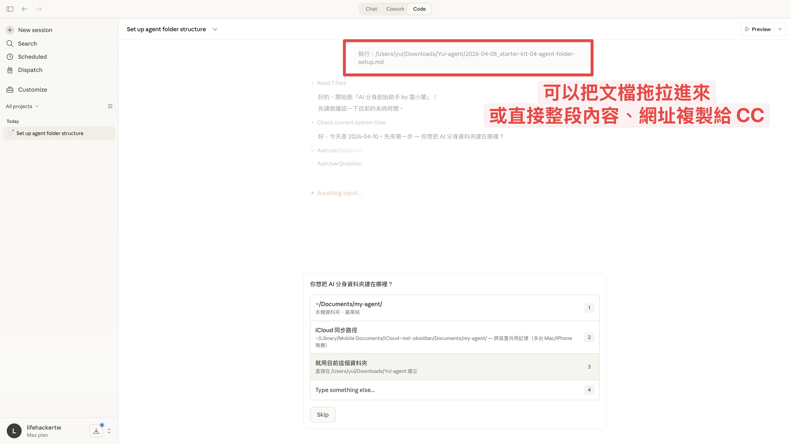
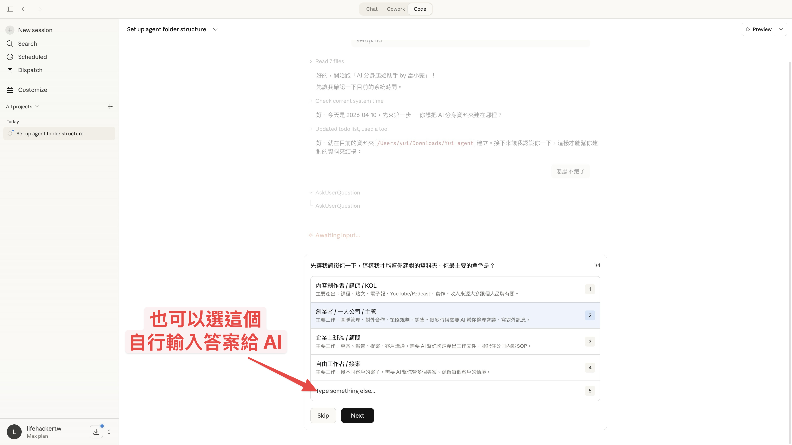
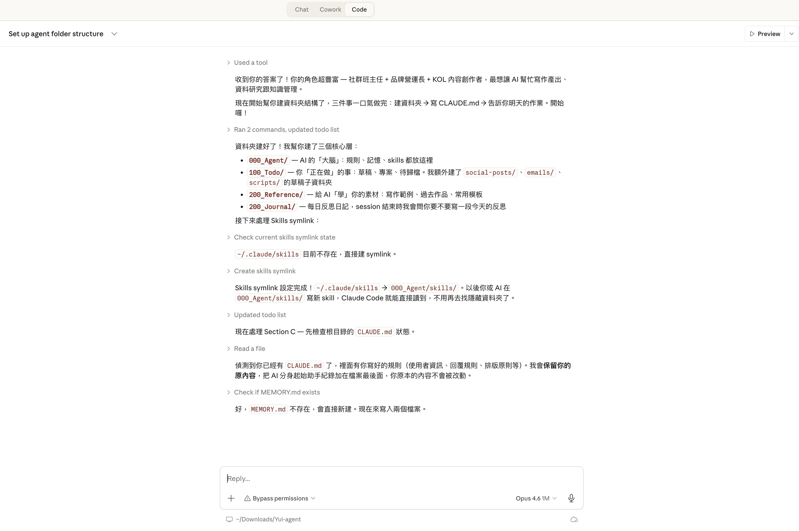
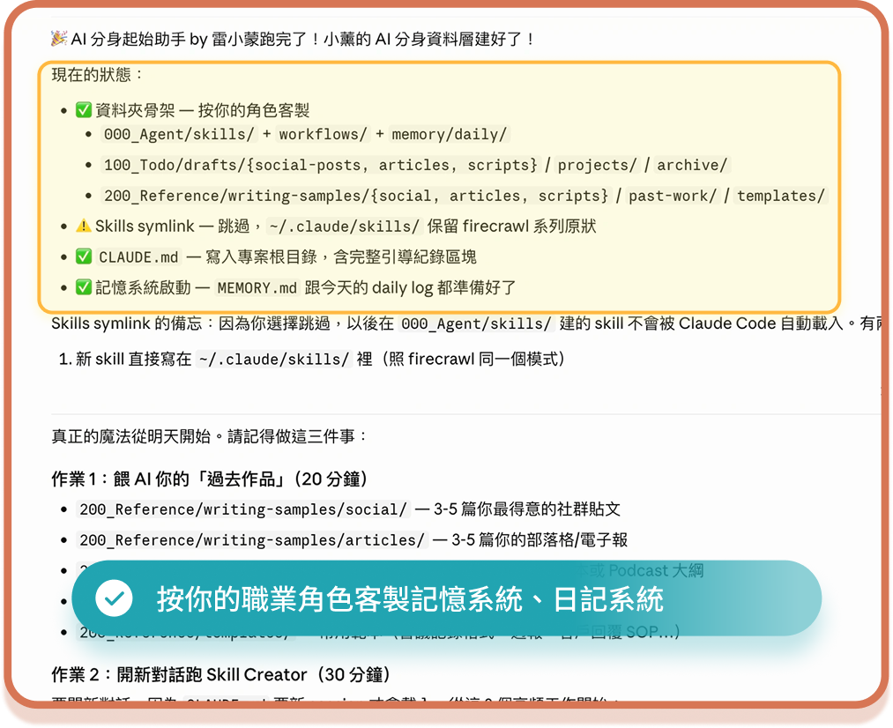

# 讓 AI 記住你的偏好，不再每次從零教

> 迷你課第 2-1 單元｜基礎篇
> 
> 學完這篇，你的 AI 不再是每次都像第一天上班的新人，而是記住你是誰、你的偏好、你的工作方式。

---

## 你一定遇過這個問題

你跟 AI 聊了半小時，教它你的寫作風格、告訴它你不喜歡某種排版、糾正了三次它用簡體中文的壞習慣⋯⋯

然後你關掉對話，下次打開，**全部忘光了。**

又要從頭教一遍。

這不是 AI 的問題，是你還沒幫它建立「記憶」。

---

## CLAUDE.md：AI 每次都會讀的「個人說明書」

在 1-1 的影片裡，你已經知道 `CLAUDE.md` 這個檔案了。現在我們來深入聊聊它為什麼重要、該怎麼寫。

**CLAUDE.md 就是你寫給 AI 的一份個人說明書。** 每次你打開 Claude Code 開始新對話，它都會自動先讀這個檔案。

想像你請了一個新助理，第一天上班你會給他一份文件，上面寫：
- 我是誰、我在做什麼
- 我的工作偏好（例如：回覆一律用繁體中文）
- 哪些事情不要做（例如：不要自己決定刪檔案）
- 我常用的工具和流程

有了這份文件，助理第一天就能上手。沒有的話，他每天都是第一天。

**CLAUDE.md 就是這份文件。**

---

## 但是手動從零寫 CLAUDE.md 很痛苦

問題來了：很多人看了教學，知道 CLAUDE.md 很重要，但打開空白檔案就卡住了，

- 「要寫什麼？」
- 「別人的模板我看了，但跟我的工作完全不同，不知道怎麼改」
- 「寫了一版，感覺很空洞，AI 讀了好像也沒什麼差」

這就是為什麼我做了 **pro-kit「AI 分身起始助手」**。

---

## 用武功秘笈，10 分鐘搞定

「AI 分身起始助手 by 雷小蒙」不是給你一個模板叫你自己填空。它會：

1. **先訪談你**：問你幾個問題（你的工作角色、常用平台、希望 AI 幫你做什麼）
2. **根據你的回答建資料夾**：不是照抄模板，是按你的工作客製化
3. **自動生成 CLAUDE.md**：根據訪談結果，寫一份專屬於你的個人說明書
4. **建立記憶系統**：讓 AI 記住你的偏好、糾正、決策，越用越懂你
5. **給你明天的作業**：引導你把最常做的 3 件事做成 Skill

> [!IMPORTANT]
> **升級包（武功秘笈）**
> 🔒 pro-kit「AI 分身起始助手」— 把這份文件丟給 Claude Code，跟它說「幫我跑 AI 分身起始助手」，全程約 10 分鐘。
>
> 打開 pro-kit `01-agent-setup.md` → 複製內容 → 貼給 Claude Code → 照著回答就好。

---

## 真實案例：柚子第一次跑起始助手

給你看一下我太太柚子第一次用全新的 Claude Code（用 Claude 桌面版 App 的 Code）執行這份武功秘笈的過程。她沒有任何工程背景，全程只要回答問題就好。

### 步驟 1：把武功秘笈丟給 AI

<p align="center">
  
</p>

柚子直接把 `01-agent-folder-setup.md` 這個檔案拖進 Claude Code 的對話框。**你也可以選擇複製整段內容、或是貼上網址**：三種方式都可以。

AI 讀完文件後開始跑起始助手，先問她第一個問題：**「你想把 AI 分身資料夾建在哪裡？」** 並且直接跳出四個選項：
- `~/Documents/my-agent/`（本機資料夾，最單純）
- iCloud 同步路徑（跨裝置共用記憶）
- 就用目前這個資料夾
- 自己輸入其他路徑

柚子選了 iCloud 同步，因為她希望未來從其他裝置也能用到同一套設定。

### 步驟 2：角色訪談，回答最能代表你的工作

<p align="center">
  
</p>

AI 問柚子：**「你最主要的角色是？」** 同樣跳出選項：
- 內容創作者 / KOL
- 創業者 / 一人公司 / 主管
- 企業上班族 / 顧問
- 自由工作者 / 接案
- 或自己輸入

這個問題的目的是讓 AI **根據你的角色生成對應的 CLAUDE.md 內容**：內容創作者會自動加寫作風格提示、企業上班族會加 SOP 產出偏好，不是一份模板大家共用。

> [!TIP]
> 如果四個選項都不精準，直接選「自行輸入」用自己的話描述就好。AI 會根據你的描述客製化。

### 步驟 3：跑完之後的成果

<table>
  <tr>
    <td width="50%"></td>
    <td width="50%"></td>
  </tr>
  <tr>
    <td align="center">柚子當時跑的是測試版（資料夾序號有重複）</td>
    <td align="center">現在的正式版，資料夾結構更完整</td>
  </tr>
</table>

> 📌 **小提醒**：柚子那張截圖是測試版時拍的，你可能會注意到資料夾編號有重複；現在你跑出來的會是右邊那份正式版，結構更完整、分類更清楚，**不用擔心跟柚子的不一樣，那才是對的**。

10 分鐘後，柚子的 Claude Code 顯示了完成畫面：

- ✅ **資料夾結構建好了**：`000_Agent/`、`100_Todo/`、`200_Reference/`、`200_Journal/` 四層
- ✅ **Skills symlink 設定完成**：`~/.claude/skills/ → 000_Agent/skills/`，以後建 skill 就在看得到的地方
- ✅ **todo list 更新**：現在準備處理 `CLAUDE.md` 的建立
- ✅ **保留原內容**：AI 會檢查既有的 `CLAUDE.md`，用疊加的方式加入新內容，不會覆蓋

整個過程柚子只按了幾次選項，其他都是 AI 自動完成。**這就是雷小蒙把它的起始設定心法傳給她的 AI 的過程**：從零到有一個完整的 AI 分身基礎，10 分鐘搞定。

---

## 跑完之後你會有什麼

### 一個按你工作客製的資料夾結構

```
你的專案資料夾/
├── 000_Agent/          ← AI 協作核心（規則、記憶、Skills）
│   ├── skills/         ← 你的 AI 會的「招式」
│   └── memory/         ← AI 的記憶（偏好、日誌）
├── 100_Todo/           ← 正在做的事（草稿、專案）
└── 200_Reference/      ← 給 AI 學的素材（寫作樣本、範本）
```

> [!TIP]
> 為什麼用 000 / 100 / 200 這種序號？因為序號讓資料夾永遠照順序排列，AI 每次都從同一個地方開始讀。而且只建三層，有需要再擴充，不會一開始就建一堆空資料夾給自己壓力。

### 一份個人化的 CLAUDE.md

不是空白模板，是根據你的訪談結果生成的內容。例如如果你說你是「內容創作者」，AI 會自動加上：
- 輸出一律繁體中文
- 寫作風格相關的偏好區塊
- 常用平台的整合提醒

### 一個記憶系統

- **MEMORY.md**：長期記憶索引（你的偏好、踩過的坑）
- **daily/ 日誌**：每次對話的摘要紀錄

AI 下次開對話時會自動讀取這些記憶，不用你再重複教。

### Skills 放在看得到的地方

AI 分身起始助手會幫你設定 symlink，讓 `~/.claude/skills/`（系統隱藏資料夾）指向你專案裡的 `000_Agent/skills/`。

效果：你的 Skill 檔案出現在看得到的地方，用 Obsidian 就能直接編輯，不用去翻隱藏目錄。而且換電腦時，整個資料夾打包帶走就好。

> [!TIP]
> **資料可攜性很重要。** 現在 Claude 是最強的 AI 大腦，但未來一定會有更強的出現。如果你的所有設定、記憶、Skills 都在看得到的資料夾裡，到時候換 AI 就是「整包丟過去」，不用重建。

---

## 如果你已經有 CLAUDE.md 了？

**不會被覆蓋。** AI 分身起始助手會用「疊加」的方式，把新內容包在特殊標記裡，加到你現有的 CLAUDE.md 後面。你原本寫的東西完全不受影響。

---

## CLAUDE.md 寫好之後，持續優化

CLAUDE.md 不是寫一次就不管了。隨著你使用 AI 的時間越長，你會發現有些偏好要加、有些規則要改。

**三個持續優化的方式：**

1. **AI 犯錯時直接糾正**：「不要用簡體中文」「回覆不要超過 500 字」，AI 會記住，而且如果你裝了記憶系統，下次自動帶入
2. **定期回顧 MEMORY.md**：看看 AI 記了什麼，有沒有過時的偏好要清掉
3. **穩定的偏好升級到 CLAUDE.md**：如果某個偏好你已經糾正了三次以上，就直接寫進 CLAUDE.md，讓它變成「預設規則」

---

## 常見問題

**Q：Skill 放在「專案裡的 `000_Agent/skills/`」和「系統層 `~/.claude/skills/`」差在哪？我該選哪個？**
Claude Code 預設**只**會從 `~/.claude/skills/` 載入 skill（系統層級、隱藏資料夾）。專案層級的 `.claude/skills/` 並**不會**被自動當成 skill 來源。所以如果你把 skill 寫在 `000_Agent/skills/`，原生機制讀不到，**除非你做一個 symlink 把原生位置指過去**。AI 分身起始助手就是在做這件事：`~/.claude/skills` 會變成指向 `000_Agent/skills/` 的捷徑，你寫檔案時在可見的專案內寫，Claude Code 讀的時候還是從原生位置讀到。好處：（1）skill 不在隱藏資料夾，打開 Finder 就看到；（2）換電腦時整個專案搬走、重跑一次 `ln -s` 就好；（3）skill 可以跟專案一起 git 版控、傳給朋友。

**Q：我只有一台電腦，不用 iCloud 同步，還需要做這個 symlink 嗎？**
**強烈建議還是做。** 原因有三層，最後一層最重要：

1. **可見性** — 隱藏資料夾 `~/.claude/` 對非工程師是惡夢：要 `Cmd+Shift+.` 才看得到，備份時常被漏掉。改成 symlink 後，你所有的 skill 都在**可見、可拖曳、可打包**的 `000_Agent/skills/` 裡。
2. **換電腦簡單** — 未來換電腦時整個專案資料夾搬走、重跑一次 `ln -s` 就好，不用挖 `~/.claude/`。
3. **換 AI 大腦也簡單（這一層才是重點）** — 現在 Claude Code 是最強的大腦，但下一代一定會有更強的出現。當那一天到來，你希望是「整個專案資料夾打包丟給新的 AI、它立刻讀得到你所有的 skill、記憶、過去作品」，還是「再去 `~/.claude/` 挖一次隱藏檔案、再搬一次家、再重建一次基建」？**這個時代的正確姿勢是讓資料具備可攜性，不被單一 AI 綁死**。你所有投入的寫作風格素材、糾正過的 feedback、建過的 workflow，都應該屬於你這個人，而不是屬於某個特定版本的 AI 產品。Symlink 是你今天能做的最低成本防呆。

**Q：我已經有一堆散亂的檔案怎麼辦？**
先建骨架、再慢慢分批搬。不用一天搬完。你可以先把「最得意的 10 個東西」丟進 `200_Reference/`，其他的放著慢慢整理。

**Q：我可以改資料夾名字嗎？例如把 `200_Reference/` 改成 `200_Lib/`？**
可以，但記得**同步改 `CLAUDE.md` 的路由表**，不然 AI 會找不到路徑。建議改完以後在對話裡跟 AI 說一次「我把 200_Reference/ 改成 200_Lib/ 了」，讓它更新記憶。

**Q：iCloud / Dropbox / Google Drive 可以同步嗎？**
可以。iCloud 在 macOS 路徑是 `~/Library/Mobile Documents/...`，會自動跨裝置同步。Dropbox 放在 `~/Dropbox/` 裡。好處：你兩台電腦都能用同一個 AI 分身、共用 `MEMORY.md` 和 `skills/`。壞處：要注意別讓兩台電腦同時寫入同一個檔案（會衝突）。

**Q：Windows 怎麼辦？**
資料夾結構完全一樣，只是 bash 指令要換成 PowerShell 的 `New-Item -ItemType Directory -Path "000_Agent/skills" -Force`。或者直接裝 WSL（Windows Subsystem for Linux）用 Ubuntu 的 bash。

**Q：我不會寫程式，這些 Skill、MEMORY.md 會不會太難？**
不會。你完全不需要碰程式碼。你要做的只有：
1. 把你的作品丟進對的資料夾
2. 用一般對話跟 AI 說「我想要做 XX」
3. AI 自己會去讀 CLAUDE.md、自己會去翻資料夾、自己會寫進 MEMORY.md

你的工作是「餵資料 + 糾正 AI」，其他都是 AI 自己做。

**Q：CLAUDE.md 裡的「自我進化機制」那段，AI 真的會照做嗎？**
會，但前提是你要**主動糾正**。AI 不會自己發明新偏好，它只會在你說「這樣不對，我想要 XX」的時候寫下來。所以一開始的 2-3 週，你要多花一點時間跟它 back-and-forth，記憶就會開始長出來。3 週後你會明顯感覺到 AI 越來越像你。

---

## 這篇學完你有了什麼

- ✅ 搞懂 CLAUDE.md 是什麼、為什麼重要
- ✅ 用武功秘笈完成個人化的資料夾結構 + CLAUDE.md + 記憶系統
- ✅ 知道怎麼持續優化，讓 AI 越用越懂你
- ✅ Skills 放在看得到的地方，不再翻隱藏資料夾

**下一步**：2-2 帶你認識 Claude Code 的完整架構，除了 CLAUDE.md，還有哪些功能你可以用。

---

⬅️ 上一章節：[1-3 怎麼跟 Claude Code 提問／協作最有效？](1-3%20%E6%80%8E%E9%BA%BC%E8%B7%9F%20Claude-Code%20%E6%8F%90%E5%95%8F%EF%BC%8F%E5%8D%94%E4%BD%9C%E6%9C%80%E6%9C%89%E6%95%88%EF%BC%9F.md) ｜ ➡️ 下一章節：[2-2 Claude Code 完整架構速覽](2-2%20Claude%20Code%20%E5%AE%8C%E6%95%B4%E6%9E%B6%E6%A7%8B%E9%80%9F%E8%A6%BD.md)
