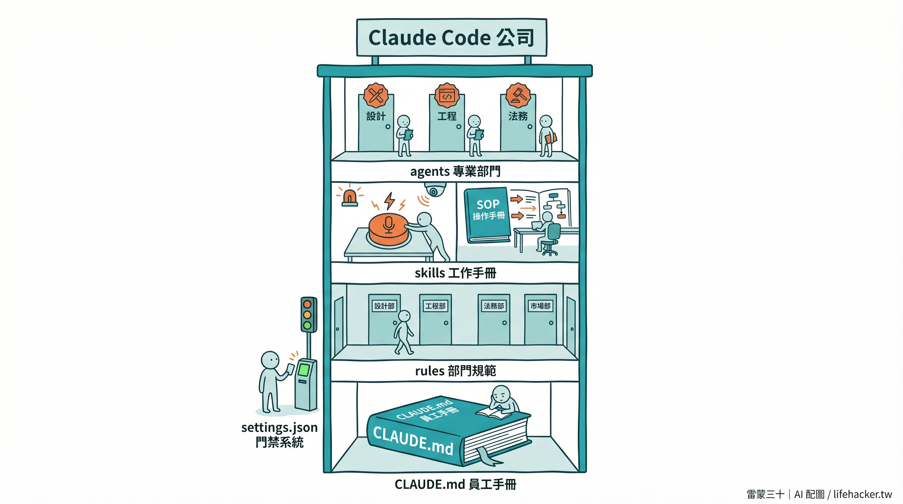
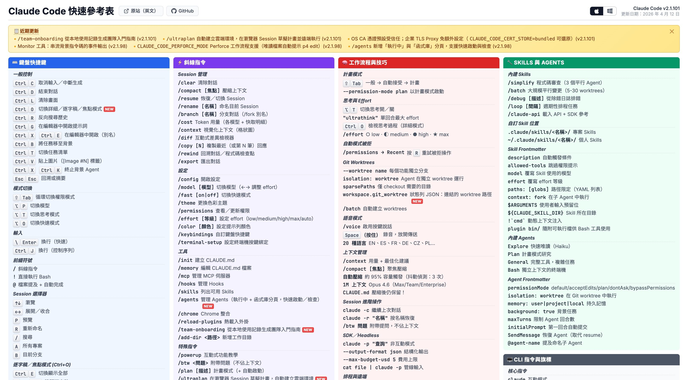

# Claude Code 的完整架構：你還有這些功能可以用

> 迷你課第 2-2 單元｜基礎篇
> 上一篇你搞定了 CLAUDE.md 和記憶系統。但 Claude Code 的能力不只這些，這篇帶你快速認識整個架構，知道「還有什麼牌可以打」。

---

## 先看全貌：Claude Code 的七大功能區

如果你只用了 CLAUDE.md，你大概只用了 Claude Code 三成的功能。

完整的 `.claude/` 資料夾長這樣：

```
.claude/
├── CLAUDE.md        ← 你已經會了！AI 的個人說明書
├── settings.json    ← 權限控制：AI 能做什麼、不能做什麼
├── rules/           ← 行為準則：特定情境的細部規範
├── skills/          ← 技能模板：可重複使用的工作流程
├── commands/        ← 快捷指令：一個 / 搞定一串流程
├── hooks/           ← 自動觸發：特定事件發生時自動執行
└── agents/          ← AI 團隊：不同任務交給不同專家
```

**不用全部學會。** 這篇的目的是讓你知道它們存在、各自做什麼。等你有需要的時候，再深入應用就好。至少不會讓自己有需求時，不知道有這些功能能幫上忙。

---

## 用公司比喻：七個功能 = 七個角色

想像你開了一家「Claude Code 公司」，裡面的七大功能，就是公司裡的七個角色：



| 功能                | 公司裡的角色 | 一句話                   |
| :---------------- | :----- | :-------------------- |
| **CLAUDE.md**     | 員工手冊   | 新人第一天就要讀的基本規則         |
| **settings.json** | 門禁系統   | 哪些門能進、哪些門不能進          |
| **rules/**        | 部門規範   | 行銷部有行銷部的 SOP，工程部有工程部的 |
| **skills/**       | 工作手冊   | 「收到客訴時，照這個流程處理」       |
| **commands/**     | 快捷命令   | 老闆說一個詞，整套流程就開始跑       |
| **hooks/**        | 自動警報系統 | 有人進出大門時，自動打卡記錄        |
| **agents/**       | 專業部門   | 設計的事交給設計部，法務的事交給法務部   |

---

## 一個一個認識

### 1. CLAUDE.md — 員工手冊（✅ 你已經會了）

AI 每次開對話都會先讀的「個人說明書」。上一篇你已經用「雷小蒙武功秘笈」搞定了。

### 2. settings.json — 門禁系統

控制 AI **可以做什麼、不能做什麼**的設定檔。

舉例來說，你可以：
- ✅ 允許 AI 讀檔案、改檔案、執行 git 指令
- ❌ 禁止 AI 執行 `rm -rf`（刪除整個資料夾）
- ❌ 禁止 AI 強制推送到 GitHub（`git push --force`）

> [!TIP]
> 你在 1-1 裝的 starter-kit「安全刪除」，背後就是在 settings.json 裡設定了禁止清單。

### 3. rules/ — 部門規範

如果 CLAUDE.md 是「全公司的規則」，rules 就是「特定部門的規則」。

例如你可以建一個 `rules/api.md`，裡面寫「所有 API 回傳都要用統一格式」。重點是：**只有當 AI 碰到 API 相關檔案時，這條規則才會被載入**，不會占用其他工作的注意力。

> 小專案用 CLAUDE.md 就夠了。等你的 CLAUDE.md 長到幾百行、開始覺得太雜的時候，再考慮拆到 rules/。

### 4. skills/ — 工作手冊（完整的 How-to 流程）

Skills 是你教 AI 的**一整套工作流程**：不只是「規則」，而是「拿到這個任務，第一步做什麼、第二步做什麼、最後交付什麼」的完整 How-to。

跟 CLAUDE.md 的差別是：CLAUDE.md 是「永遠都要知道的事」，Skills 是「做特定工作時才展開的操作手冊」。

例如我（雷蒙）有一個「寫電子報」的 Skill，裡面完整定義了：電子報的格式、語氣、段落結構、要先去哪裡撈素材、怎麼挑金句、最後推到哪個平台。AI 只有在我說「幫我寫電子報」的時候才會讀它，平常不會占用 token。

> [!IMPORTANT]
> **升級包（武功秘笈 + 招式學習器）**
> 迷你課後續的基礎篇每個單元都會附上可直接安裝的 Skill。例如 2-2 的筆記日記 Skill、第三章節的工作流運用。這些就是你的 AI 的「招式學習器」， 裝了後，AI 就會按需取用。

#### 先裝一個「能幫你長 Skill 的 Skill」：官方 Skill Creator

雷蒙要先推薦你一個很關鍵的補充包，**Anthropic 官方出的 `skill-creator`**。

它是一個「能幫你建立 skill 的 skill」。裝了之後，以後你想把任何一個流程變成 skill，只要打 `/skill-creator` 加一段描述，它會用引導式問答的方式把整個 SKILL.md 幫你生出來，不用你自己去學語法。

**官方 GitHub**：https://github.com/anthropics/skills/tree/main/skills/skill-creator

**安裝方式**（因為雷蒙這套課的資料夾結構比較特別，直接用 `git clone` 或手動下載會放錯地方，雷蒙幫你準備了一段可以直接丟給 Claude Code 的安裝指令）：

> [!IMPORTANT]
> **升級包：安裝官方 Skill Creator**
>
> 打開 Claude Code，把下面這段**整段複製貼上**送出，它會自動幫你處理：
>
> ````text
> 我要安裝 Anthropic 官方的 skill-creator skill。
> 來源：https://github.com/anthropics/skills/tree/main/skills/skill-creator
>
> 請幫我做以下事情：
> 1. 用 git sparse-checkout 只拉 skills/skill-creator 這一個子資料夾（不要整個 clone anthropic/skills，那個 repo 太大）
> 2. 安裝到 ~/.claude/skills/skill-creator/
>    （如果我已經用了雷蒙三十的 000_Agent 架構，請改安裝到 000_Agent/skills/skill-creator/ 然後跑一次 sync-agent.sh）
> 3. 安裝完讀一下 SKILL.md 的 frontmatter 確認 name 是 skill-creator
> 4. 最後告訴我要怎麼驗證，例如我應該能在 Claude Code 打 /skill-creator 看到它
>
> 開始吧。
> ````
>
> Claude Code 會按步驟執行：clone → 移動檔案 → 清理 → 驗證。裝完之後你打 `/skill-creator` 就能用了。

> [!TIP]
> **為什麼安裝指令要這麼囉嗦？**
> 因為 `anthropic/skills` repo 裡面有很多個 skill，直接 `git clone` 會把整包 100+ MB 的東西下載下來。用 `sparse-checkout` 只抓 `skill-creator/` 一個資料夾，幾秒就裝完。這段描述其實是在教 Claude 怎麼最有效率地完成這個安裝任務，你只要貼上去，剩下的它會自己搞定。

裝好之後，雷蒙建議你第一個用 `/skill-creator` 做的事情是：**把你每天做的某個重複流程抽出來變成 skill**。例如「每次接到學員客服信我都會先看哪幾個資料夾 → 判斷屬於哪類問題 → 套用哪個回覆模板」，丟給它，它會幫你一步步問清楚，最後生成一個完整的 SKILL.md。

### 5. commands/ — 快捷命令

**重點就一句話：把你每天要打的一大串提示詞，變成一個簡單的快捷命令。**

Commands 讓你把常用的流程包裝成一個指令。輸入 `/指令名` 就會自動觸發整套流程，不用再每次從頭打一遍「幫我讀今天的行事曆、檢查信箱、整理出今天要做的三件事⋯」這種落落長的開場白。

例如我有一個 `/morning` 指令，一個字打下去，AI 就會自動讀行事曆、掃信箱、看 Todo、最後整理成一份早晨簡報。從「要打 300 字 prompt」變成「打 8 個字」。

> [!TIP]
> **2-3 會實際帶你做一個 `/morning`**
> 下個單元會示範怎麼從零建立你自己的第一個快捷命令，你會看到「怎麼把一串複雜流程塞進 `/morning` 裡」的完整過程。

> **Commands 和 Skills 的關係**（先有個初步概念就好，2-4 會完整拆解）：
> 在 Claude Code 最新版本，Skills 和 Commands 其實已經合併成同一個機制，你放在 `.claude/skills/` 的每個 skill 都會**自動變成一個 slash 指令**。所以這一節講的「commands」你可以理解為「你主要用來手動觸發的那一批 skill」。雷蒙在 2-4 會把整個機制攤開給你看，包括為什麼他還額外搞了一個 `workflows/` 層級。

### 6. hooks/ — 自動警報系統

Hooks 讓你在特定事件發生時，**自動執行某些動作**：不用你喊、不用 AI 記得，系統會自己跳出來做。

| 觸發時機 | 白話文 |
|:--|:--|
| `UserPromptSubmit` | 你**按下送出**的那一刻 |
| `PreToolUse` | AI 動手**之前** |
| `PostToolUse` | AI 動手**之後** |
| `SessionStart` | 對話**剛開始** |
| `PreCompact` | Context 快滿、**壓縮之前** |
| `SessionEnd` | 對話**結束時** |

**雷小蒙實際用的幾個 Hook**（挑三個最常用的給你感受一下）：

| Hook 名稱 | 觸發時機 | 做什麼事 |
|:--|:--|:--|
| **每次發訊息自動注入今日脈絡** | `UserPromptSubmit` | 每次雷蒙按下送出，系統自動塞入「今天日期 / 最近 3 天 daily log / 在哪台電腦」，這樣雷小蒙永遠知道「我現在在哪、最近發生什麼事」，不會每次對話都變失憶金魚 |
| **Context 壓縮前自動存快照** | `PreCompact` | Claude Code 對話太長會自動壓縮，壓縮前這個 hook 會先把「目前改了哪些檔案、講到哪裡」存到 snapshot，避免壓縮後關鍵決策消失 |
| **對話結束自動寫 daily log** | `SessionEnd` | 對話關掉的瞬間，hook 會讀這次對話的重點、自動寫進當日的 daily log，雷蒙不用自己寫日誌，系統幫他寫 |

看得出 Hook 的共通點嗎？**它們都在「你不會主動想到的時間點」幫你做事**。這就是 Hook 的價值：把「我應該要記得做」的事情，變成「系統自動幫我做」。

> 2-4「設好防線」會帶你從零建立自己的 Hook。

### 7. agents/ — 專業部門

Agents 是你自訂的「AI 專家」，每個 Agent 有自己的角色設定、可用工具和行為規則。例如你可以建一個「校稿專家」Agent，專門檢查文章的錯字和語氣。

但雷蒙想先跟你講一個**很多人還不知道的變化**：

**現在的 Claude（特別是 Opus 4.6 這一代）已經聰明到，不需要你去「派工」。**

以前大家都會教你：跟 AI 對話要先「設定角色」，「你是一個資深行銷專家」「你是一個 Python 工程師」「你是一個文案寫手」。那是因為以前的 AI 真的笨，你不先幫它穿上角色的衣服，它就不知道要用哪一套腦袋回答你。

**但現在不一樣了。** 當你丟一個複雜任務給 Claude Code，它會自己判斷：「這個任務我需要先派一個研究員去查資料 → 再派一個工程師寫 code → 最後派一個審稿人檢查」，**你不用自己想該派誰，Claude 會自己調度。**

用比喻來說：

> 以前經營公司，你是個體戶老闆。要找廣告得自己想找誰、設計得自己想找誰、業務得自己想找誰，每一件事都要自己張羅外包，非常累。
>
> 現在你面對的是一家「完整的大公司集團」。你只要說「我要打進某個市場」，公司裡就會自動派出策略顧問、行銷、設計、業務⋯整組人馬自己開工。你不用再當調度中心，**Claude 就是那個調度中心。**

所以 Agents 這個功能，現在還算是**一個過渡期角色**。等 Claude 自己的判斷力越來越好，加上你的 CLAUDE.md 和 Skills 夠完整，它未來只會越來越會自動派工。

> [!TIP]
> **現在還要不要手動建 Agent？**
> 除非你有**非常特殊的工作流**（例如固定要跑一串「研究→寫稿→校稿→排版」的長鏈），或是想把某個 Agent 配上**特定權限/工具限制**，否則初學階段真的不用急。先把 CLAUDE.md、Skills、Commands 寫好，Claude 自己就會用聰明的方式幫你調度。

> 這也是為什麼這堂迷你課的重點放在 CLAUDE.md → Skills → Commands → Hooks 這條主線，把這條主線做紮實，Agents 自然會在你需要的時候浮現。

---

## 雷小蒙的真實案例：這些功能怎麼協作

讓你看看我的 AI 分身「雷小蒙」實際用了哪些功能：

| 功能 | 雷小蒙怎麼用 |
|:--|:--|
| **CLAUDE.md** | 記錄雷蒙的身份、語言偏好（繁體中文）、回覆風格、常見錯誤防護 |
| **settings.json** | 禁止刪除重要檔案、禁止強制推送 GitHub |
| **rules/** | 10+ 條細部規範（例如：WordPress 文章格式、Git commit 慣例） |
| **skills/** | 34 個工作流程（寫電子報、社群貼文、筆記整理、Email 回覆⋯） |
| **commands/** | `/morning`（早晨工作流）、`/journal`（寫日記）、`/newsletter`（生成週報） |
| **hooks/** | 對話開始時自動同步記憶、commit 後自動提醒更新文件 |
| **agents/** | 幾乎沒手動建，Claude Opus 4.6 會自己依任務派工（搜尋、規劃、執行自動分配） |

> [!IMPORTANT]
> **想看雷小蒙的完整資料夾結構？**
> 雷蒙把整套 `000_Agent/` 配置、跨裝置 iCloud 同步、symlink 設計、skills/workflows/memory/hooks 的實際長相，全部攤開在 **👉 2-4「雷小蒙的資料夾結構：把 AI 分身變成真正的你」**。那一篇會告訴你為什麼「資料夾結構」是 Claude Code 從 20% 推到 100% 的關鍵。

> [!TIP]
> 你不需要一次建到這麼多。雷小蒙是經過半年慢慢長出來的。你現在只要搞定 CLAUDE.md + 記憶系統 + 幾個常用 Skill，就已經超過大部分人了。

---

## Claude Code Cheat Sheet：隨時查

雷蒙整理了一份完整的 Claude Code 快速參考表（繁體中文），涵蓋鍵盤快捷鍵、斜線指令、CLI 旗標、MCP、記憶檔案、Skills、Agents、環境變數，**點下面這張圖**就能直接進去線上閱讀，建議加入書籤：

<p align="center">
  <a href="https://github.com/Raymondhou0917/claude-code-cheatsheet-zh">
    
  </a>
</p>

> [!TIP]
> 這份 Cheat Sheet 會跟著 Claude Code 原廠版本**每週同步更新**。
> 想直接看線上版：👉 [raymondhou0917.github.io/claude-code-cheatsheet-zh](https://raymondhou0917.github.io/claude-code-cheatsheet-zh/)

下面這張是本單元的功能速查表，搭配前面 Cheat Sheet 一起看最有感：

| 你想做的事 | 功能 | 怎麼用 |
|:--|:--|:--|
| 讓 AI 認識我 | CLAUDE.md | 寫在專案根目錄的 `CLAUDE.md` |
| 讓 AI 記住偏好 | 記憶系統 | `MEMORY.md` + `daily/` 日誌 |
| 禁止危險操作 | settings.json | 設定 `deny` 清單 |
| 特定檔案的規則 | rules/ | 建 `.claude/rules/xxx.md`，加 `paths` 限定範圍 |
| 重複性工作流程 | skills/ | 建 `.claude/skills/xxx/SKILL.md` |
| 一鍵執行流程 | commands/ | 建 `.claude/commands/xxx.md`，用 `/xxx` 觸發 |
| 自動化檢查 | hooks/ | 在 settings.json 設定觸發條件 + 腳本 |
| 專家分工 | agents/ | 建 `.claude/agents/xxx.md` |

---

## 學習順序建議

不用急著全學。按照這個順序，遇到需要再學：

```
CLAUDE.md（✅ 已完成）
    ↓
commands/（2-3 帶你做第一個 /morning）
    ↓
skills/ + workflows/ + 跨裝置同步結構（2-4 會整套攤開給你看）
    ↓
hooks/（2-4 會展示雷小蒙的三個關鍵 hook）
    ↓
rules/ + agents/（進階，有需要再長）
```

---

## 這篇學完你有了什麼

- ✅ 認識 Claude Code 的七大功能區
- ✅ 知道每個功能的用途和使用時機
- ✅ 看到雷小蒙的真實配置案例
- ✅ 有一份 Cheat Sheet 可以隨時查
- ✅ 知道接下來該按什麼順序學

**下一步**：2-3 帶你把 AI 連上你的 Email 和行事曆，讓它不只能操作檔案，還能幫你讀信、排行程。

---

⬅️ 上一章節：[2-1 讓 AI 記住你的偏好](2-1%20%E8%AE%93%20AI%20%E8%A8%98%E4%BD%8F%E4%BD%A0%E7%9A%84%E5%81%8F%E5%A5%BD.md) ｜ ➡️ 下一章節：[2-3 把工具授權給 AI，組合出你的每日工作流](2-3%20%E7%94%A8%20AI%20%E7%AE%A1%E7%90%86%E4%BD%A0%E7%9A%84%E7%AD%86%E8%A8%98%E5%92%8C%E6%AF%8F%E6%97%A5%E5%8F%8D%E6%80%9D.md)
