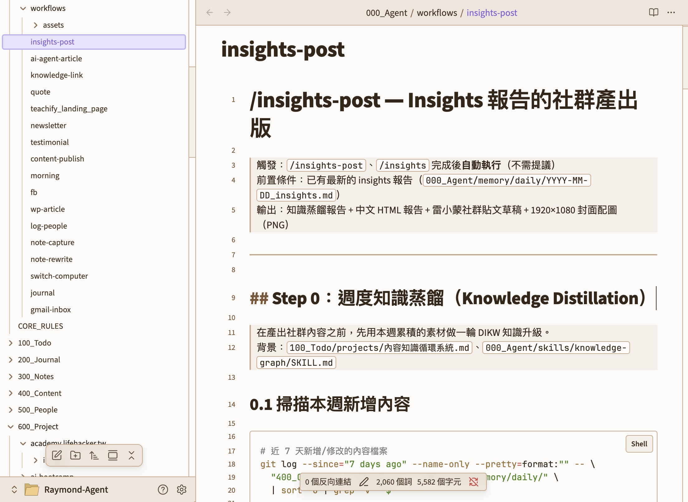
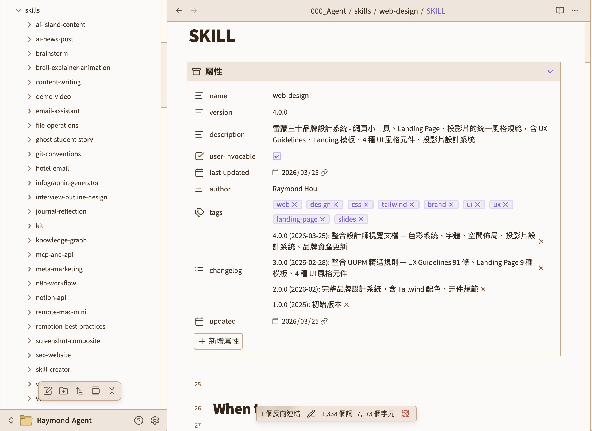

# AI 分身資料夾結構：雷小蒙拆解

> 迷你課第 2-4 單元｜基礎篇
> 你已經在 [2-1](<2-1 讓 AI 記住你的偏好.md>) 跑過 pro-kit 01，拿到了一個能用的骨架。
> 這一篇，雷蒙要把雷小蒙這個「用了半年的 AI 分身」整個攤開給你看，**讓你看懂骨架背後的三個關鍵設計決定**，未來才有辦法自己迭代。

---

## 開場：資料夾結構，是 Claude Code 真正的魔法

很多人以為 Claude Code 厲害是因為「AI 模型很強」。其實不完全是。

**它真正厲害的地方，是它讀檔案的方式**——你的偏好寫在 `CLAUDE.md`、你的工作流程寫在 `skills/`、你的記憶寫在 `memory/`，每次開新對話，AI 都會按照你設計的結構「重新組裝自己」。

如果你只把 Claude Code 當成「比較聰明的聊天機器人」，那它的潛力你大概只用了 20%。它有 80% 的功力，全部藏在你怎麼設計這個資料夾結構裡。

雷蒙的這份分身「雷小蒙」，是用了半年迭代出來的。下面攤開給你看，**重點不是叫你照抄，而是看懂三個關鍵決定背後的「為什麼」**。

---

## 雷小蒙的真實案例：整個資料夾長這樣

這是雷蒙目前在兩台電腦（Mac mini + MacBook）之間跨裝置使用的配置：

> 🖼️ **截圖 1：Raymond-Agent 根目錄全景**
> 📌 拍攝重點：Obsidian / Finder 側邊欄展開 Raymond-Agent 資料夾，可以看到 `000_Agent/`、`.claude/`、`100_Todo/`、`300_Notes/`、`600_Project/` 等頂層結構，最好選中 `000_Agent/` 讓它高亮。
> 檔名建議：`2-4-01-raymond-agent-root.jpg`

```
Raymond-Agent/                ← 雷蒙的人生管理系統根目錄（iCloud 同步）
├── CLAUDE.md → 000_Agent/CORE_RULES.md    ← 這是 symlink，等下解釋
├── .claude/                  ← Claude Code 的本地設定
├── 000_Agent/                ← 雷小蒙的大腦（核心）
│   ├── CORE_RULES.md         ← 全域規則（被 CLAUDE.md symlink）
│   ├── skills/               ← 34 個方法論（AI 需要時翻的手冊）
│   ├── workflows/            ← 17 個觸發詞指令（你每天主動喊的儀式）
│   ├── memory/               ← 記憶系統（MEMORY.md + daily/）
│   └── knowledge/            ← 領域知識庫
├── 100_Todo/                 ← 待辦、草稿
├── 300_Notes/                ← 知識卡片、主題頁
├── 500_People/               ← 人脈 CRM（核心夥伴、創作者同行、合作廠商、會員）
├── 600_Project/              ← 所有專案（含這堂迷你課）
└── ...
```

看起來複雜，其實只要看懂下面三個關鍵決定，這張圖你就讀懂九成了。

---

## 關鍵決定 1：為什麼把核心配置放在 `000_Agent/` 而不是 `.claude/`？

### 預設的 `.claude/` 會害你「換裝置就失憶」

Claude Code 預設把所有設定放在 `~/.claude/`（本機家目錄下的隱藏資料夾）。**這個資料夾只存在於這一台電腦。**

雷蒙有兩台 Mac。如果用預設配置：在 Mac mini 辛苦調教了一週的 CLAUDE.md、幾十個 Skills、上百條記憶，換到 MacBook 打開 → **完全失憶**，全部重來。

對「養 AI 分身」來說這是致命的——你不可能每次換裝置都從頭教一遍。

### 雷小蒙的解法：把配置搬出來 + symlink 接回去

雷蒙做了一件反直覺但關鍵的事：**把核心規則、Skills、Workflows、Memory，全部從 `.claude/` 搬到一個叫 `000_Agent/` 的一般資料夾，放在 iCloud 同步路徑下。**

然後用 symlink（軟連結）把 `.claude/` 預期看到的檔案，連回去 `000_Agent/`：

```
Raymond-Agent/
├── CLAUDE.md     →  000_Agent/CORE_RULES.md    ← Claude Code 會讀
├── AGENTS.md     →  000_Agent/CORE_RULES.md    ← Codex CLI / Claude Agent SDK 會讀
├── GEMINI.md     →  000_Agent/CORE_RULES.md    ← Gemini CLI 會讀
├── .cursorrules  →  000_Agent/CORE_RULES.md    ← Cursor 會讀
└── 000_Agent/CORE_RULES.md                     ← 真正的檔案只有這一份
```

> [!TIP]
> **這是「可擴充」的設計，不是固定清單**
> 未來不管哪個新的 AI Agent CLI 流行起來，規定要讀 `XXXX.md` 還是 `.xxxxrc`，你只要多加一條 symlink 指到同一份 `CORE_RULES.md` 就好。**一份規則、所有 AI 共用。**

**這個設計帶給你三件事**：
1. ✅ 多台電腦自動同步，換機不失憶
2. ✅ 多個 AI 共用同一份規則（Claude / Codex / Gemini / Cursor）
3. ✅ 整個人生管理系統（筆記、專案、AI 分身）在同一個資料夾，備份、搬家、分享一次搞定

#### 想把這個設計變成你自己的？用 [pro-kit 07](<../pro-kit/07-cross-device-sync.md>)

同步這件事因人而異——你可能用 iCloud、Dropbox、Google Drive、OneDrive，也可能只有一台電腦但想做 GitHub 備份。雷蒙把整個訪談 + 備份 + 建架構 + 體檢腳本的流程打包成 [pro-kit 07 · 跨裝置同步引導助手](<../pro-kit/07-cross-device-sync.md>)，讓 AI 當你的同步顧問，根據你的裝置組合量身訂做。

> [!IMPORTANT]
> **搭配 [pro-kit 07：跨裝置同步引導助手 by 雷小蒙](<../pro-kit/07-cross-device-sync.md>)**
> - 10 分鐘互動設定，從訪談到體檢腳本一條龍
> - 涵蓋 Apple 全家桶 / Mac+Windows / 純 PC / 單機 + GitHub 五種情境
> - 強制 `.claude/` 備份（出事一鍵還原）
> - 附 `sync-health.sh` 體檢腳本 + 未來換電腦／換 AI 的遷移手冊
>
> 👉 **[點這裡開啟 pro-kit 07 完整文件](<../pro-kit/07-cross-device-sync.md>)**
>
> **前提**：需要先跑過 [pro-kit 01](<../pro-kit/01-agent-folder-setup.md>)。07 會偵測 01 的狀態，沒跑過會請你先回去跑 01。

> [!TIP]
> **作業：公開分享／交流你的同步方案**
> 跑完 07 後，把你的架構截圖紀錄下來，分享到社群上。每個人的硬體、雲端、習慣都不同，**你的方案很可能會啟發別人**，反過來也一樣。（如果是[訂閱會員](https://community.lifehacker.tw/)，也可以分享到【AI 共學島】頻道唷！）

---

## 關鍵決定 2：skills/ 和 workflows/ 為什麼要分開放？

打開 `000_Agent/` 你會看到兩個乍看很像的資料夾：

```
000_Agent/
├── skills/        ← 34 個（方法論、AI 需要時翻的手冊）
└── workflows/     ← 17 個（你每天會主動喊的固定儀式）
```

要講清楚這個設計，雷蒙先幫你補一個常被搞混的觀念。

### Claude Code 的 Skill = 自動變成的 Slash 指令

官方的機制是：**你在 `~/.claude/skills/` 建立一個 Skill，它就自動變成一個 `/skill-name` 的 slash 指令，同時 Claude 也會自己判斷什麼時候要主動取用它。**

換句話說，**你不用另外註冊**。檔案放對地方、`SKILL.md` 寫了 `name: xxx`，你打 `/xxx` 就能用，Claude 也會在對話中自動判斷要不要載入。

官方還提供了三種設定讓你微調：

| frontmatter 設定 | 你能手動打 `/xxx`？ | Claude 會自動取用？ | 用在 |
|:--|:--:|:--:|:--|
| （預設） | ✅ | ✅ | 一般 skill，雙向都可用 |
| `disable-model-invocation: true` | ✅ | ❌ | 不希望 AI 擅自決定的事，例如 `/deploy`、`/commit` |
| `user-invocable: false` | ❌ | ✅ | 純背景知識庫，AI 自動用，你不會手動打 |

### 那為什麼還要拆 workflows/ 出來？

**雷蒙想了很久，還是決定拆。理由是：大部分的 skill 根本不是「你會想手動執行」的東西。**

對照看就懂了：

| 類型 | 例子 | 你會手動打 `/xxx` 嗎？ |
|:--|:--|:--|
| **Skill** | `zeabur-deploy`、`git-conventions`、`wordpress`、`notion-api`、`content-writing` | ❌ 不會。AI 遇到相關任務時自動翻就好 |
| **Workflow** | `/morning`、`/journal`、`/newsletter`、`/fb`、`/quote` | ✅ 每天/每週固定喊一次 |

**用一個比喻**：
- **Skills 是員工的專業能力**（會寫文章、會操作 WP、會部署），你不會每天跟員工說「請執行你的寫作能力」
- **Workflows 是主管每天下達的例行任務**（「每天早上幫我做晨間簡報」），你會每天喊

兩者的差別不是「能不能變成 slash 指令」，而是**「你想不想把這個東西擺在 `/` 選單的主位」**。

拆兩層**不是重工，是避免 `/` 選單被 34 個你根本不會手動打的東西塞爆**。

> [!TIP]
> **官方其實有等價開關**
> 你也可以全部塞 `skills/`，在「方法論類 skill」加 `user-invocable: false`，效果一樣。雷蒙用兩層資料夾的理由是：在 Obsidian 側邊欄看得更清楚。**兩種做法都對，挑你順手的。**

<table>
  <tr>
    <td width="50%"></td>
    <td width="50%"></td>
  </tr>
  <tr>
    <td align="center">⚡ workflows/ — 17 個觸發詞儀式（你主動喊）</td>
    <td align="center">📚 skills/ — 34 個方法論手冊（AI 自動翻）</td>
  </tr>
</table>

### Workflow 的真正威力：串接多個 Skill

雷蒙的 `/morning` 觸發 `workflows/morning.md`，裡面會**串接好幾個 skill**：

```
/morning  →  workflows/morning.md
              ├─ 調用 skills/email-assistant 讀信
              ├─ 調用 skills/notion-api 查行事曆
              ├─ 調用 skills/journal-reflection 問反思問題
              └─ 調用 skills/content-writing 統整成晨間簡報
```

一句 `/morning` = 四個 skill 串接 = 一份完整的晨間簡報。**這就是 workflow 存在的意義。**

> [!TIP]
> **你一開始不需要搞這麼細**
> 這種分層是雷蒙用了 1-2 個月後才長出來的。剛起步時所有東西塞 `~/.claude/skills/` 就夠了。等你的 `/morning`、`/journal` 這類「每天要手動喊」的儀式超過 5、6 個，再考慮拆 workflows/ 層。

---

## 關鍵決定 3：memory/ 用「三層載入」的通用心智模型

在看資料夾結構之前，先搞懂背後的**通用心智模型**。資料夾長怎樣其實是次要的，**真正重要的是這個觀念**：

### 三個問題，對應三層記憶

AI 分身的記憶不是大雜燴，而是根據**「什麼時候該被看到」**分成三層：

| 層 | 問自己一句話 | 什麼時候被 AI 看到 |
|:--|:--|:--|
| **L1 自動載入** | 「這件事**不看到就會出錯**嗎？」 | 每次開新對話就看得到 |
| **L2 按需載入** | 「這件事**只有特定任務**才用到嗎？」 | AI 判斷要用時才去讀 |
| **L3 時序層** | 「這件事**昨天/上週發生過**，之後可能要回顧嗎？」 | 要的時候手動 grep 或 AI 主動搜 |

這三層的設計哲學是**通用的**：不管你用 Claude、Codex、Gemini 還是未來新出的 AI，這個分層都適用。**資料夾名字會變、檔案格式會變，但「該每次看 vs 該按需看 vs 該事後查」這三個區分不會變。**

### 不同職業可以怎麼填？

| 層 | 雷蒙版（內容創作者） | 接案設計師可能會這樣填 |
|:--|:--|:--|
| **L1 自動載入** | 「一律繁體中文」「身份：雷蒙三十經營者」 | 「回話用客戶的母語」「身份：獨立視覺設計師」 |
| **L2 按需載入** | `content-writing`（寫作 SOP）、`wordpress`（發文流程） | `proposal-template`（提案 SOP）、`figma-handoff`（交付流程） |
| **L3 時序** | 每日 daily log（今天做了什麼、學到什麼） | 每個客戶的互動紀錄（上次提案進度、偏好顏色） |

> [!TIP]
> **用心智模型設計你自己的版本，別抄資料夾名**
> 通常的起步建議：
> - **L1**：先把語氣、禁止事項、身份寫進 `CLAUDE.md`
> - **L2**：等你發現「有個流程做了第 3 次」再抽成 Skill
> - **L3**：讓 AI 在每次對話結束幫你寫一行「今天做了什麼」就夠了
>
> 這個三層模型**不會因為 Claude Code 改版，換另一個 Agent 系統（例如 Codex）就失效**，因為它是關於「資訊該什麼時候被看到」的本質問題。

---

## 觀念帶走：你已經有骨架了，現在開始觀察

這節不是叫你「現在動手照抄雷蒙的資料夾結構」——你在 [2-1](<2-1 讓 AI 記住你的偏好.md>) 跑過 pro-kit 01，已經有一個入門骨架了。

**現在開始的任務不是建，是觀察**：

### 1. 在每次摩擦發生時，回想三個關鍵決定

- 換電腦時資料沒同步 → 想起「決定 1：把記憶配置搬出 `.claude/`」
- `/` 選單被一堆雜訊塞爆 → 想起「決定 2：分開 skills/ 和 workflows/」
- AI 忘記你昨天交代的事 → 想起「決定 3：這件事該放哪一層記憶？」

**真正的學習不是讀完，而是下次遇到問題時，腦袋會自動跳出對應的設計觀念。**

### 2. 讓骨架慢慢長，不要規劃一輩子

雷蒙的 34 個 skill、17 個 workflow，**每一個都是遇到具體問題時才長出來的**：
- 某次 AI 寫的文章太 AI 味 → 開始建 `content-writing` Skill
- 某次 AI 把 Notion 頁面搞壞 → 新增 `notion-api` Skill，定義讀寫策略
- 某次 AI 又忘記今天日期 → 寫了 hook 自動注入時間

**每一次摩擦，都是一次 Skill / Rule 的誕生。** 你沒辦法一次規劃完美，你只能讓它慢慢長。

---

## 為什麼雷蒙要花大篇幅，講資料夾結構？

因為雷蒙自己摸索時發現一件事：**Claude Code 的所有運作機制，都來自於文件結構。**

不是什麼神秘的 AI 魔法、不是什麼隱藏參數、不是什麼 prompt 技巧。

就是「**檔案放在哪、用什麼檔名、寫什麼內容**」這件事。

當你懂這件事，你就懂了：
- 為什麼 `CLAUDE.md` 要叫這個名字（因為 Claude Code 會主動找它）
- 為什麼要獨立拉 Workflow 出來，不只是寫 Skills？（因為只有一些工作流需要人來呼叫）
- 為什麼 hooks 要註冊在 `settings.json`（因為這是事件綁定表）

**Claude 之所以能變成「你的分身」，不是因為它記得你，而是因為你用檔案結構教會了它。**

這也是為什麼，當 AI Agent 越來越進化，就跟訓練新員工一樣，你得讓它知道，它可以去哪裡找知識、找檔案、找工具。

---

## 時間期待管理：這需要 1–2 個月

雷蒙要很誠實地跟你講：**這套東西不是一個週末就能建好的。**

根據雷蒙自己的經驗和教過一些學員的觀察：

| 你每天花多少時間用 Claude Code？ | 成熟為「真正堪用的 AI 分身」大概需要 |
|:--|:--|
| 每天 1–2 小時，順手用 | 約 **1 個月** |
| 每天 3–5 小時，認真把過往工作流、筆記、內容都餵給它 | 約 **2 週** |
| 一週只碰一兩次 | 不太會成熟，比較像「多一個聊天工具」 |

**為什麼需要這麼久？** 因為 AI 分身不是「裝好就能用」，是「用久了才會變成你」。

每一條 feedback、每一個 skill、每一條 memory，都是雷蒙遇到具體問題時才長出來的。例如：

- 雷蒙某次發現 AI 寫的文章太 AI 味 → 開始建 `content-writing` Skill，把自己的語氣拆解寫進去
- 某次 AI 又把 Notion 頁面搞壞 → 新增 `notion-api` Skill，定義「讀取用 MCP、寫入用 REST API」
- 某次 AI 忘記今天是什麼日子 → 寫了 `context-inject.sh` hook 自動注入時間

**每一次摩擦，都是一次 Skill / Rule / Hook 的誕生。**

這也是為什麼雷蒙說：你沒辦法一次把它建好，你只能「讓它慢慢長」。

> [!TIP]
> **加速成熟的三個小習慣**
> 1. 遇到 AI 做錯事 → 立刻告訴它「下次不要這樣」，系統會自動存成 feedback
> 2. 發現某個流程會重複 → 立刻請 Claude 幫你抽成 Skill 或 Workflow
> 3. 每週花 30 分鐘讀一次 `MEMORY.md` → 把錯的刪掉、重要的升級到 CLAUDE.md

---

## 一個更深的理由：可攜性（Portability）

這是雷蒙最想跟你強調的部分。

有一天，如果 Anthropic 倒了、Claude 被關了、或是有更強的 AI 出現了，**你的 AI 分身會跟著消失嗎？**

如果你用的是「對 ChatGPT 下複雜 prompt」那種玩法，答案是：**會，全部消失**。你所有的努力綁在某家公司的某個產品上。

但如果你用的是「建立資料夾結構」這套玩法——

**你的分身不會消失。它是一疊 Markdown 檔案，放在你自己的硬碟上。**

任何夠強的 AI，只要讀得懂 Markdown，都能秒速接管。雷蒙的 `CORE_RULES.md` 現在就同時被 Claude、Gemini、Cursor、Codex 讀取（透過 symlink）。

> **你花時間建立的不是一個工具的配置。**
> **你建立的是「訓練一個新 AI 員工」的完整教材。**
>
> 任何 AI 來接手，都能用這套教材快速變成你的分身。

這就是「可攜性」的真正意義：**你的 AI 分身不屬於任何一家公司，它屬於你。**

---

## 常見問題 FAQ

**Q1：iCloud 同步會不會有衝突問題？**
> 會，但不常發生。雷蒙的做法：(1) 關鍵設定檔寫入後等 2 秒重讀驗證；(2) 兩台電腦不要同時改同一個檔案；(3) 定期打包到 GitHub 私有 repo 當第二層保險。

**Q2：我沒有兩台電腦，還需要搞資料夾結構嗎？**
> 需要。跨裝置只是其中一個好處，真正的好處是「可攜性」和「AI 分身的累積」。你總有一天會換電腦、升級系統、或想把這套東西借給別人。結構化永遠值得。

**Q3：我可以把 `000_Agent/` 放到 GitHub 嗎？**
> 可以而且推薦！(1) 有版本歷史可以看 CLAUDE.md 怎麼演化；(2) 是硬碟以外的第二層備份；(3) 換電腦只要 `git clone` 就恢復。**唯一注意：不要把 API key / secrets 傳上去。**

---

## 這篇學完你有了什麼

- ✅ 看懂雷小蒙完整的 `000_Agent/` 結構，知道每個子資料夾的角色
- ✅ 理解三個關鍵設計決定背後的「為什麼」（不是死記資料夾名稱）
- ✅ 知道為什麼把配置搬出 `.claude/` 是值得的（跨裝置 + 多 AI 共用 + 可攜性）
- ✅ 對「AI 分身要花 1-2 個月才成熟」有合理的時間期待
- ✅ 理解可攜性的哲學，你的分身屬於你，不屬於任何 AI 公司

**下一步**：基礎篇到這邊結束。接下來進入**應用篇**：雷蒙會帶你拆解幾個真實案例，看雷小蒙怎麼被拿來寫內容、做社群圖卡、蓋網站。從 3-1 開始，我們進入「邊做邊學」。

---

⬅️ 上一章節：[2-3 把工具授權給 AI，組合出你的每日工作流](<2-3 用 AI 管理你的筆記和每日反思.md>) ｜ ➡️ 下一章節：[3-1 用 Plan Mode 讓 AI 先想清楚再動手](<3-1 用 Plan Mode 讓 AI 先想清楚再動手.md>)
