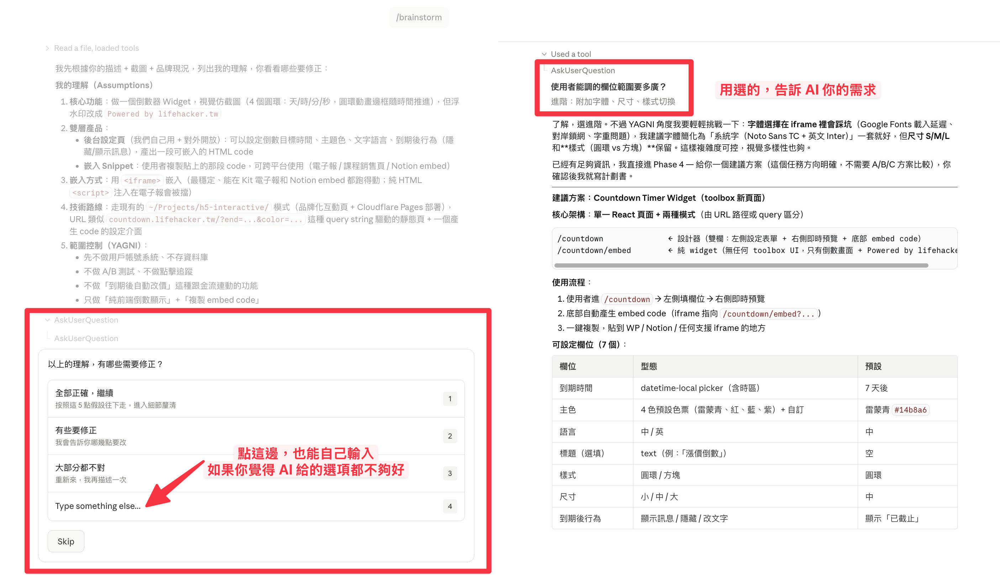
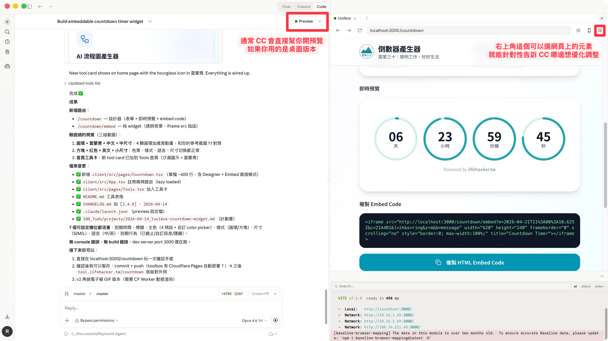

# 3-1 用 Plan Mode 讓 AI 先想清楚再動手

> **搭配裝備**：🔒 pro-kit「AI 規劃模式」（`/brainstorm`）
> **預計閱讀**：8-10 分鐘
> **前置條件**：已完成 1-1（安裝配置）、建議完成 2-1（記憶系統）

---

## 你一定遇過這個問題：AI 做了一堆，但都不是你要的

你有沒有這種經驗：跟 AI 說「幫我做一個 XXX」，結果它花了五分鐘寫了一大堆 code，你打開一看，完全不是你要的。

改了一輪、兩輪、三輪，改到最後你心裡想：「我自己做搞不好比較快。」

問題不在 AI 不夠聰明，問題在你讓它「先做再想」。

這篇要教你的，就是怎麼讓 AI 「先想清楚再動手」。

---

## 一、內建的 Plan Mode：你已經有的武器

Claude Code 有一個內建功能叫 **Plan Mode**。開啟的方式很簡單：

1. **快捷鍵**：按 `Shift + Tab` 切換（Normal Mode ↔ Plan Mode）
2. **打字切換**：在輸入框打 `/plan` 也可以

Plan Mode 開啟後，AI 會先列出它打算做什麼，讓你確認後再執行。

### Plan Mode 的好處

- AI 會先列出步驟，不會直接動手
- 你可以看到 AI 的「思路」，發現偏差及時修正
- 複雜任務不會一口氣做完，而是分階段讓你確認

### Plan Mode 的限制

但 Plan Mode 有個根本的限制：**它只是讓 AI 列計劃，不會幫你釐清需求。**

如果你自己都不確定要什麼，Plan Mode 列出來的計劃也不會對。AI 會根據它的「猜測」列計劃，而這個猜測可能跟你想的完全不同。

打個比方：
- Plan Mode 像是你跟裝潢師傅說「幫我裝修房子」，師傅說「好，我先列個施工計劃」。計劃列出來了，但如果你連要幾房幾廳都沒決定，這個計劃有什麼用？
- 你需要的是在列計劃「之前」，先有人幫你問：你住幾個人？有沒有小孩？需要書房嗎？預算多少？

這就是 `/brainstorm` 要做的事。

---

## 二、/brainstorm：Plan Mode 的加強版

> [!IMPORTANT]
> 🔒 **pro-kit 04：AI 規劃模式** — 安裝後你的 Claude Code 會多一個 `/brainstorm` 指令。
> 把 `04-brainstorm.md` 的內容丟給 Claude Code，跟它說「幫我安裝 AI 規劃模式」。

`/brainstorm` 是我們打造的一個 Skill（Claude Code 的技能擴充），它做的事情比 Plan Mode 多很多：

| | Plan Mode（內建） | /brainstorm（pro-kit） |
|:--|:--|:--|
| **啟動方式** | `Shift+Tab` 或 `/plan` | `/brainstorm` + 你的想法 |
| **AI 會做什麼** | 列出執行步驟 | 先釐清需求 → 討論方案 → 再列步驟 |
| **互動方式** | 你看計劃，說 OK 或要改 | AI 一步步問你問題，用選項框回答 |
| **適合什麼時候** | 你已經知道要做什麼，只是要 AI 列步驟 | 你有個想法，但還沒想清楚細節 |
| **產出** | AI 腦中的計劃（對話裡看得到） | 一份存檔的計劃書（之後可以重複使用） |

**簡單記法**：
- 想法很清楚 → 用 Plan Mode
- 想法很模糊 → 先用 `/brainstorm`，再執行

---

## 三、/brainstorm 實際走一次

讓我用一個真實例子帶你看 `/brainstorm` 的完整流程。

### 情境：你想做一個「每日名言」的桌面小工具

你在 Claude Code 裡輸入：

```
/brainstorm 我想做一個每天早上會在桌面跳出一句名言佳句的小工具
```

### Phase 1：AI 先幫你分類

AI 會跳出一個選項框：

> 🤔 這比較像是哪一種？
> 1. 🆕 做一個新東西 ← 你選這個
> 2. 🔧 解決一個問題
> 3. ✨ 改善現有的東西
> 4. 🤔 我還不確定

### Phase 2：AI 列出它的理解

AI 會花幾秒鐘掃描你的專案，然後列出它的假設：

> 根據你的描述，我先列出我的理解：
>
> 1. **目標**：每天早上自動顯示一句名言佳句
> 2. **呈現方式**：桌面通知（macOS 原生通知）
> 3. **名言來源**：內建一個名言資料庫
> 4. **語言**：中文名言為主
> 5. **觸發方式**：開機自動執行
>
> 以上有要修正的嗎？

你發現第 2 點不對，你想要的是一個漂亮的小視窗，不是系統通知。你選「有些要修正」然後告訴 AI。

### Phase 3：AI 問你細節問題

接下來 AI 會一次問一個問題，都是選擇題：

> 「名言來源你想要哪種？」
> 1. 📚 內建 100 句經典名言（最簡單，離線可用）← 推薦
> 2. 🌐 從網路 API 即時抓取（名言更多，但需要網路）
> 3. ✍️ 自己輸入收藏的名言（最客製）
> 4. 以上都不是，我想要的是...

大概 3-4 個問題後，AI 就會進入下一階段。

### Phase 4：AI 提出方案

> | | 方案 A：Electron 桌面 App | 方案 B：macOS 原生 SwiftUI | 方案 C：網頁 + 開機自動開 |
> |:--|:--|:--|:--|
> | **做法** | 用 HTML/CSS 做介面 | 寫 Swift 原生 App | 做成網頁，設定開機自動打開 |
> | **優點** | 跨平台、設計自由度高 | 輕量、系統整合好 | 最簡單、不用安裝 |
> | **缺點** | 比較吃資源 | 只能 Mac 用 | 沒有桌面 App 的感覺 |
>
> 💡 我推薦方案 C，因為你是第一次做這種工具，先用最簡單的方式驗證想法。

### Phase 5：AI 產出計劃書

確認方案後，AI 會寫一份計劃書存到你的專案裡。

### Phase 6：問你要不要開始

> 計劃書好了！你想怎麼做？
> 1. 🚀 現在就開始執行！
> 2. 📝 我想先修改計劃書
> 3. 💾 先存著，之後再做

如果你選 1，AI 就會退出規劃模式，按照計劃書一步步幫你做。

### 真實案例：我用 /brainstorm 做了一個倒數器小工具

上面的流程講起來有點抽象，來看我自己前幾天用 `/brainstorm` 實際跑過的一次，把「我想要一個倒數器小工具」從一句話，變成一個真的能用的網頁工具。

**Phase 1-4：釐清需求 + 提方案**

我只丟了一句「我想做一個倒數器 widget」，`/brainstorm` 先幫我掃了一下現有的 toolbox 專案，列出它對這個需求的理解（要幾種倒數模式？放哪裡？要跟現有風格一致嗎？），確認完之後直接提出三個方案讓我挑：



最棒的是，**這整段我完全沒寫半行 code**，也沒有 AI 跑去亂建檔案。它就是逼我先想清楚「到底要什麼」。

**Phase 5-6：計劃書 + 一鍵執行**

選完方案、確認計劃書之後，我按下「現在就開始執行」，AI 才開始真的動手開檔案、寫 code、裝進 toolbox 的既有架構裡：



從一句模糊的想法，到一個真的跑起來的工具，中間沒有「這不是我要的，重做」這種輪迴。

**👉 完成的成果**：[Facebook 貼文：我做了一個倒數器小工具](https://www.facebook.com/share/p/1E8qNsjAvg/)

這就是 `/brainstorm` 跟「直接叫 AI 做」最大的差別，**先把腦袋釐清，再讓 AI 動手**，成品一次到位。

---

## 四、什麼時候用 Plan Mode，什麼時候用 /brainstorm？

這裡給你一個簡單的判斷流程：

```
你要請 AI 做一件事
    │
    ├─ 你能用兩句話清楚描述嗎？
    │   ├─ YES → 用 Plan Mode（Shift+Tab）
    │   └─ NO → 用 /brainstorm
    │
    └─ 做完如果不對，改起來很麻煩嗎？
        ├─ YES → 用 /brainstorm（先想清楚比較保險）
        └─ NO → 直接做（反正改很快）
```

**常見情境對照**：

| 情境 | 建議 | 為什麼 |
|:--|:--|:--|
| 「幫我加個按鈕」 | 直接做 | 太簡單了 |
| 「把這段 code 改成 TypeScript」 | Plan Mode | 你知道要什麼，只是步驟多 |
| 「我想做一個自動化工作流」 | /brainstorm | 需要先釐清做什麼 |
| 「幫我重構這個專案架構」 | /brainstorm | 影響範圍大，要先規劃 |
| 「修一下這個 bug」 | Plan Mode | 通常問題明確 |
| 「我有一個 App 的點子...」 | /brainstorm | 連你自己都還沒想清楚 |

---

## 五、進階：這個 Skill 是怎麼來的？（原版 vs 雷蒙優化版）

> [!TIP]
> 這段是寫給對 AI 工具生態有好奇心的你。看完你會更理解 Claude Code 的 Skill 是怎麼設計的，以及為什麼「同樣叫 brainstorm，體感差很多」。

`/brainstorm` 不是我們從零發明的，它站在開源社群的肩膀上，然後我們花了很多時間，把「工程師導向的原版」改成「非工程師也能 5 分鐘上手的版本」。

### 原版：obra/superpowers 的 brainstorming skill

[obra/superpowers](https://github.com/obra/superpowers) 是目前 Claude Code 社群中最知名的 Skill 套件之一，由 Jesse Vincent 開發（MIT 授權）。它的 brainstorming skill 有一個核心設計：**HARD-GATE**：在設計文件被確認前，AI 絕對不會開始寫 code。這個「不准先動手」的鐵則，是整個 brainstorm 流程能成立的靈魂，我們完整保留了下來。

但原版本質上是給工程師用的，功能非常「完整」也非常「重」：

- **瀏覽器視覺化工具**：用 WebSocket 即時推送設計圖到瀏覽器，要自己跑 server
- **多 Agent Spec 審查**：同時開好幾個 subagent 互相 review 設計文件
- **Git 自動 commit**：寫完設計文件就自動下 git commit
- **串接下一個 Skill**：brainstorming 完還要跳到 writing-plans skill 才能產出實作計劃
- **輸出格式**：工程規格（spec）文件，滿滿技術名詞
- **對話介面**：純英文純文字，全部自己打字回答

對工程師來說這是一整套專業流程；對第一次用 Claude Code 的學員來說，光是把它裝起來就會卡住。

### 我們簡化與優化了哪些部分

以下是完整的對照表，每一行都是雷蒙實際試用原版後，覺得「小白一定會卡住」才動手改的：

| 項目 | obra 原版 | 雷蒙優化版（/brainstorm） | 為什麼要改 |
|:--|:--|:--|:--|
| **語言** | 全英文 | 繁體中文、親切語氣 | 降低閱讀門檻，看得懂才用得起來 |
| **互動方式** | 純文字對話，自己打字 | 選項框（AskUserQuestion） | 不會打字、不知道怎麼答，點一下就好 |
| **溝通模式** | 預設工程師語言 | 開場先選「小白 / 半技術 / 工程師」 | 同一個 Skill，三種人都能無痛用 |
| **假設驗證** | 直接從零問你要什麼 | AI 先掃專案列出假設讓你修正 | 從修正比從零回答快 10 倍 |
| **專案分類** | 一套問題問到底 | 先問是新做 / 除錯 / 優化，再問對應問題 | 不同類型本來就該問不同問題 |
| **視覺輔助** | WebSocket 瀏覽器模擬器 | 移除 | 要自己跑 server，小白裝不起來 |
| **審查機制** | 多 subagent 互相 review | AI 內建 self-review（四項自檢） | 一個 AI 搞定，不用開多視窗 |
| **輸出格式** | 工程規格文件（spec） | 口語化計劃書（含白話版步驟） | 非工程師要看得懂才有用 |
| **存放位置** | 指定系統資料夾 | 你自己的專案 `100_Todo/plans/` | 檔案放在你看得到的地方 |
| **Git 操作** | 自動 `git commit` 設計文件 | 完全不碰 Git | 初學者還沒學 Git，不該被嚇到 |
| **收斂機制** | 無 | 不耐煩偵測 + 強制收斂 | 不會問到天荒地老，用戶喊停就停 |
| **後續銜接** | 還要再裝 writing-plans Skill 才能出計劃 | 一個 Skill 從釐清到計劃書一次到位 | 一步到位，不用學一堆指令 |
| **語言鐵則** | 無 | 執行階段也強制繁體中文 | 避免 AI 進入 code 模式後偷偷切英文 |

簡單說，我們做的事情是，**把一套給資深工程師的嚴謹流程，改造成非工程師也能 5 分鐘上手、而且真的用得下去的版本**。HARD-GATE 和 Assumptions Mode 這兩個核心靈魂保留下來，其他對小白不友善的部分，全部重寫或移除。

### 其他值得參考的同類作品

除了 obra/superpowers，還有一個台灣工程師的作品也很推薦給想研究得更深的人：

- **[Spectra](https://github.com/kaochenlong/spectra-app)**（高見龍 老師開發），Windows / Mac 都能用的桌面 App，走更完整的「討論 → 提案 → 執行 → 歸檔」專案管理路線，UI 做得很漂亮。如果你想了解完整的工程師如何用 SDD（Spec-Driven Development）做規格開發，非常建議向他學習。不過如果你只是想開發一般小工具、網頁，沒有要營利的大專案，其實懂得用以上雷蒙的引導提問法，就能做出不錯的成果了。

這就是站在巨人肩膀上的概念：學習別人的好設計，拆解它、重組它，做出更適合自己受眾的版本。`/brainstorm` 背後這張對照表，就是雷蒙花在「幫你把複雜的東西變簡單」的時間。

---

## 重點回顧

1. **Plan Mode 是 Claude Code 的內建功能**：按 `Shift+Tab` 就能用，AI 會先列計劃再做
2. **Plan Mode 的限制**：它只列計劃，不幫你釐清需求
3. **`/brainstorm` 是 Plan Mode 的加強版**：先釐清需求、討論方案、做決策，然後才產出計劃書
4. **判斷原則**：想法清楚用 Plan Mode，想法模糊用 `/brainstorm`
5. **不用怕流程長**：簡單任務 2-3 分鐘就走完，AI 會根據複雜度自動調整

> [!IMPORTANT]
> 🔒 **pro-kit 04：AI 規劃模式** — 安裝 `/brainstorm` 指令
> 把 pro-kit 裡的 `04-brainstorm.md` 丟給 Claude Code，跟它說「幫我安裝 AI 規劃模式」，3 分鐘搞定。

---

⬅️ 上一章節：[2-4 AI 分身資料夾結構：雷小蒙拆解](2-4%20AI%20%E5%88%86%E8%BA%AB%E8%B3%87%E6%96%99%E5%A4%BE%E7%B5%90%E6%A7%8B%EF%BC%9A%E9%9B%B7%E5%B0%8F%E8%92%99%E6%8B%86%E8%A7%A3.md) ｜ ➡️ 下一章節：[3-2 擁有一份 DESIGN.md，品牌社群圖卡 & 簡報自動生成](3-2%20%E6%93%81%E6%9C%89%E4%B8%80%E4%BB%BD%20DESIGN.md%20%E5%93%81%E7%89%8C%E7%A4%BE%E7%BE%A4%E5%9C%96%E5%8D%A1%20%26%20%E7%B0%A1%E5%A0%B1%E8%87%AA%E5%8B%95%E7%94%9F%E6%88%90.md)
