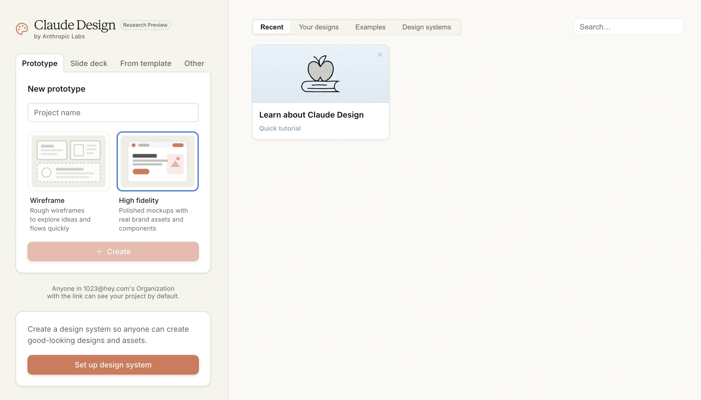
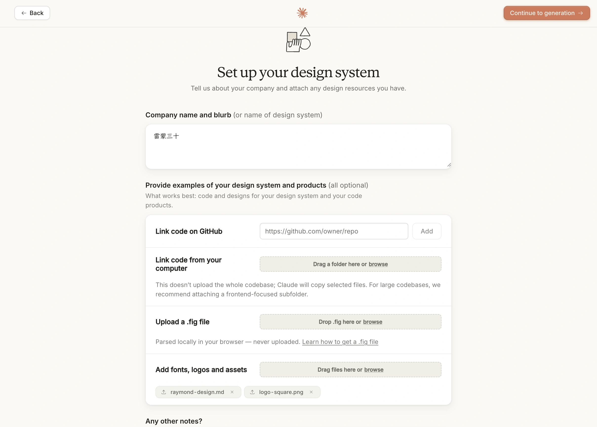
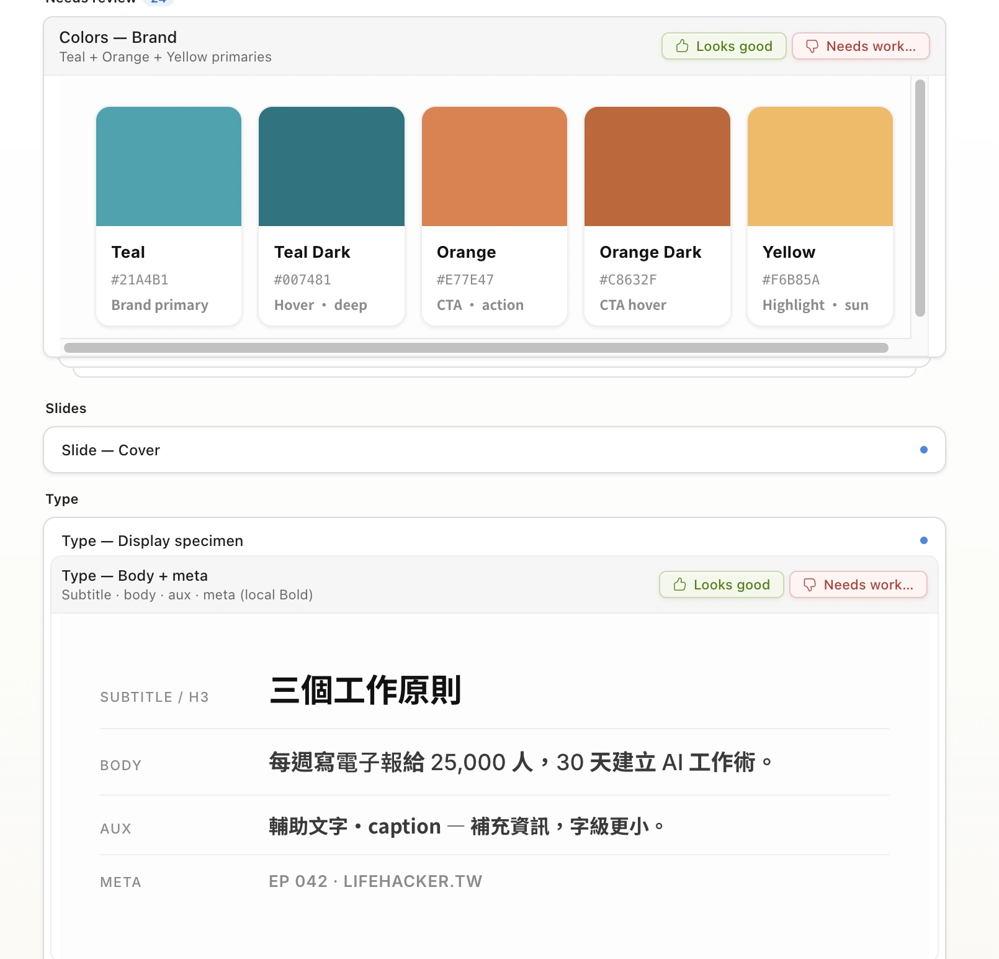
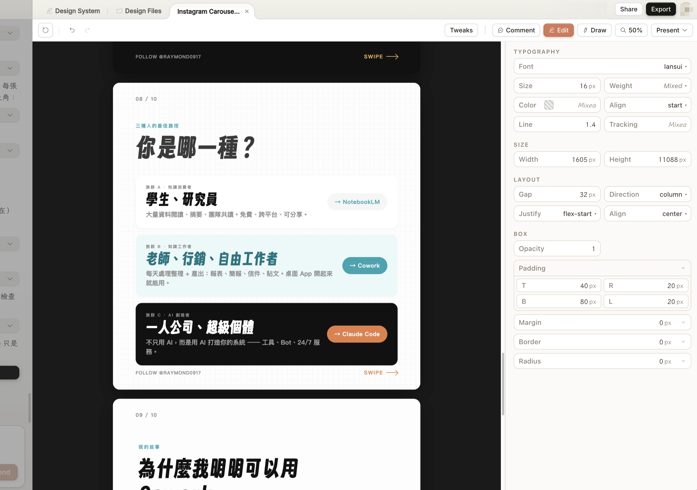
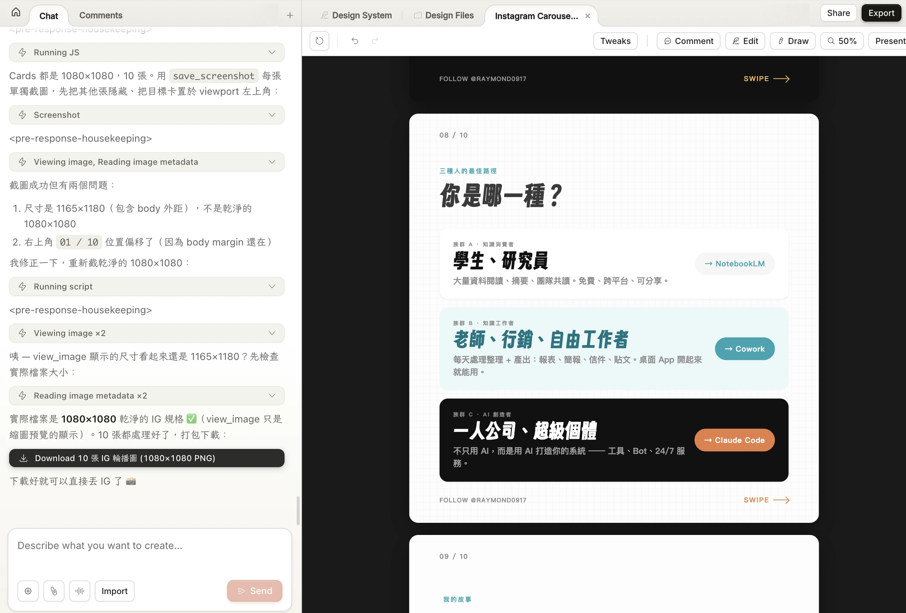
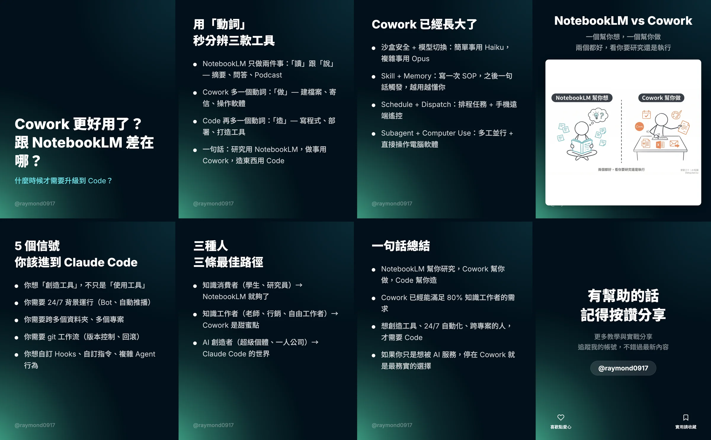
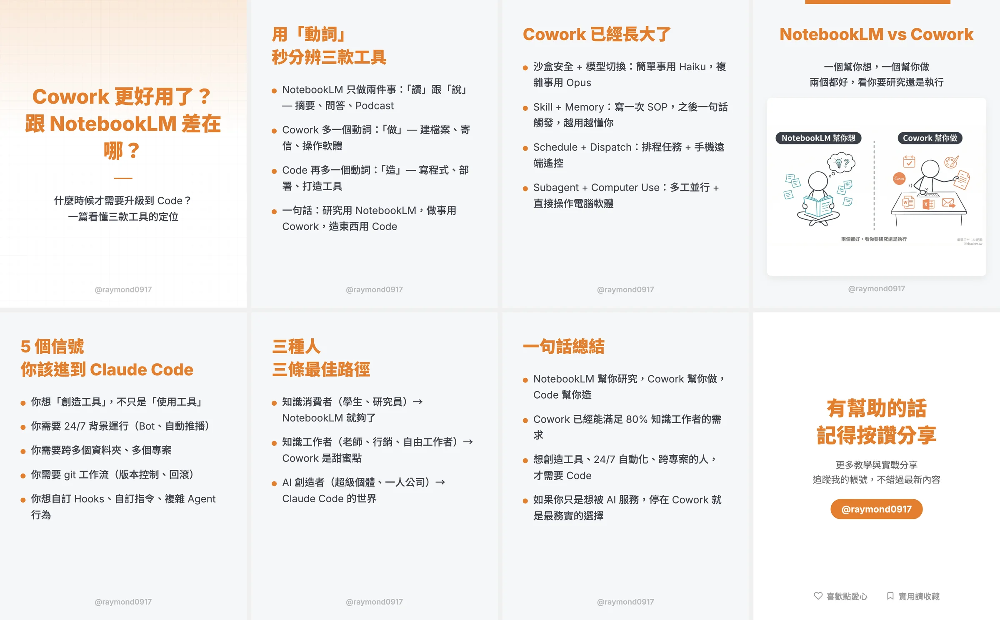
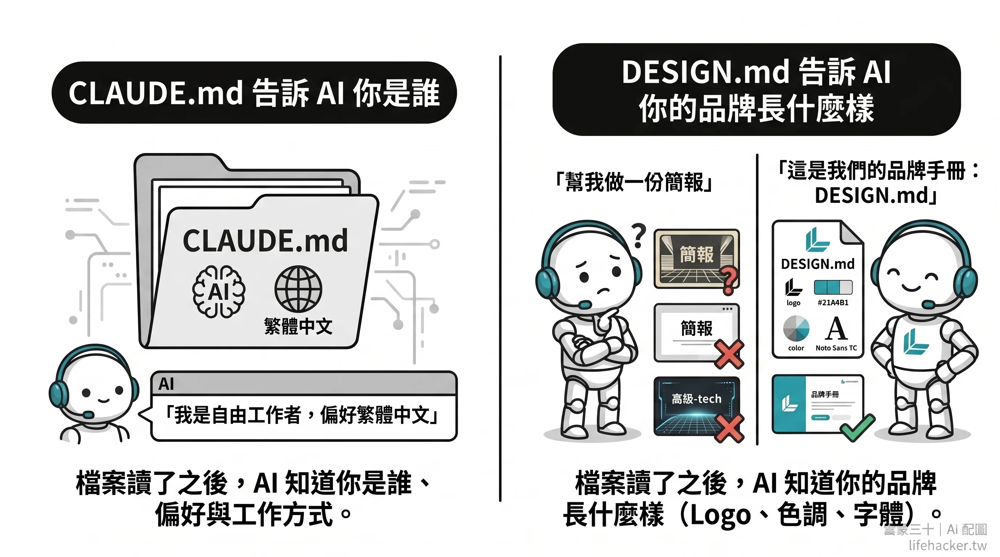

# 3-2 建立 DESIGN.md 品牌說明書（社群圖卡 & 簡報自動生成）

> **搭配裝備**：🔒 pro-kit「社群圖卡產生器」（`/cards`）
> **預計閱讀**：15-18 分鐘
> **前置條件**：已完成 [1-1（安裝配置）](1-1%20%E9%96%8B%E5%A7%8B%E5%AE%89%E8%A3%9D%E9%85%8D%E7%BD%AE%E4%BD%A0%E7%9A%84%20Claude%20Code.md)

---

## 你一定遇過這個問題：光做一張圖卡，就要花一小時

你寫了一篇不錯的文章，想分享到 IG。

打開 Canva，光選模板就花 20 分鐘，調字體配色又一個小時。做完還是不滿意，每次做出來的配色都不一樣，也沒有「品牌感」。

只是想要把這段文字變成好看的圖，怎麼這麼麻煩？

這篇教你兩條路：一條是 Anthropic 官方剛推出的 Claude Design，另一條是我們用 Claude Code 從零打造的 `/cards` Skill。

---

## Claude Design：官方的視覺設計工具

2026-04-17，Anthropic 推出了 [Claude Design](https://www.anthropic.com/news/claude-design-anthropic-labs)，一個專門做視覺設計的產品，由最新的 Claude Opus 4.7 驅動。

<p align="center">
  
</p>

**如果你只是想快速做出好看的圖卡、簡報、銷售頁**，Claude Design 是目前最簡單的方式：

| 功能 | 說明 |
|:--|:--|
| **對話式設計** | 描述你要什麼，Claude 直接生成完整設計 |
| **直接在畫面上改** | 點選元素、留 inline comment、拖拉調整，不用打字描述「第 3 張文字太長」 |
| **品牌設計系統** | 第一次使用時 Claude 會讀你的程式碼和設計檔，自動建立設計系統。之後每個專案自動套用 |
| **多格式匯出** | PDF、PPTX、HTML，或一鍵送到 Canva 繼續編輯 |
| **Handoff 給 Claude Code** | 設計確認後，Claude 會打包成 handoff bundle，一個指令就能交給 Claude Code 實作 |
| **團隊協作** | 組織內分享連結、多人同時編輯、一起跟 Claude 對話 |

適合的場景：IG 圖卡、簡報投影片、產品 wireframe、pitch deck、landing page、行銷素材。

**需要 Claude Pro / Max / Team / Enterprise 訂閱**，到 [claude.ai/design](https://claude.ai/design) 就能開始。

### 用 Claude Design 做一組 IG 圖卡

具體怎麼用？走一次流程你就懂了。

**Step 1：建立你的品牌設計系統**

第一次打開 Claude Design，它會問你品牌的基本資訊。你可以：

- **上傳你的網站截圖或 Logo**：Claude 會自動辨識你的品牌色、字體風格，幫你生成一套設計系統
- **貼上你的 DESIGN.md**：Claude 直接讀取，套用到所有專案
- **用對話描述**：「我的品牌是溫暖的橘色系，字體用圓體，風格簡潔明亮」，Claude 會幫你建出完整設計系統

這個設計系統只需要建一次。之後每個新專案都會自動套用你的品牌色、字體、元件風格。

<p align="center">
  
</p>

<p align="center">
  
</p>

**Step 2：開一個新專案**

跟 Claude 說你要做什麼：

```
我寫了一篇關於 Claude Code 桌面版 vs 終端機的教學文章
[貼入內容]
請幫我做成一組 IG 輪播圖卡（1080x1350），6 張
```

Claude 會直接生成一組完整有你品牌風格的圖卡，包含封面、內容頁、結尾 CTA。

**Step 3：直接在畫面上修改**

這是 Claude Design 最強的地方，你不用打字描述要改什麼，直接在設計上操作：

- **點選文字**就能改內容
- **在某個元素旁邊留 comment**——「這裡字太小了」「換成深色背景」
- **用調整滑桿**微調間距、字級、圓角
- 改完一張，跟 Claude 說「把這個風格套用到所有圖卡」，一次改全部

<p align="center">
  
</p>

**Step 4：匯出**

滿意之後，選擇匯出格式：
- **PNG / PDF**：直接發 IG 或印出來
- **HTML**：放到網站上
- **送到 Canva**：如果你想在 Canva 裡繼續加動畫、濾鏡
- **Handoff 給 Claude Code**：如果設計需要寫成真的網頁程式碼

<p align="center">
  
</p>

### Claude Design vs Claude Code `/cards`：怎麼選？

| | Claude Design | Claude Code `/cards` |
|:--|:--|:--|
| **適合誰** | 所有人，不需要技術背景 | 偏好終端機操作、想完整控制輸出的人 |
| **操作方式** | 圖形介面，點選修改 | 純文字對話，在終端機裡操作 |
| **品牌設定** | 上傳截圖 / Logo，自動辨識 | 手動建立 DESIGN.md |
| **修改方式** | 直接在畫面上點、拖、留 comment | 打字描述「第 3 張文字太長」 |
| **匯出格式** | PNG / PDF / PPTX / HTML / Canva | PNG（透過 Puppeteer 截圖） |
| **學到什麼** | 快速產出 | 理解 AI 工作流的設計原理 |

想學「怎麼從零打造 AI 工作流」→ 繼續往下看 `/cards` 的做法。兩者學到的觀念（品牌設計系統、版型拆解、內容結構化）是共通的。

---

## 用 Claude Code 打造 `/cards` Skill

在 Claude Design 推出之前，我們用 Claude Code 做了一套圖卡自動生成的 Skill。

下面帶你看我們怎麼做的，以及背後的原理，這些觀念（DESIGN.md、品牌一致性、版型系統）不管用什麼工具都適用。

### 先看成果

在教你怎麼做之前，先讓你看看最後出來的東西長什麼樣。

以下是我用[同一篇文章](https://raymondhouch.com/lifehacker/digital-workflow/claude-cowork-vs-notebooklm-vs-code/)，分別用兩套配色做出來的圖卡：

### 🔵 藍黑系 — 科技感

適合教學、工具介紹、技術分享。深色背景讓文字和截圖更突出。

<p align="center">
  
</p>


### 🟠 橘白系 — 溫暖感

適合觀點分享、心得、生活風格內容。淺色背景看起來乾淨明亮。

<p align="center">
  
</p>

**兩套配色，同一篇文章，AI 全自動生成。** 從丟文章到拿到 PNG，都不做修改的話不到 5 分鐘。

---

## 背後的原理：DESIGN.md

不管你用 Claude Design 還是 Claude Code，或是其他 AI 工具，如果你不告訴它你的品牌規範、色彩，AI 就會用它自己的「預設審美」。而且每次做出來的風格都不一樣，因為 AI 每次都不斷的猜。

解決方法：**給 AI 一份「品牌說明書」**

### CLAUDE.md 告訴 AI 你是誰，DESIGN.md 告訴 AI 你的品牌長什麼樣？

<p align="center">
  
</p>

你在基礎篇 [2-1](2-1%20%E8%AE%93%20AI%20%E8%A8%98%E4%BD%8F%E4%BD%A0%E7%9A%84%E5%81%8F%E5%A5%BD.md) 學過 CLAUDE.md，它是 AI 的「個人說明書」，讓 AI 知道你的偏好和工作方式。

**DESIGN.md 就是你品牌的說明書**

| 檔案          | AI 讀了之後知道 | 例子                             |
| :---------- | :-------- | :----------------------------- |
| `CLAUDE.md` | 你是誰、怎麼工作  | 「我是自由工作者，偏好繁體中文」               |
| `DESIGN.md` | 你的品牌長什麼樣  | 「主色青綠 #21A4B1 字體 Noto Sans TC」 |

如果你只告訴 AI 說「幫我做一份簡報」，每次拿到的風格都不一樣。但如果你給他一本品牌手冊：「我們的 Logo 是這個、主色是這個、標題永遠用這個字體」，AI 就能做出風格一致的東西。

有了 DESIGN.md，AI 每次幫你做圖、做網頁、做簡報，風格都會一致，不管你做 10 張還是 100 張，出來的東西都像同一個品牌做的。

> [!TIP]
> Claude Design 用圖形介面讓你建立和管理設計系統；DESIGN.md 用一個文字檔達成同樣的事。你在 Claude Design 建立的設計系統，也可以匯出成 DESIGN.md 給 Claude Code 用，反之亦然。

你不需要一開始就寫出完美的設計系統。
一份能用的 DESIGN.md，最少只需要三件事：**品牌色、字體、風格關鍵字**。

```markdown
# My Brand Design System

## 色彩
- 主色：#7C3AED（紫色）
- 強調色：#F59E0B（琥珀黃）
- 背景：#FAFAFA（淺灰白）
- 文字：#1A1A1A（近黑）

## 字體
- 標題：Noto Sans TC Bold
- 內文：Noto Sans TC Regular
- 英文：Inter

## 風格
- 簡潔現代、留白多、圓角 12px
- 不要漸層、不要陰影過重、不要太多顏色
```

AI 讀了這份檔案之後，就知道你要紫色系、簡潔風格、用思源黑體（Noto Sans TC）。之後不管做圖卡、做簡報、做 Landing Page，風格都會一致。

隨著你用久了、對品牌感有更多想法，再慢慢補上按鈕樣式、排版規則就好。

### DESIGN.md 完整版可以包含什麼？

如果你想做得更完整，[Google Stitch](https://stitch.withgoogle.com/docs/design-md/overview/) 提出了一個標準格式，涵蓋 7 個段落：

| #   | 段落              | 定義什麼                     |
| :-- | :-------------- | :----------------------- |
| 1   | 視覺主題與氛圍         | 整體風格（科技感？溫暖？極簡？）         |
| 2   | 色彩系統            | 主色、強調色、背景色、文字色（附 hex 色碼） |
| 3   | 字體規則            | 標題字體、內文字體、大小層級           |
| 4   | 元件樣式            | 按鈕、卡片、輸入框長什麼樣            |
| 5   | 排版原則            | 間距、留白、網格                 |
| 6   | 深度與陰影           | 卡片的陰影、層次感                |
| 7   | Do's and Don'ts | 設計守則（該做的和不該做的）           |

看起來很多？

你完全可以從上面那 20 行的最小版開始，讓 AI 幫你擴充。跟 Claude Code 說「幫我把這份 DESIGN.md 補完整，參考 Google Stitch 的標準格式」，它就會幫你生成剩下的段落。

### 怎麼建立你的 DESIGN.md？

很多人卡在「我沒有品牌色」這一步。其實你不需要是設計師，只要回答三個問題：

1. **你喜歡什麼顏色？** 打開你的 IG，看看你最常發的照片是什麼色調。暖色系（橘、黃、粉）？冷色系（藍、綠、紫）？
2. **你想給人什麼感覺？** 
	- 專業可靠 → 深藍、深綠
	- 溫暖親和 → 橘、珊瑚
	- 創意大膽 → 紫、螢光。
3. **你欣賞哪個品牌的視覺？** 

**找靈感的配色資源**

| 網站                                                 | 特色                                | 適合            |
| :------------------------------------------------- | :-------------------------------- | :------------ |
| [Coolors](https://coolors.co/)                     | 按空白鍵隨機生成 5 色配色，鎖定喜歡的繼續換           | 完全沒想法，想隨機探索   |
| [Realtime Colors](https://www.realtimecolors.com/) | 即時預覽你選的顏色套在真實網頁上的效果               | 想看顏色實際用起來長什麼樣 |
| [Happy Hues](https://www.happyhues.co/)            | 精選配色方案，每組都附上完整的網頁範例               | 想直接挑一組現成的配色   |
| [Color Hunt](https://colorhunt.co/)                | 社群票選的配色卡，可按「warm」「pastel」「neon」篩選 | 想找特定氛圍的配色     |
| [Muzli Colors](https://colors.muz.li/)             | 輸入一個顏色，自動生成完整配色方案                 | 已經有主色，想搭配其他顏色 |

有了一個主色，AI 就能幫你搭配剩下的顏色。你甚至可以把配色網站的截圖直接貼給 Claude，說「我喜歡這組配色，幫我建 DESIGN.md」。

#### 方式一：讓 AI 幫你生成（推薦）

跟 Claude Code 或 Claude Design 說：

```
幫我建立一份 DESIGN.md，我的品牌資訊如下：
- 品牌名稱：XXX
- 主色：紫色 #7C3AED
- 風格：簡潔現代
- IG 帳號：@xxx
```

AI 會根據你提供的資訊，自動生成一份完整的 DESIGN.md，包含色彩搭配、字體建議、元件樣式。你看過確認就好。

如果用 Claude Design，它會在 onboarding 流程直接引導你完成這件事，連打指令都不用。

#### 方式二：上傳現有素材讓 AI 辨識

如果你已經有自己的網站、IG 頁面、或之前做過的設計，可以：

- **Claude Design**：用內建的 web capture 工具抓你的網站畫面，Claude 自動分析配色和風格
- **Claude Code**：截圖你的網站或 IG 貼給它，說「根據這些截圖，幫我建立 DESIGN.md」

AI 會從你現有的視覺素材裡，辨識出你正在使用的顏色、字體、排版風格，幫你整理成一份系統化的設計規範。

#### 方式三：從現有品牌複製（進階）

如果你喜歡某個品牌的設計風格，可以直接用別人寫好的 DESIGN.md 當起點。

[**Awesome DESIGN.md**](https://github.com/VoltAgent/awesome-design-md) 是一個開源收藏庫（⭐ 51K+），裡面收錄了 66 個知名品牌的 DESIGN.md，從這些品牌的公開網站萃取出設計規範：

| 分類 | 品牌範例 |
|:--|:--|
| AI 工具 | Claude、Mistral AI、Ollama、Replicate |
| 開發者工具 | Cursor、Vercel、Warp、Raycast |
| 生產力 SaaS | Notion、Linear、Zapier、Cal.com |
| 設計工具 | Figma、Framer、Webflow、Airtable |
| 消費品牌 | Apple、Nike、Spotify、Airbnb |
| 金融科技 | Stripe、Revolut、Coinbase |

**怎麼用？**

1. 到 [awesome-design-md](https://github.com/VoltAgent/awesome-design-md) 找一個你喜歡的風格
2. 點進去，複製那個品牌的 `DESIGN.md` 內容
3. 貼給你的 Claude Code，說「用這個當我的設計基礎，幫我調整成我的品牌色」

例如你喜歡 Notion 的溫暖簡約風，就複製 Notion 的 DESIGN.md，然後請 AI 把顏色換成你的品牌色。

---

## 怎麼做安裝我們的圖卡 Skill？

### Step 1：安裝 `/cards`

> [!IMPORTANT]
> 🔒 **pro-kit 05：社群圖卡產生器** — 安裝 `/cards` 指令
> 把 pro-kit 裡的 `05-social-cards.md` 丟給 Claude Code，跟它說「幫我安裝社群圖卡產生器」，10 分鐘搞定。

安裝後，你的 Claude Code 會多一個 `/cards` 指令，以及兩套配色模板。

### Step 2：給 AI 你的內容

三種方式，看哪個方便：

| 方式 | 你做的事 | AI 做的事 |
|:--|:--|:--|
| **貼網址** | `/cards https://你的文章.com` | 自動抓取文章內容 |
| **給檔案** | `/cards 我的筆記.md` | 讀取 Markdown 檔案 |
| **直接打字** | 說「做圖卡」然後貼文字 | 直接用你貼的內容 |

### Step 3：回答 AI 的問題

AI 會問你三件事（每次都是選擇題，點一下就好）：

1. **配色**：藍黑還是橘白？
2. **尺寸**：4:5（IG 貼文）還是 1:1（IG / X 通用）？
3. **帳號**：圖卡上要顯示什麼 @handle？（只有第一次會問）

### Step 4：確認卡片規劃

AI 讀完你的內容後，會列出它打算怎麼拆，例如：

> 我把內容拆成 7 張圖卡：
>
> 1. 📘 cover — Claude Code 桌面版 vs 終端機 / 你該用哪一個？
> 2. 📝 content-text — 三種入口，同一個大腦
> 3. 📝 content-text — 一張表看完差異
> 4. 🖼️ content-image — 桌面版獨有功能（建議放截圖）
> 5. 📝 content-text — 終端機獨有功能
> 6. 📝 content-text — 新手該怎麼選？
> 7. 📢 cta — 有幫助的話記得按讚分享
>
> 第 4 張建議放截圖，你要提供嗎？

這裡你可以調整：增減張數、改標題、決定哪張要放圖片。

### Step 5：預覽 & 修改

確認後，AI 會生成圖卡並在瀏覽器打開預覽。你可以看到完整效果：

<!-- TODO：放預覽畫面截圖 -->

看到不滿意的地方？直接跟 AI 說：

> 「第 3 張文字太長了，幫我精簡」
> 「第 4 張的截圖放錯了，換這張」
> 「封面標題改成 XXX」

AI 會即時更新，重新整理瀏覽器就能看到修改後的效果。

### Step 6：匯出

確認 OK 後，跟 AI 說「匯出」，幾秒後你會拿到一組 PNG：

```
📁 output/2026-04-17-desktop-vs-terminal/
├── card-01-cover.png
├── card-02-content.png
├── card-03-content.png
├── card-04-content.png
├── card-05-content.png
├── card-06-content.png
└── card-07-cta.png
```

直接拖到 IG 就能發了。

---

4 種卡片版型一覽

每套配色都有 4 種版型，AI 會自動根據內容選擇：

| 版型 | 用途 | 什麼時候用 |
|:--|:--|:--|
| **cover** | 封面 | 每組圖卡的第 1 張，大標題 + 副標題 |
| **content-text** | 純文字內容 | 觀點、條列、比較表——不需要圖的頁面 |
| **content-image** | 文字 + 圖片 | 搭配截圖、UI 畫面、流程圖的頁面 |
| **cta** | 結尾呼籲 | 每組圖卡的最後一張，引導按讚收藏追蹤 |

你不需要記這些，AI 會自動判斷。但如果你想手動指定（例如「第 3 張我要放截圖」），直接跟 AI 說就好。

---

## 什麼內容適合做成圖卡？

| 適合 | 不適合 |
|:--|:--|
| 教學文章（步驟拆成多張卡） | 超長文（3000 字以上，內容太多塞不進去） |
| 工具比較（用表格或條列對比） | 純個人心情日記（不適合公開分享） |
| 觀點分享（一個核心觀點 + 3-4 個論點） | 需要大量圖片的內容（旅遊照片集） |
| 讀書筆記（書中金句 + 你的心得） | |
| FAQ 整理（常見問題 + 回答） | |

**黃金法則**：一張圖卡 = 一個重點。如果你的內容能拆成 5-8 個重點，就很適合做圖卡。

---

## 重點回顧

1. **Claude Design 是最快的路**：有 Claude 付費方案就能用，對話式設計 + 直接在畫面上修改 + 多格式匯出
2. **DESIGN.md 是品牌說明書**：不管用 Claude Design 還是 Claude Code，品牌設計系統都是讓 AI 輸出一致的關鍵
3. **`/cards` Skill 展示了 DIY 思路**：從零打造 AI 圖卡工作流的方法

> [!IMPORTANT]
> 🔒 **pro-kit 05：社群圖卡產生器** — 安裝 `/cards` 指令
> 如果你想用 Claude Code 的方式做圖卡，把 pro-kit 裡的 `05-social-cards.md` 丟給 Claude Code，跟它說「幫我安裝社群圖卡產生器」。

---

⬅️ 上一章節：[3-1 用 Plan Mode 讓 AI 先想清楚再動手](3-1%20%E7%94%A8%20Plan%20Mode%20%E8%AE%93%20AI%20%E5%85%88%E6%83%B3%E6%B8%85%E6%A5%9A%E5%86%8D%E5%8B%95%E6%89%8B.md) ｜ ➡️ 下一章節：[3-3 把每日反思變成自動化 Skill](3-3%20%E6%8A%8A%E6%AF%8F%E6%97%A5%E5%8F%8D%E6%80%9D%E8%AE%8A%E6%88%90%E8%87%AA%E5%8B%95%E5%8C%96%20Skill.md)
