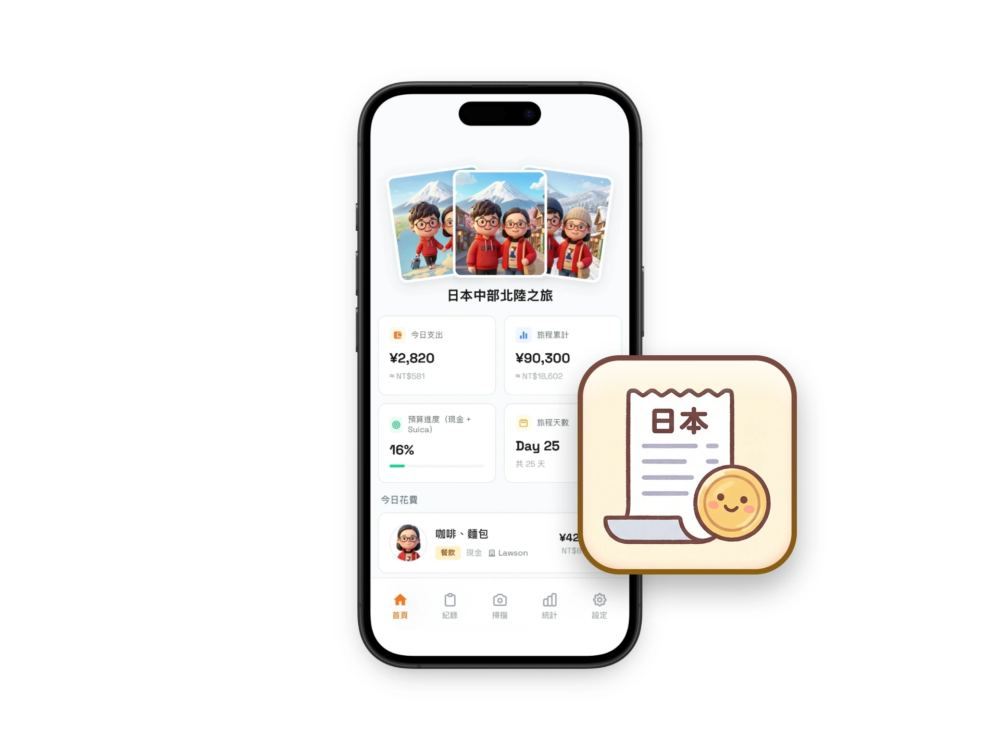
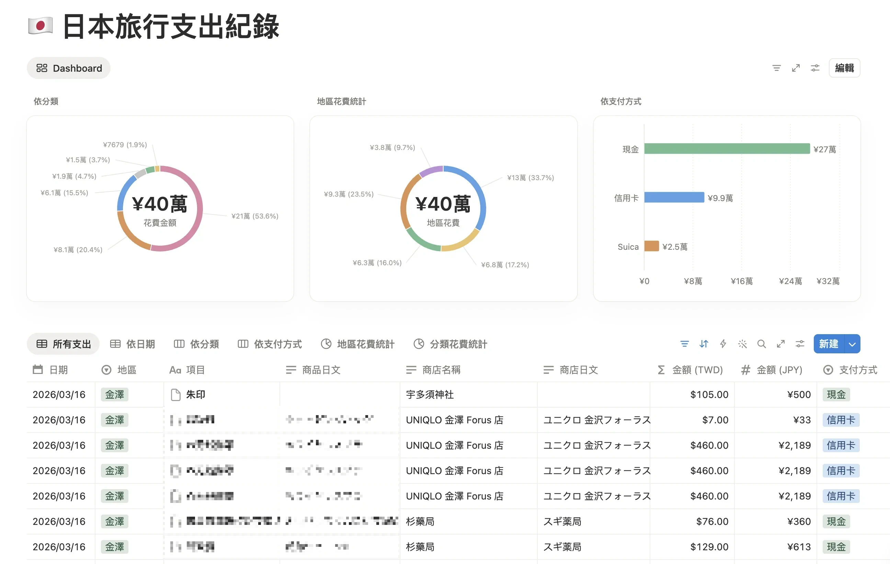
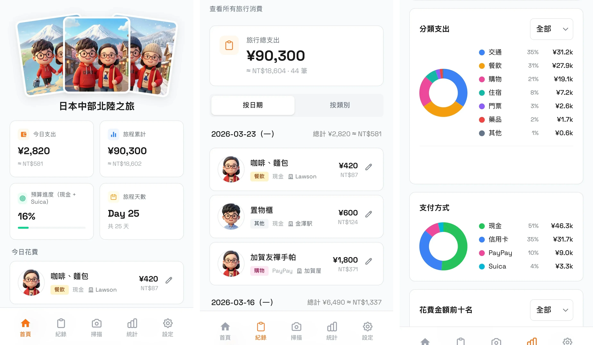
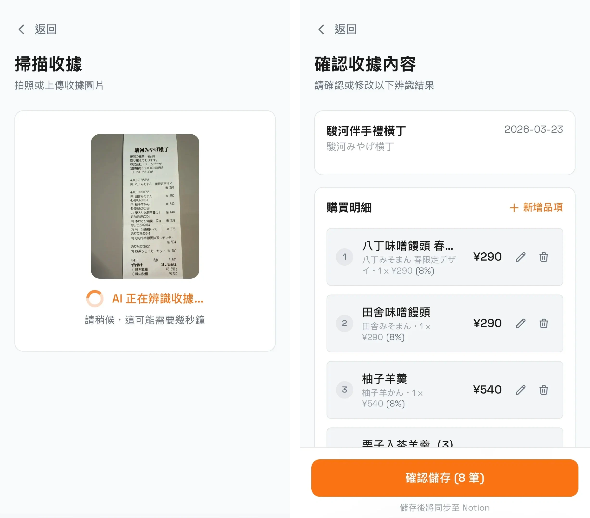
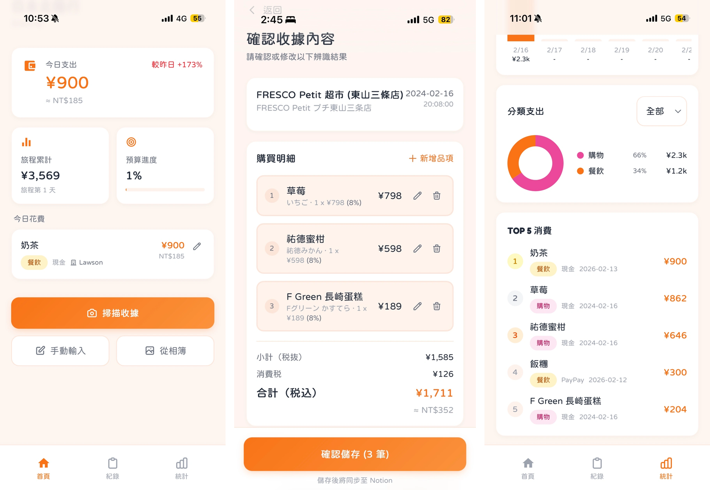

# 3-4 日本旅行 AI 拍照收據自動記帳

> **搭配裝備**：案例故事，不需要安裝任何東西
> **預計閱讀**：10-12 分鐘
> **前置條件**：已完成入門篇（1-1 ~ 1-3）

---

> [!TIP]
> **雷蒙的話：這篇是團隊夥伴的案例分享**
>
> 今年（2026）我們團隊裡的這位夥伴帶家人去日本旅行了一個月，期間他做了下面這套「拍照收據自動記帳」工具——一個我自己看了都覺得很讚的小東西，所以特別請他把整個製作、開發、架構分享出來給大家。
>
> 重點是：他**沒寫任何一行程式**。這個時代的真相就是這樣——只要有執行力、有想像力、不害怕學習，每個人都能做出比自己想像中更厲害的東西。

---

你出國旅行會記帳嗎？

我試過很多次，每次出國前都跟自己說「這次一定要好好記帳」，下載一個記帳 App，前兩天認真輸入每一筆，但大概到第三天就開始懶了，第四天直接放棄。

原因：太麻煩。

你買了一杯咖啡，掏出手機，打開 App，輸入金額，選分類，選支付方式。一杯咖啡 30 秒喝完的事，記帳要花一分鐘。

一天下來買十幾樣東西，光記帳就要花十幾分鐘。

如果是在日本，收據上都是日文，看不懂品項名稱，含稅、折扣算法也搞不清楚，想記帳前還得先翻譯！

今年二月，我跟家人去日本一個月，這次沒有下載記帳 App，我跟 AI 一起做了一個 AI 翻譯記帳網頁。

  

> [!TIP]
> 分享在 Threads 時引起廣大關注，一堆人留言想學習，原始貼文：https://www.threads.com/@chaseyhan/post/DWOEou6EUNe

---

## 從「不可能」到「上線」花了一天

### 第一階段：想清楚「要做什麼」

如果這個工具我只能做一件事，會是什麼？

答案：**拍照。**

我拍一張收據的照片，剩下的事情都讓 AI 來做：

- 辨識日文
- 翻譯成中文
- 支出分類
- 換算匯率
- 存進資料庫

> [!WARNING]
> **Vibe Coding 最容易掉進去的坑**，就是在動手之前想太多功能。你覺得「順便加一下也不難」，但每一個「順便」都可能讓你的完工時間延後一天，也會失焦。
>
> 需求定義的重點，其實是「取捨」，加功能很簡單，但決定不做什麼才是關鍵。

### 第二階段：選擇適合的工具

做這種個人工具，選工具的原則只有一個：**能讓我少做一件事的，就是好工具。**

這個專案要處理三件事：AI 辨識、存資料、讓手機能用。每一件我都選了最省事的方案：

| 需要做的事          | 我選的工具           | 為什麼選它                                                         |
| :------------- | :-------------- | :------------------------------------------------------------ |
| **AI 辨識收據**    | Gemini Flash    | 免費額度夠用整趟旅行。每天 1,500 次請求，25 天掃了近 100 張收據、新增約 500 條記錄，API 費用 $0 |
| **存資料 & 手動修正** | Notion          | AI 辨識不可能 100% 正確，Notion 本身就是介面，打開直接改。不用另外做後台管理頁面              |
| **讓手機能用**      | PWA 網頁 + Zeabur | 加到手機桌面就能用。不用申請開發者帳號、不用審核、旅行前一天做完當天就能用                         |

  

掃描的每筆收據資料都會同步到 Notion

**總成本**：每月 $5 美金的 Zeabur 開發者方案，其他都無需額外付費。

技術架構分享：

| Layer | Tech | Why |
|:------|:-----|:----|
| Framework | **Next.js 16** (App Router) | Server-side API routes + client SPA，一個框架搞定前後端 |
| Language | **TypeScript** (strict mode) | 收據資料結構複雜（稅制、多幣別），型別檢查防止計算錯誤 |
| Styling | **Tailwind CSS v4 + 自訂 Design Tokens** | Tailwind utilities 搭配 CSS variables 管理色彩與元件樣式 |
| AI / OCR | **Google Gemini 2.0 Flash** | 圖片辨識 + 日文翻譯 + 結構化輸出，一個 API call 搞定 |
| Database | **Notion API** | 免費、有 UI 可以手動編輯、方便匯出，適合旅行記帳場景 |
| Deployment | **Zeabur** | 自動偵測 Next.js，zero-config 部署 |

> [!TIP]
> 想看完整技術架構：[japan-receipt-tracker-stack](https://github.com/chasehuang/japan-receipt-tracker-stack)

### 第三階段：最花時間的，是教 AI 怎麼算帳

你可能覺得「叫 AI 辨識收據」這件事很簡單——丟一張照片進去，它就會告訴你上面寫了什麼。但整個專案最花時間的，是讓 AI 了解「日本收據該怎麼辨識」。

日本的消費稅有三種制度：

- **含稅標價**（内税）：你看到的價格就是最終價格
- **未稅標價**（外税）：結帳時再加 8% 或 10% 的稅
- **退稅**（免税）：觀光客買東西可以退稅，收據上會扣掉稅金

同一張收據上，可能同時有 8% 和 10% 兩種稅率。

折扣的寫法也有好幾種，有的收據顯示原價再折扣，有的直接顯示折扣後的價格，計算邏輯完全不同。

如果不事先跟 AI 說清楚這些規則，它就會算錯。

所以必須寫一份「規則表」給 AI，告訴它：遇到含稅收據怎麼算、遇到退稅收據怎麼算、折扣有哪幾種格式、算完要自己驗算一次。

第一版只有 5 條規則，到了日本邊旅行邊修改，最後這份規則表有 15 條。

**這就是跟 AI 協作最真實的樣子。** 不會一次就完成所有功能，而是帶著你的工具到真實場景裡，遇到問題，來來回回修規則。

---

## 成果

  

結果比我預期的好。最終這個工具做到了：

- **拍照就記帳** — AI 自動辨識日文收據，擷取店名、金額、品項、稅別，翻譯成繁體中文
- **即時 Dashboard** — 今日花費、旅程累計、現金預算進度，一眼看完
- **統計分析** — 每日趨勢、類別佔比、支付方式分布、TOP 10 消費
- **自動判斷地區** — 根據旅程日程，掃描時自動歸類到當前城市
- **多人記帳** — 頭像區分不同旅伴的花費
- **Notion 即時同步** — 所有資料自動存進 Notion，隨時可查、可改、可匯出

一個月的旅行裡，每天晚上回到飯店就是拍收據，每張花不到一分鐘就搞定。

  

如果用手動記帳，我大概第三天就放棄了。但因為記帳這件事變成「拍一張照」，完全無痛。

---

## 四件我學到的事

### 1. 你不需要等別人做出你要的工具

以前遇到這種情況，我的反應是「算了，那就手動吧」。但現在有了 AI，「自己做」的門檻已經比你想像的低很多。

不是說每個人都應該自己造輪子，而是如果你遇到一個很具體的問題、市面上也沒有適合你的解法時，你可以選擇自己做。

### 2. 先決定不做什麼

第一版只有三個功能：拍照記帳、預算追蹤、Dashboard。沒有多人記帳、沒有圖表分析。

到了日本，核心功能穩定了，我才陸續加了統計頁面、每日趨勢圖、類別圓餅圖。甚至花了時間重新設計整個視覺風格，因為一個好看的工具，你才會願意每天打開它。

重點是順序：**先確保核心功能能用，之後再加額外功能。**

### 3. AI 做得好不好，取決於你給它的規則

Gemini 的圖片辨識、翻譯能力很強，但不代表「會做對」。

我花在寫規則表的時間，比花在做網頁的時間還多。15 條規則、三種稅制、兩種折扣格式，每一條都是因為 AI 算錯了某張收據，我才持續加入修改。

AI 很強，但你得給它方向。規則越清楚，它才能幫上忙。

### 4. 成就感是最好的燃料

第一版很醜、功能很陽春、到日本之後也持續在修 Bug。

  

但在旅行的第一個晚上，我拍下一張超商收據，三秒後螢幕上跳出翻譯好的品項、算好的金額、自動存進 Notion 的那個瞬間，湧出了感動。這是下載任何 App 都不會有的。

因為這些都是我根據自己的需求，從零開始做出來的。

---

## 未來可改善

1. **收據照片沒有保存**：掃描後圖片就丟了，如果 Gemini 辨識錯誤想回頭對照原圖沒辦法。可以存到 Notion 附件或 Cloudflare R2
2. **圖片沒有壓縮**：手機拍的收據照片可能 3-5MB，直接 base64 傳給 Gemini。加 client-side resize（壓到 1024px 寬）可以加快上傳，辨識效果不會差
3. **沒有 Auth**：任何人知道 URL 都能用。個人使用沒問題，但分享給別人用的話需要加密碼保護

## 重點回顧

1. **一個痛點就夠了** — 不需要做「完整的 App」，解決一個具體問題就有價值
2. **先想清楚不做什麼** — 第一版只做核心功能，穩定後再擴充
3. **選最省事的工具** — Gemini（免費 AI）+ Notion（免做後台）+ PWA（免上架）
4. **規則比 code 重要** — 教 AI 怎麼算帳的規則表，比網頁本身花更多時間
5. **帶到真實場景修正** — 不會一次做完，邊用邊改才是正常的

> [!TIP]
> 這篇沒有搭配 pro-kit，因為重點不是「怎麼操作」，而是讓你看到一個完整的從想法到成品的過程。如果你也有類似的小痛點想解決，回顧一下 3-1 的 `/brainstorm` 流程，先跟 AI 想清楚再動手。

---

⬅️ 上一章節：[3-3 把每日反思變成自動化 Skill](3-3%20%E6%8A%8A%E6%AF%8F%E6%97%A5%E5%8F%8D%E6%80%9D%E8%AE%8A%E6%88%90%E8%87%AA%E5%8B%95%E5%8C%96%20Skill.md) ｜ ➡️ 下一章節：[3-5 做一個自己的品牌 Landing Page](3-5%20%E5%81%9A%E4%B8%80%E5%80%8B%E8%87%AA%E5%B7%B1%E7%9A%84%E5%93%81%E7%89%8C%20Landing%20Page.md)
