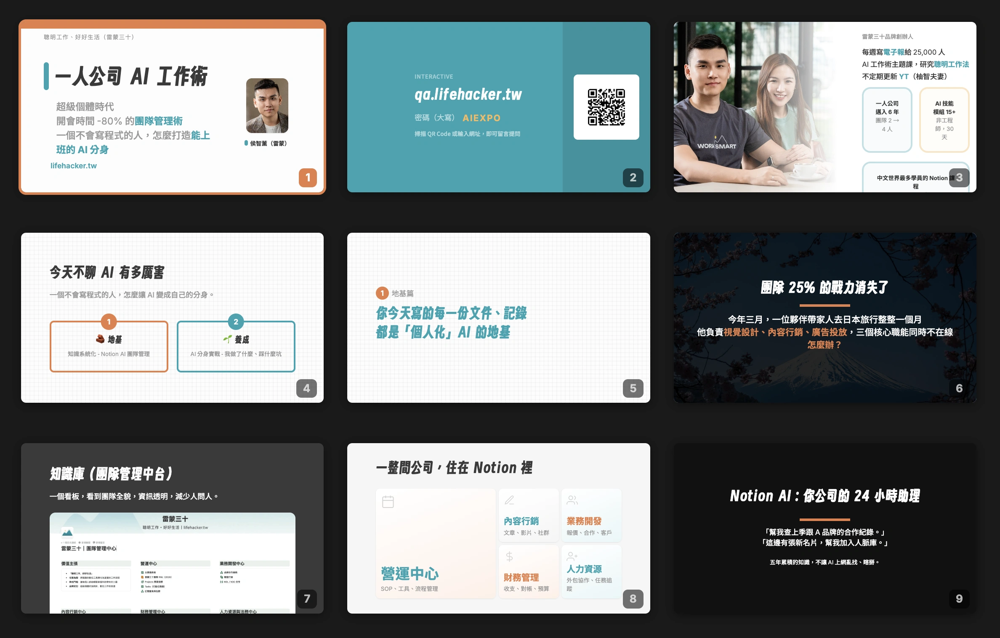
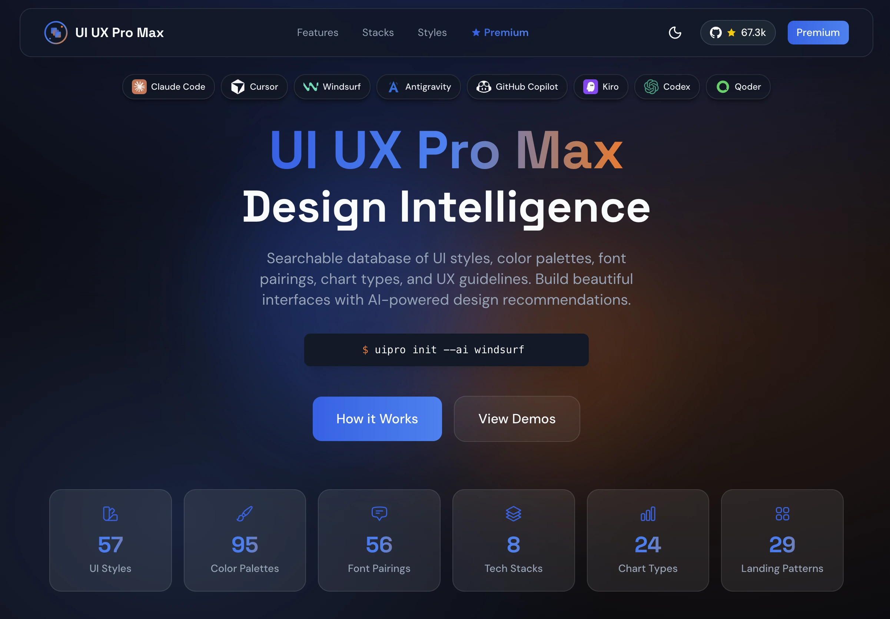

# 3-5 做一個自己的品牌 Landing Page

> **搭配裝備**：🔒 pro-kit「引導式 Landing Page 生成」（`/landing`）
> **預計閱讀**：15-18 分鐘
> **前置條件**：已完成 [1-1（安裝配置）](1-1%20%E9%96%8B%E5%A7%8B%E5%AE%89%E8%A3%9D%E9%85%8D%E7%BD%AE%E4%BD%A0%E7%9A%84%20Claude%20Code.md)、建議完成 [3-2（DESIGN.md）](3-2%20%E5%BB%BA%E7%AB%8B%20DESIGN.md%20%E5%93%81%E7%89%8C%E8%AA%AA%E6%98%8E%E6%9B%B8%EF%BC%88%E7%A4%BE%E7%BE%A4%E5%9C%96%E5%8D%A1%20%26%20%E7%B0%A1%E5%A0%B1%E8%87%AA%E5%8B%95%E7%94%9F%E6%88%90%EF%BC%89.md)

---

## 開場鉤子

「我也想做一個自己的 landing page，放我的課、我的服務、我的數位商品⋯」

發現要會 Framer、Webflow、Carrd，或是要架 WordPress、選主題、調版型。每一條路都有門檻，最後你還是在 IG 簡介貼一個 Google 表單連結。

這一篇，要教你用 Vibe Coding 的方式，**一段對話做出一個自己的 landing page**。

如果你看過 [3-2](3-2%20%E5%BB%BA%E7%AB%8B%20DESIGN.md%20%E5%93%81%E7%89%8C%E8%AA%AA%E6%98%8E%E6%9B%B8%EF%BC%88%E7%A4%BE%E7%BE%A4%E5%9C%96%E5%8D%A1%20%26%20%E7%B0%A1%E5%A0%B1%E8%87%AA%E5%8B%95%E7%94%9F%E6%88%90%EF%BC%89.md)，你已經知道 DESIGN.md 可以讓 AI 做出風格一致的圖卡。這篇會讓你看到同一份 DESIGN.md，**還能驅動 Landing Page、簡報、甚至整個品牌網站**。

---

## 什麼是 Vibe Coding？

Vibe Coding 是最近流行的一個詞，意思是：**你不寫 code，你跟 AI 聊你要什麼，AI 幫你寫。**

傳統寫程式：你要知道 HTML、CSS、JS，懂布局、懂字體、懂配色⋯⋯一個頁面下來要好幾天。

Vibe Coding：你跟 AI 說「我要做一個課程銷售頁」，AI 邊問你問題、邊幫你寫。半小時你就有一個可以打開的 HTML 檔案。

**Vibe Coding 的 Hello World 就是 landing page**：因為 landing page 是最常見、最標準化的頁面結構，AI 能把它處理得又快又好。

---

## AI 做出來的為什麼常常很醜？

如果你直接對 Claude Code 說：「幫我做一個課程 landing page」，它真的會做一個出來。

但你打開會發現：
- **配色像 2015 年的範本**：藍色漸層 + 白底 + 圓角按鈕
- **字體對齊不對**：中英文混排一團亂
- **結構莫名其妙**：把「講師介紹」放在 hero 下面、把「價格」放在最底下、FAQ 只有一題
- **完全不是你的品牌風格**：跟你 IG / 部落格的調性完全不搭

問題不在 AI，問題在你沒給它足夠的 **方向**。AI 的強項是填空，不是從無到有做決策。

這就是 [3-2](3-2%20%E5%BB%BA%E7%AB%8B%20DESIGN.md%20%E5%93%81%E7%89%8C%E8%AA%AA%E6%98%8E%E6%9B%B8%EF%BC%88%E7%A4%BE%E7%BE%A4%E5%9C%96%E5%8D%A1%20%26%20%E7%B0%A1%E5%A0%B1%E8%87%AA%E5%8B%95%E7%94%9F%E6%88%90%EF%BC%89.md) 教你建立 DESIGN.md 的原因，**有了品牌說明書，AI 做出來的東西才會像你的品牌**。

---

## 真實案例：一份 DESIGN.md 驅動所有視覺產出

在教你怎麼做之前，先讓你看看我們用同一份 DESIGN.md，做出了哪些東西。

### 演講簡報

這兩份簡報都是用 Claude Code + DESIGN.md 生成的 HTML 簡報，直接部署到 [slides.lifehacker.tw](https://slides.lifehacker.tw/)：

<p align="center">
  <a href="https://slides.lifehacker.tw/">
    
  </a>
</p>
<p align="center"><sub>AI EXPO 2026 — 一人公司 AI 工作術</sub></p>

兩份簡報的配色、字體、排版完全一致，白底、橘青配色、Noto Sans TC、左側色條裝飾。因為它們共用同一份 DESIGN.md。

### IG 社群圖卡

[3-2](3-2%20%E5%BB%BA%E7%AB%8B%20DESIGN.md%20%E5%93%81%E7%89%8C%E8%AA%AA%E6%98%8E%E6%9B%B8%EF%BC%88%E7%A4%BE%E7%BE%A4%E5%9C%96%E5%8D%A1%20%26%20%E7%B0%A1%E5%A0%B1%E8%87%AA%E5%8B%95%E7%94%9F%E6%88%90%EF%BC%89.md) 教過你的 `/cards` 圖卡，也是讀同一份 DESIGN.md。藍黑系和橘白系兩套配色，都從品牌色延伸出來。

### Landing Page

這篇要教你的 `/landing`，同樣讀 DESIGN.md。做出來的銷售頁會自動套用你的品牌色、字體、按鈕風格。

**一份 DESIGN.md，不只能有這三種產出：**

| 產出 | 用什麼做 | 結果 |
|:--|:--|:--|
| **IG 圖卡** | `/cards` 或 Claude Design | 1080×1350 品牌風格圖卡 |
| **演講簡報** | `/slides` 或 Claude Design | HTML 簡報，可部署到網站 |
| **銷售頁** | `/landing` 或 Claude Design | 完整 HTML Landing Page |

你只需要維護一份 DESIGN.md，所有視覺產出都會風格一致。這就是「品牌設計系統」的威力。

---

## `/landing` 讓 AI 變成銷售頁設計師

我們做了一個 `/landing` 的 Skill（Claude Code 的技能擴充），專門解決「非設計師想做銷售頁」這件事。它做的事情是：

1. **一次只問你一個問題**：從產品類型、品牌調性、痛點、價格，一題一題收集
2. **每題都給你「好 / 壞範例」**：讓你知道怎麼答
3. **你卡住時可以說「幫我生」**：AI 根據前面答案生初稿給你挑
4. **讀取你的 DESIGN.md**：自動套用品牌色、字體、元件風格
5. **整合 UI UX Pro Max**：業界級的設計系統，會根據你的產業挑對的字體、顏色、風格
6. **自動生 HTML + 自動打開**：你不用開 IDE、不用存檔，它做完直接彈出瀏覽器

安裝後你在 Claude Code 裡輸入 `/landing`，整個流程大約 **20-30 分鐘** 就能做出第一個版本。

<p align="center">
  
</p>
<p align="center"><sub>整合 UI UX Pro Max，讓你的設計減少 AI 味</sub></p>

---

## 實戰練習

> [!IMPORTANT]
> **升級包**
> 🔒 pro-kit「引導式 Landing Page 生成」，把 `06-landing-page.md` 的內容丟給 Claude Code，跟它說「幫我安裝引導式 Landing Page 生成」。
> 裝完後 Claude Code 會多一個 `/landing` 指令。

假設你要幫自己的「一日 Notion 實體課」做一張銷售頁，我們走一次完整流程。

### Phase 1：產品定位（4 題）

你輸入 `/landing`，AI 會問：

**Q1：你要做哪一種銷售頁？**
- 1. 實體活動／工作坊
- 2. 線上課程
- 3. 數位產品

你選 **1**。

**Q2：你的產品屬於什麼產業／主題？（中文描述）**

你回：「Notion 一日實體課程，教生產力管理，給新手」

AI 會把這句翻成英文關鍵字 `productivity notion workshop education beginner` 去餵 UI UX Pro Max（UUPM）。

**Q3：你的品牌調性 3 個關鍵字？**

你回：「親和、溫暖、清楚」

**Q4：產品名稱 / slug？**

你回：`notion-one-day`

---

### Phase 2：內容填入（10 題）

接下來會問你 Hero 標題、痛點、課程介紹、你會學到什麼、見證（可選）、適合誰、日期地點、價格、FAQ、講師介紹⋯⋯

每一題都有好 / 壞範例，讓你知道怎麼寫會打中人。卡住就說「幫我生」，AI 會根據你前面答的東西生初稿。

### Phase 3：倒數與 CTA（3-4 題）

要不要放倒數計時器？（早鳥優惠截止）→ 如果要，再問結束時間、按鈕文字。

---

### Phase 4：設計系統

如果你已經有 DESIGN.md（[3-2](3-2%20%E5%BB%BA%E7%AB%8B%20DESIGN.md%20%E5%93%81%E7%89%8C%E8%AA%AA%E6%98%8E%E6%9B%B8%EF%BC%88%E7%A4%BE%E7%BE%A4%E5%9C%96%E5%8D%A1%20%26%20%E7%B0%A1%E5%A0%B1%E8%87%AA%E5%8B%95%E7%94%9F%E6%88%90%EF%BC%89.md) 教你建的那份），AI 會直接讀取你的品牌色和字體。

如果你還沒有，AI 會呼叫 UI UX Pro Max，根據你的產業和調性推薦 **3 種設計風格**讓你選：

```
A. Exaggerated Minimalism + Playfair + 黑金暖白
   → 雜誌封面 feel，適合高客單課程

B. Soft UI + Inter + 溫暖米色系
   → 親和、療癒，適合新手課程

C. Swiss Modernism + Helvetica + 精準網格
   → 冷靜、專業，適合 B2B 培訓
```

> [!TIP]
> 如果你在 [3-2](3-2%20%E5%BB%BA%E7%AB%8B%20DESIGN.md%20%E5%93%81%E7%89%8C%E8%AA%AA%E6%98%8E%E6%9B%B8%EF%BC%88%E7%A4%BE%E7%BE%A4%E5%9C%96%E5%8D%A1%20%26%20%E7%B0%A1%E5%A0%B1%E8%87%AA%E5%8B%95%E7%94%9F%E6%88%90%EF%BC%89.md) 已經建好 DESIGN.md，這一步會被跳過，AI 直接用你的品牌設定，不用再選。這就是「先建品牌說明書」的好處。

---

### Phase 5：生成 + 打開

AI 怎麼協助你？
1. 組合所有答案 + 選定設計系統
2. 寫出完整的 HTML 檔案到 `generated-pages/notion-one-day/index.html`
3. **自動幫你在瀏覽器打開**，你不用手動點開

打開你會看到：
- Hero 區大標題 + 副標 + 倒數計時
- 3 個痛點
- 課程簡介
- 5 個你會學到的東西
- 適合 / 不適合誰
- 活動資訊（日期、時間、地點、名額⋯）
- 3 個價格方案（早鳥 highlighted）
- 最終 CTA（黑底金按鈕）
- 講師介紹
- FAQ
- **底部 sticky bar**：滾到第二屏後會跳出，帶著倒數和 CTA 跟著你

---

## 做完之後怎麼上線？

做出來的是一個 `index.html` 檔案（內嵌 CSS + JS），你有好幾條路可以讓別人看到它：

### 最簡單：丟到 static hosting

| 平台 | 費用 | 適合 |
|:--|:--|:--|
| **GitHub Pages** | 免費 | 已經在用 GitHub 的人 |
| **Cloudflare Pages** | 免費 | 想要 CDN 加速 |
| **Vercel / Netlify** | 免費（個人方案） | 想要自訂網域 |
| **Zeabur** | $5/月起 | 想要一站式管理多個專案 |

> 不確定怎麼選？什麼情況用哪個？請查看這篇完整比較：
> 👉 [Zeabur 與 Cloudflare 兩條部署路線完整指南](https://raymondhouch.com/lifehacker/digital-workflow/zeabur-cloudflare-deploy-guide/)

把 `generated-pages/notion-one-day/` 資料夾推上 GitHub，連接 Cloudflare Pages 或 Vercel，幾分鐘就上線了。

### 進階：複製到現有網站

如果你已經有 WordPress、Framer、Webflow，可以把 HTML 的內容複製貼上去當起點，再用平台本身的工具微調。

### 最懶：直接傳檔案

`index.html` 是獨立檔案，不需要伺服器。直接傳給同事或客戶，他們用瀏覽器打開就能看。適合內部提案、快速給人看效果。

---

## 從一份 DESIGN.md 到整個品牌生態

你做的東西越多，DESIGN.md 的價值就越高。因為每一個新產出都不需要從零開始想配色、選字體、定風格，**品牌一致性是自動的**。

這也是為什麼我們的簡報網站 [slides.lifehacker.tw](https://slides.lifehacker.tw/) 上的每一份簡報，看起來都像同一個品牌做的。

---

## 這篇學完你有了什麼

- ✅ 一個 `/landing` 指令，之後任何產品都可以用
- ✅ 一個 `generated-pages/{slug}/` 資料夾，每個產品都有自己的檔案
- ✅ 一個完整的 HTML 檔案，可以直接部署，或複製貼到 Framer / Webflow / WordPress
- ✅ 一個 `answers.json`，你填過的答案都存著，下次改版可以直接讀
- ✅ 跟 UI UX Pro Max 的整合經驗，以後做任何 UI 都可以用它
- ✅ 理解「一份 DESIGN.md 驅動所有視覺產出」的品牌系統思維

---

## 常見問題 FAQ

### Q1：做出來的頁面可以直接上線嗎？

可以。輸出的是單一 HTML 檔案（內嵌 CSS + JS），可以丟到任何 static hosting（Vercel、Netlify、Cloudflare Pages、GitHub Pages）。也可以複製 HTML 貼到 Framer / Webflow 當起點，再微調。

### Q2：假如我不想裝 UI UX Pro Max 呢？

可以跳過！Skill 會偵測你有沒有裝，沒有的話會問你要不要安裝。你選「不要」就用 Claude 自己的美感生成，只是少了產業對齊和設計資料庫。大部分情況還是堪用的。

### Q3：改文案要重跑嗎？

不用。`generated-pages/{slug}/index.html` 可以直接打開編輯，HTML 標籤看得懂，改文字就好。要**整個重跑**的情境只有：換風格、加減 section、大幅改結構。

### Q4：倒數計時器怎麼調？

打開 HTML 搜尋 `data-deadline`，改 ISO 格式的日期時間（例：`2026-06-01T23:59:00+08:00`）。或者重跑 `/landing`（會讀 `answers.json` 不用從頭答）。

### Q5：我已經有 DESIGN.md 了，`/landing` 會自動讀嗎？

會。如果你的專案根目錄有 DESIGN.md，`/landing` 會自動讀取並套用。你不需要再回答「品牌調性」和「設計風格」的問題，AI 會直接用你定義好的品牌規範。

### Q6：可以做多個不同產品的銷售頁嗎？

可以。每個產品有自己的 `generated-pages/{slug}/` 資料夾和 `answers.json`。你可以同時維護 `notion-one-day/`、`ai-writing-system/`、`claude-code-course/`⋯⋯每個都獨立，但共用同一份 DESIGN.md，風格永遠一致。

> [!IMPORTANT]
> 🔒 **pro-kit 06：引導式 Landing Page 生成** — 安裝 `/landing` 指令
> 如果你想用 Claude Code 的方式做銷售頁，把 pro-kit 裡的 `06-landing-page.md` 丟給 Claude Code，跟它說「幫我安裝引導式 Landing Page 生成」。

---

⬅️ 上一章節：[3-4 日本旅行 AI 拍照收據自動記帳](3-4%20%E6%97%A5%E6%9C%AC%E6%97%85%E8%A1%8C%20AI%20%E6%8B%8D%E7%85%A7%E6%94%B6%E6%93%9A%E8%87%AA%E5%8B%95%E8%A8%98%E5%B8%B3.md)
