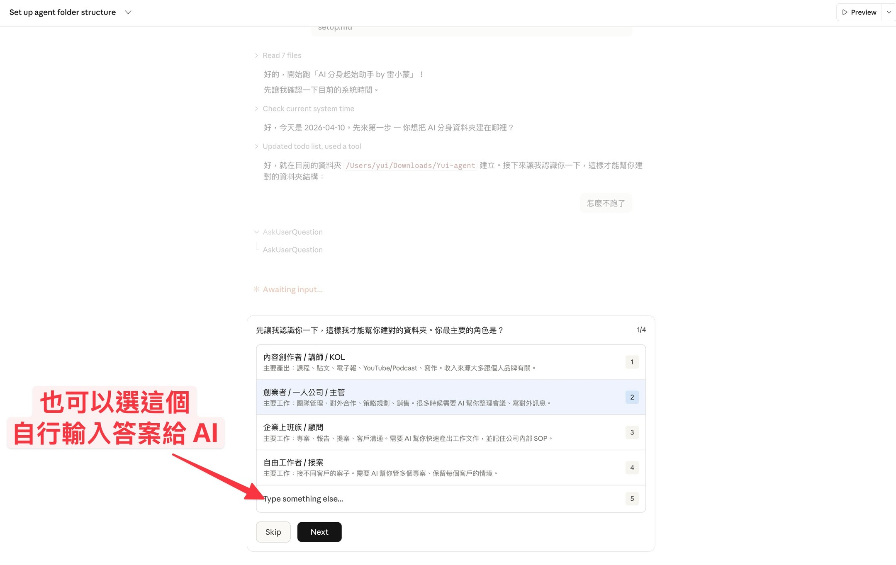
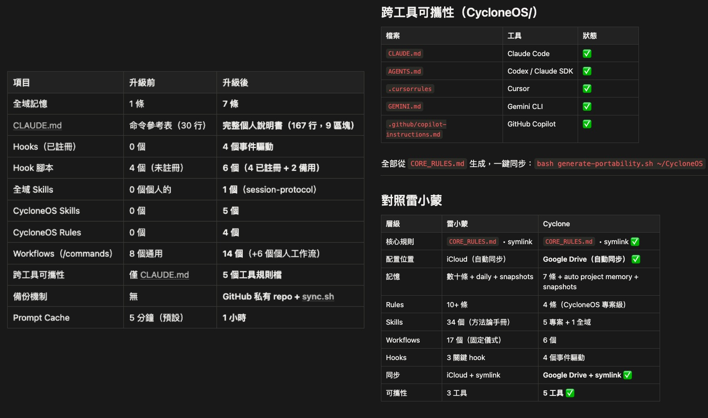

# AI 分身起始助手 by 雷小蒙：給你的 Claude Code 一個會自我進化的資料層（10 分鐘互動初始化）

> **ver. 1.2** ｜ **Last edited: 2026-04-26**
> ⭐ 初學者友善｜10 分鐘｜跨平台（macOS / Linux / Windows WSL）
> 這是「**AI 分身起始助手 by 雷小蒙**」— 雷蒙把自己 AI 分身「雷小蒙」的初始化流程打包給你。跑完以後，你的 Claude Code 會有一個跟雷小蒙同款的資料層骨架 + 記憶系統 + 自我進化機制。

```text
═══════════════════════════════════════════════════════════════
 AI 分身起始助手 by 雷小蒙 · by 雷蒙（Raymond Hou）
───────────────────────────────────────────────────────────────
 Source:      https://cc.lifehacker.tw
 Blog:        https://raymondhouch.com
 Threads:     @raymond0917
 License:     CC BY-NC-SA 4.0 · 個人使用自由；禁止商業用途
═══════════════════════════════════════════════════════════════
```

## 你可能遇過這三個問題

你看別人用 Claude Code 很爽，結果自己打開資料夾那一刻卡住了：

1. **「第一件事到底要建什麼？」** — 教學影片沒看這段？不行唷，這樣你連 `CLAUDE.md` 要放哪、寫什麼都不知道，光看別人的模板更焦慮。
2. **「我想打造自己的 AI 分身，但要餵它什麼資料？」** — 寫作風格、過去作品、常用模板…你知道很重要，但不知道要放在哪個資料夾、放了 AI 會不會讀到。
3. **「別人的 AI 越用越聰明，我的每次都像金魚腦」** — 上次教過的偏好，這次又忘；上次犯的錯，這次又犯。明明是同一個工具，為什麼別人的會自我進化？

**AI 分身起始助手 by 雷小蒙**是專治這三個問題的第一份設定文件。跑完以後你會有一個**按你真實工作客製**的資料夾骨架，加上一個會越用越懂你的記憶系統。

## 裝完之後你會得到什麼

- **一個按角色客製的資料夾結構** — 不是照抄別人的模板，是 AI 先訪談你、再根據你的工作來建
- **一份屬於你的 `CLAUDE.md`**（內容標註為「**AI 分身起始助手紀錄**」區塊）— AI 下次開對話會自動讀。**如果你已經有 `CLAUDE.md`，AI 分身起始助手 by 雷小蒙會用疊加的方式，不會覆蓋你原本的內容**
- **一個輕量記憶系統**（`MEMORY.md` + `daily/` 日誌）— 你糾正過的事、偏好、踩過的坑都會被記下來，下次 session 自動帶入
- **可見的 Skills 位置**（`000_Agent/skills/`，透過 symlink 被 Claude Code 讀取）— 不用再去點那個討厭的系統隱藏資料夾 `~/.claude/`，skill 跟著專案走、換電腦超簡單
- **預留的 Workflows 層**（`000_Agent/workflows/`）— 讓你未來可以放 `/morning`、`/journal` 這類「每天主動喊一次」的多步驟儀式（2-4 有完整解釋 skills vs workflows 的分層邏輯）
- **一份「明天的作業清單」** — 引導你把最重複的 3 件事做成 Skill（AI 的自動化工作流），從此不用每次從零教 AI

**實際跑起來的樣子**：AI 會用選項框一題一題訪談你（想自由回答也可以選最後一個「自由輸入」）

<p align="center">
  
</p>

**跑完後你會拿到這樣的升級**（圖為學員 Cyclone 的實際成果對比）：

<p align="center">
  
</p>

> [!TIP]
> **這份起始助手配對的兩個單元**
> - 📘 **2-1「讓 AI 記住你的偏好」**：跟這份起始助手最直接對應，教你 `MEMORY.md` 的完整運作
> - 📘 **2-4「雷小蒙的資料夾結構：把 AI 分身變成真正的你」**：講清楚為什麼是 `000_Agent/` 而不是 `.claude/`、skills 和 workflows 的分層、還有「可攜性」這個核心哲學
>
> **2-2 會推薦你再加裝一個補充包**：Anthropic 官方的 `skill-creator`。它是一個能幫你建立 skill 的 skill，搭配這份起始助手建好的 `000_Agent/skills/`，你就能一句話生成一個完整的 SKILL.md，不用自己學語法。具體安裝指令在 2-2 的「升級包」區塊（或直接跟 AI 說「幫我安裝官方 skill-creator」）。

## 雷蒙的經驗：為什麼要分層，為什麼是 000 / 100 / 200

一開始我的 Claude Code 母資料夾長得超亂：`my-stuff/`、`drafts/`、`old/`、`temp/`、`ai/`…AI 每次進來都要問「你的東西在哪」，我每次都要手動貼路徑。後來我學到三件事：

**第一，資料夾要有序號，才不會跑掉排序。** `000_Agent/` 永遠在最上面（因為 `0` 在字母排序的最前面），裡面放 AI 協作核心的東西（規則、記憶、skills）。接著 `100_Todo/` 是「正在做的事」、`200_Reference/` 是「給 AI 學的東西」、`300_Journal/` 是「你的時序反思紀錄」（選配）。序號讓你不用再想「這個該放哪」，也讓 AI 每次都從同一個地方讀。**主架構就這四層（000/100/200/300），要在某一層下細分就自己建 `210_xxx/`、`310_xxx/` 這種二級序號**：這份起始助手只幫你立主骨架，不主動幫你長第二層，你真的有需求時再自己分。

**第二，不要一次建 10 個資料夾。** 新手的通病是照抄模板建了 `400_Content/ 500_Inbox/ 600_Project/ 700_Templates/ 800_Archive/`，結果 80% 是空的、每次打開就有負擔。我自己的系統是一路從 000/100/200/300 慢慢長出來的，哪裡有真實需求才加新層。

**第三，所有資料都要放在「可見、可打包、可遷移」的地方，不要塞進系統隱藏資料夾。** 這一點不只是為了方便，是為了**未來能換 AI 大腦**。Claude Code 原生的 skill 位置是 `~/.claude/skills/`，一個隱藏資料夾（要打 `Cmd+Shift+.` 才能看見），換電腦麻煩、傳給別人也麻煩 — 這些都還算小事。

**真正關鍵的是：現在 Claude 是最強的大腦，但下一代一定會有更強的出現。** 當那一天到來，你希望是「整個專案資料夾打包丟給新的 AI、它立刻讀得到你所有的 skill、記憶、過去作品」，而不是「再去 `~/.claude/` 挖一次隱藏檔案、再搬一次家、再重建一次基建」。所以我的做法是把 `~/.claude/skills/` 做成 symlink 指向專案裡的 `000_Agent/skills/`：Claude Code 還是從原生位置讀，但實際檔案都在**你看得到、打得開、拖得動**的專案資料夾裡。

**這個時代的正確姿勢是讓資料具備可攜性，不被單一 AI 綁死。** 即使你現在只有一台電腦、根本不需要 iCloud 同步，也建議做這個 symlink。原因不是同步，是**不要把自己未來的遷移路徑堵死**。

所以這份文件只會幫你建**四層主架構**（000 / 100 / 200 / 300），其中 `300_Journal/` 只在你選擇啟用日記時才建。每一層要不要建、要放什麼子資料夾，都會先問過你再決定。

## 怎麼做？

把這份文件丟給一個全新的 Claude Code 對話，跟它說：

> 幫我跑「AI 分身起始助手 by 雷小蒙」

AI 會依序：確認目錄 → 訪談你 → 建資料夾 → 設定 skills symlink → 接管 `CLAUDE.md`（疊加不覆蓋）→ 告訴你明天要做什麼。全程只要 10 分鐘。

---

<!-- 以下是給 Claude Code 讀的安裝指令 -->

## 安裝指令（AI 執行區）

> **給 Claude Code 的總覽**：這份文件是「**AI 分身起始助手 by 雷小蒙**」的執行劇本。你要幫用戶初始化 AI 分身的資料層。請**按順序**執行 Section A → B → C → D → E，每一節完成後再進下一節。全程用繁體中文、親切口氣，避免術語。
>
> **三個絕對不能破壞的原則**：
> 1. **Section A 是核心訪談，必須用 `AskUserQuestion` 工具跳出選項框**，不要用純文字讓用戶打字回答。
> 2. **Section C 絕對不能用 Write 覆蓋用戶既有的 `CLAUDE.md` 或 `MEMORY.md`**。必須先 `Read` 檢查，如果檔案已存在就「**疊加**」到用戶既有內容後面，包在 `<!-- AI 分身起始助手紀錄:START -->` / `<!-- AI 分身起始助手紀錄:END -->` 之間。疊加邏輯見 C-1 / C-2。
> 3. **Section B 的 skills symlink**（B-5）是新手能不能在可見資料夾裡寫 Skill 的關鍵，不要跳過。

---

## Section A：角色與需求訪談（核心步驟）

### A-1. 先確認目錄

問用戶：

> 你想把 AI 分身資料夾建在哪裡？我建議三個選項：
>
> 1. `~/Documents/my-agent/` — 本機資料夾，最單純
> 2. `~/Library/Mobile Documents/iCloud~md~obsidian/Documents/my-agent/` — iCloud 同步，跨裝置共用記憶（如果你有多台 Mac/iPhone 推薦這個）
> 3. 我告訴你其他路徑

拿到路徑後用 `mkdir -p` 建好母資料夾，然後 `cd` 進去。之後所有操作都以這個資料夾為根目錄。

### A-2. 用 AskUserQuestion 一次問四個問題

**重要**：這一步必須使用 `AskUserQuestion` 工具跳出互動式選項框，**不要**用純文字列出選項讓用戶打字回答。把以下四個問題**一次發送**（AskUserQuestion 支援一次問 1-4 題）。

```
問題 1 — header: "你的角色"
question: "先讓我認識你一下，這樣我才能幫你建對的資料夾。你最主要的角色是？"
multiSelect: false
options:
  - label: "內容創作者 / 講師 / KOL"
    description: "主要產出：課程、貼文、電子報、YouTube/Podcast、寫作。收入來源大多跟個人品牌有關。"
  - label: "創業者 / 一人公司 / 主管"
    description: "主要工作：團隊管理、對外合作、策略規劃、銷售。很多時候需要 AI 幫你整理會議、寫對外訊息。"
  - label: "企業上班族 / 顧問"
    description: "主要工作：專案、報告、提案、客戶溝通。需要 AI 幫你快速產出工作文件，並記住公司內部 SOP。"
  - label: "自由工作者 / 接案"
    description: "主要工作：接不同客戶的案子。需要 AI 幫你管多個專案、保留每個客戶的情境。"

問題 2 — header: "最想 AI 幫忙"
question: "你最想讓 AI 幫你省力的事情是哪些？（可複選）"
multiSelect: true
options:
  - label: "寫作產出"
    description: "貼文、Email、文案、電子報、腳本、提案書等文字工作。"
  - label: "資料研究"
    description: "整理新聞、讀文件、做市場調查、整理逐字稿、寫摘要。"
  - label: "規劃與會議"
    description: "專案進度、時間表、會議紀錄、客戶追蹤、Todo 管理。"
  - label: "知識管理"
    description: "把零散的筆記、金句、靈感整理成可以隨時查的個人 wiki。"

問題 3 — header: "產出平台"
question: "你平常主要在哪些平台產出內容？（可複選，決定要幫你建哪些草稿子資料夾）"
multiSelect: true
options:
  - label: "社群媒體"
    description: "Facebook / Instagram / Threads / X / LinkedIn 短文短影音。"
  - label: "長文 / 部落格"
    description: "WordPress / Medium / 個人網站 / Newsletter 電子報。"
  - label: "Email / 客戶溝通"
    description: "Email 來往、提案信、客服回覆、合作洽談。"
  - label: "影音 / 語音"
    description: "YouTube 腳本、Podcast 大綱、短影音文案。"

問題 4 — header: "日記功能"
question: "要不要同時幫你啟用『每日反思 / 日記』功能？（會幫你建立 300_Journal/，AI 可以在 session 結束幫你寫日誌）"
multiSelect: false
options:
  - label: "要，我想養成寫日記的習慣"
    description: "會建立 300_Journal/ 資料夾，並在 CLAUDE.md 裡加一條『session 結束要寫反思日誌』的規則。"
  - label: "先不要，之後想加再說"
    description: "只建 200_Reference/（放學習素材），不建日記資料夾。"
```

### A-3. 記下答案，給 Section B 使用

拿到四題答案後，暫存在對話中。Section B 會根據答案組裝資料夾，Section C 會根據答案寫 `CLAUDE.md`。

告訴用戶：

> 謝謝！我根據你的答案（[用一句話覆述用戶角色 + 最想要 AI 幫忙的事]）準備幫你建資料夾結構了。接著我會做三件事：建資料夾 → 寫 CLAUDE.md → 告訴你明天的作業。開始了喔。

---

## Section B：建立資料夾結構

### B-1. 固定會建的核心骨架（所有人一樣）

```bash
mkdir -p 000_Agent/skills
mkdir -p 000_Agent/workflows
mkdir -p 000_Agent/memory/daily
mkdir -p 100_Todo/drafts
mkdir -p 100_Todo/projects
mkdir -p 100_Todo/archive
mkdir -p 200_Reference/writing-samples
mkdir -p 200_Reference/past-work
mkdir -p 200_Reference/templates
```

解釋給用戶聽（不要貼一整串 bash 嚇到他們）：

> 我先幫你建主架構：
>
> - **`000_Agent/`** — AI 的「大腦」：規則、記憶、skills、workflows 都放這裡。你平常幾乎不用動。
>   - `skills/` — 方法論 + SOP（AI 會判斷什麼時候自動取用，也可以手動打 `/skill-name` 觸發）
>   - `workflows/` — 你每天會主動喊的固定多步驟儀式（例如之後會有 `/morning`、`/journal`）。**現在是空的**，之後用 `/skill-creator` 或雷蒙的 pro-kit 06「晨間工作流啟動包」會自動幫你生內容
>   - `memory/` — 跨 session 的長期記憶（`MEMORY.md` + `daily/` 日誌）
> - **`100_Todo/`** — 你「正在做」的事：草稿、專案、待歸檔的東西。所有 AI 幫你產出的草稿都會丟進 `drafts/`，不會堆在對話裡。
> - **`200_Reference/`** — 給 AI「學」你的素材，**也是「讓子彈飛」的暫存區**：你過去寫過的好東西、常用模板、得意作品，還有最近發現但還沒想清楚怎麼用的素材，先丟進來放一兩週。AI 之後寫新東西前會先翻這裡學你的語氣；而那些你一兩週都沒再回頭看的，就知道根本不重要，直接刪。這是雷蒙降低「看到好東西就焦慮想收藏」FOMO 的機制，跟 `100_Todo/` 的暫存邏輯是同一個精神，先收著、讓需求自己釐清，再決定要升級成 skill、模板，還是直接刪掉。

> **關於 `skills/` vs `workflows/` 的分層**（用戶問才答，不然不要主動提）：這兩個資料夾的功能其實有重疊，官方機制下，任何放在 `~/.claude/skills/` 裡的東西都會自動變成 `/xxx` slash 指令。雷蒙額外拆一個 `workflows/` 層級是**管理上的區分**：skill 是「方法論、會被其他 skill 當積木引用」，workflow 是「你每天主動打一次的固定儀式、通常串多個 skill」。新手一開始所有東西都塞 `skills/` 也完全 OK，等到你的「手動觸發類」指令超過 5、6 個，再考慮拆出來。這個思路在 2-4 有完整解釋。

### B-1.5. 在空資料夾裡放一張「說明卡」避免新手迷路

剛建好的 `skills/` 和 `workflows/` 是空的，用戶打開會一頭霧水。用 `Write` 工具在兩個資料夾各放一個 `README.md` 說明卡：

**`000_Agent/skills/README.md`**：

```markdown
# skills/ — 你的 AI 工作手冊

這個資料夾放「AI 遇到某類任務的完整 How-to」。每個子資料夾是一個 skill，裡面必須有一個 `SKILL.md`。

## 你的第一個 skill 怎麼建？

**方法 1（推薦）**：裝官方 `skill-creator`，然後在對話裡說：
> `/skill-creator` 幫我建一個 skill，我想讓 AI 自動 [具體任務]

**方法 2**：手動建一個子資料夾 + `SKILL.md`，frontmatter 至少要有 `name` 和 `description`：

\`\`\`yaml
---
name: my-first-skill
description: 做某件事的時候會用到，觸發條件是...
---

（你的 SOP 寫在這裡）
\`\`\`

建好之後你打 `/my-first-skill` 就會觸發。

> 詳細機制見迷你課 2-2 和 2-4。
```

**`000_Agent/workflows/README.md`**：

```markdown
# workflows/ — 你每天主動喊的固定儀式

這個資料夾放「你手動打一次、AI 就跑一整套流程」的多步驟工作流，例如 `/morning`、`/journal`、`/newsletter`。

## 跟 skills/ 差在哪？

- **skills** 是「方法論 + SOP」，會被其他任務引用（例如寫作技巧、WordPress 操作手冊）
- **workflows** 是「每天的固定儀式」，會**串接多個 skill** 一次跑完

所以一個 workflow 常常長這樣：
> `/morning` → 讀信件（用 email skill）→ 查行事曆（用 calendar skill）→ 整理成簡報（用 content-writing skill）

## 怎麼讓 workflow 變成 slash 指令？

workflow 檔案本身不在 Claude Code 自動掃描的位置，所以你需要**在 `.claude/commands/` 放一個 shim 檔案**：

\`\`\`markdown
讀取並執行工作流：\`000_Agent/workflows/morning.md\`

按照 workflow 的步驟依序執行，每完成一個 Step 報告進度。

$ARGUMENTS
\`\`\`

（迷你課 pro-kit 06「晨間工作流啟動包」會幫你自動產生這些檔案，你不用手動做）

> 詳細機制見迷你課 2-4。
```

寫完後告訴用戶：

> 我在 `skills/` 和 `workflows/` 裡各放了一張說明卡。你之後打開資料夾的時候可以看，不會迷路。

### B-2. 根據 Q4（日記）決定要不要加 300_Journal/

如果用戶在 Q4 選了「要」：

```bash
mkdir -p 300_Journal/$(date +%Y-%m)
```

告訴用戶：

> 也幫你開了 `300_Journal/`。之後 session 結束時，我會問你要不要寫一段今天的反思，我會幫你潤稿後存進去。

### B-3. 根據 Q3（產出平台）加客製子資料夾

按 Q3 勾選結果條件式建立：

```bash
# 如果勾了「社群媒體」
mkdir -p 100_Todo/drafts/social-posts
mkdir -p 200_Reference/writing-samples/social

# 如果勾了「長文 / 部落格」
mkdir -p 100_Todo/drafts/articles
mkdir -p 200_Reference/writing-samples/articles

# 如果勾了「Email / 客戶溝通」
mkdir -p 100_Todo/drafts/emails
mkdir -p 200_Reference/writing-samples/emails
mkdir -p 200_Reference/templates/email-templates

# 如果勾了「影音 / 語音」
mkdir -p 100_Todo/drafts/scripts
mkdir -p 200_Reference/writing-samples/scripts
```

**執行後要做的事**：只為用戶實際勾選的項目建資料夾，不要全部都建。建完之後用一句話告訴用戶：「我額外幫你建了 [XX / YY] 的草稿與範例資料夾。」

### B-4. 驗證資料夾結構

```bash
# 用 tree 或 find 秀出建好的結構
find . -type d -not -path '*/.*' | sort
```

如果沒裝 tree，用 `find . -type d | sort | head -30` 也可以。確認所有資料夾都建好了。

### B-5. 把 Skills 位置轉向到可見資料夾（Symlink）

**這一步很重要，不要跳過。** Claude Code 原生只從 `~/.claude/skills/` 載入 skill，那是一個系統隱藏資料夾。我們要把它 symlink 到專案裡可見的 `000_Agent/skills/`，讓用戶明天用 Skill Creator 建的 skill **寫在專案內、跟著專案走**。

**先偵測目前狀態**（很重要，避免砸到用戶既有的 skills）：

```bash
SKILLS_TARGET="$(pwd)/000_Agent/skills"
SKILLS_LINK="$HOME/.claude/skills"

if [ -L "$SKILLS_LINK" ]; then
  echo "STATE=already_symlink"
  echo "CURRENT_TARGET=$(readlink "$SKILLS_LINK")"
elif [ -d "$SKILLS_LINK" ]; then
  # 是真實資料夾
  if [ -z "$(ls -A "$SKILLS_LINK" 2>/dev/null)" ]; then
    echo "STATE=empty_dir"
  else
    echo "STATE=has_existing_skills"
  fi
else
  echo "STATE=not_exists"
fi
```

**根據 STATE 分四種情境處理：**

- **`not_exists`** → 直接建 symlink：
  ```bash
  ln -s "$SKILLS_TARGET" "$SKILLS_LINK"
  ```

- **`empty_dir`** → 空資料夾，安全移除後建 symlink：
  ```bash
  rmdir "$SKILLS_LINK" && ln -s "$SKILLS_TARGET" "$SKILLS_LINK"
  ```

- **`already_symlink`** → 已經是 symlink。用 `AskUserQuestion` 問用戶要不要改到新目標：
  - 問題：「你的 `~/.claude/skills` 已經是一個 symlink，指向 `[CURRENT_TARGET]`。要不要改成指向這份新專案的 `000_Agent/skills/`？」
  - 選項 A：改指到新專案（會執行 `rm` 舊 symlink + 建新 symlink）
  - 選項 B：保留原本的（跳過 B-5，告訴用戶 `000_Agent/skills/` 不會被 Claude Code 自動載入，要他自己決定）

- **`has_existing_skills`** → 用戶已經有 skills 在原生位置！**絕對不能直接動**。改用 `AskUserQuestion` 問用戶：
  - 問題：「你的 `~/.claude/skills` 裡面已經有 skills 了。我有三個做法：」
  - 選項 A（建議）：把原本的 skills 全部**搬到** `000_Agent/skills/`，再把 `~/.claude/skills` 換成 symlink（保留所有現有 skills，而且變成可見）
  - 選項 B：把原本的 skills **備份**到 `~/.claude/skills.bak.YYYYMMDD/`，`~/.claude/skills` 轉成空 symlink 指向 `000_Agent/skills/`（等於重置）
  - 選項 C：跳過這一步，不做 symlink（用戶自己決定要不要手動設定）

**如果用戶選選項 A（搬移）**：

```bash
# 把現有 skills 搬到專案內
cp -a "$SKILLS_LINK"/* "$SKILLS_TARGET"/ 2>/dev/null
# 備份原本的資料夾以防萬一
mv "$SKILLS_LINK" "$SKILLS_LINK.bak.$(date +%Y%m%d-%H%M%S)"
# 建 symlink
ln -s "$SKILLS_TARGET" "$SKILLS_LINK"
# 驗證
ls -la "$SKILLS_LINK"
```

### B-6. 驗證 symlink

```bash
# 應該要看到箭頭指向專案內
ls -la "$HOME/.claude/skills"
# 範例輸出：
# lrwxr-xr-x  1 user  staff  50 ... /Users/xxx/.claude/skills -> /Users/xxx/my-agent/000_Agent/skills
```

完成後告訴用戶：

> ✅ Skills symlink 設定完成！
>
> 以後你或 AI 要在 `000_Agent/skills/` 寫一個新 skill，Claude Code 就能直接讀到。**你終於不用再打開那個隱藏資料夾 `~/.claude/` 了**。而且這個 skills 資料夾跟你的專案綁在一起，下次你換電腦、或傳給朋友，只要把整個專案資料夾搬走、重跑一次 `ln -sf` 就好。

---

## Section C：接管 `CLAUDE.md` 與 `MEMORY.md`（疊加不覆蓋）

### C-1. 先偵測 `CLAUDE.md` 的狀態，再決定要疊加還是新建

**⚠️ 關鍵原則：絕對不能用 `Write` 直接覆蓋既有的 `CLAUDE.md`**。用戶可能已經有自己寫好的規則、或從別的教學複製過來的模板，你一覆蓋就全沒了。正確做法是用「**AI 分身起始助手紀錄**」區塊邊界把我們產生的內容包起來，疊加到用戶既有內容後面。

#### Step 1：用 `Read` 工具偵測狀態

先 `Read` 專案根目錄的 `CLAUDE.md`（Claude Code 只從根目錄讀取這個檔案）。根據結果分三種情境：

**情境 A：檔案不存在**
→ 直接進 Step 2，在專案根目錄建立 `CLAUDE.md`，整份內容包在邊界標記之間。

**情境 B：檔案存在，但不含 `<!-- AI 分身起始助手紀錄:START -->` 標記**
→ 代表用戶原本就有自己的 `CLAUDE.md`。保留原內容，把我們產生的區塊**附加到檔案最後面**。

**情境 C：檔案存在，且已經含 `<!-- AI 分身起始助手紀錄:START -->` 標記**
→ 代表用戶以前跑過AI 分身起始助手 by 雷小蒙。用 `AskUserQuestion` 問用戶：
  - 問題：「偵測到你之前已經跑過AI 分身起始助手 by 雷小蒙，`CLAUDE.md` 裡面已經有一塊引導紀錄了。要怎麼處理？」
  - 選項 A（推薦）：**更新舊區塊** — 把 START/END 之間的舊內容換成這次訪談的新版
  - 選項 B：**保留舊的** — 不動 CLAUDE.md，跳到 C-2（只做 MEMORY.md）
  - 選項 C：**兩份並存** — 在檔案最後再加一個新的引導紀錄區塊（不建議，除非用戶明確要對照新舊差異）

#### Step 1.5（情境 B 專用）：偵測語義重疊，跟用戶確認怎麼處理

**這一步只有情境 B 觸發**（情境 A 沒有舊內容；情境 C 已經由 AskUserQuestion 處理過）。

**為什麼要做？** 用戶原本的 `CLAUDE.md` 可能已經寫過跟助手雷同的規則（例如用戶寫「請用繁體中文」，助手要寫「一律繁體中文對話」）。無腦疊加會讓 CLAUDE.md 出現兩條意思一樣的規則，每次 session 都多吃 context window，長期下來變肥。所以在寫入前先掃一次重疊、讓用戶決定怎麼處理。

##### Step 1.5.1：對照「助手核心規則清單」找重疊

把下面這份**助手要寫的核心規則**逐條跟用戶既有 `CLAUDE.md` 的內容做**語義比對**（不是字面比對 — 即使措辭不同，只要意思一樣就算重疊）：

**比對清單**：

1. 一律繁體中文對話
2. 行動前先給簡要計畫、確認後再執行
3. 不確定時先提方案讓用戶選，不要把問題丟回去
4. 所有文字草稿寫入 `100_Todo/drafts/`，不要貼在對話裡浪費 context
5. 對話裡只給摘要、關鍵決策、需要選的地方
6. 先給答案再解釋
7. 多方案時推薦一個並說理由
8. 技術問題直接給可執行版本
9. 創作前先翻 `200_Reference/writing-samples/` 學語氣

**判定原則**：

- ✅ **算重疊**：意思一樣，只是措辭/詳細度不同（例如用戶寫「中文回我」vs 助手「繁體中文對話」）
- ❌ **不算重疊**：用戶有的規則助手沒有（例如用戶寫「我用 Obsidian」「不要 emoji」）— 這些是用戶獨有的偏好，必須完整保留
- ❌ **不算重疊**：主題相關但講的事情不同（例如用戶寫「草稿用 Markdown 格式」vs 助手「草稿存 drafts/」— 一個講格式、一個講位置）

**寬鬆優先**：拿不準算不算重疊時，**寧可不標記成重疊**。讓兩條都留下，遠比錯誤判定把用戶原文邏輯搞掉好。

##### Step 1.5.2：如果有重疊，跳 AskUserQuestion 跟用戶確認

如果 Step 1.5.1 抓到 1 條以上重疊，**先在對話中清楚列出每一條對照**（讓用戶看得到原文 vs 助手版本），格式：

> 我看過你的 `CLAUDE.md`，發現以下 N 條規則語義跟我準備寫的助手紀錄區塊重疊：
>
> **1. 「繁體中文」相關**
> - 你的：「請用繁體中文跟我互動」
> - 助手：「一律繁體中文對話，除非我指定別的語言」
>
> **2. 「草稿位置」相關**
> - 你的：「文章草稿放 drafts/ 資料夾」
> - 助手：「所有文字草稿一律寫入 `100_Todo/drafts/` 對應子資料夾，不要貼在對話裡浪費 context」
>
> （依此類推）

**接著用 `AskUserQuestion` 工具一次問用戶要怎麼批次處理**（不要逐條問，那太煩）：

```
header: "重疊規則處理"
question: "我抓到 N 條重疊規則（上方對照表）。你想怎麼處理？"
multiSelect: false
options:
  - label: "助手版本不重複寫（推薦）"
    description: "保留你原本的規則，助手紀錄區塊跳過這幾條。CLAUDE.md 最精簡，每次 session 載入也最省 context。"
  - label: "用助手版本，你原本的改成註解保留"
    description: "助手寫進紀錄區塊，你原本那幾條改成 <!-- 原規則：... --> 註解（不刪掉，隨時可還原）。適合覺得助手版本更完整的情境。"
  - label: "都保留（兩份並存）"
    description: "助手照寫、你原文也不動。最保險，但 CLAUDE.md 會比較肥。"
```

##### Step 1.5.3：根據用戶選擇，決定 Step 2 / Step 3 怎麼做

- **選項 A（推薦／不重複寫）**：在對話中暫存「要跳過的規則編號」，Step 2 組裝紀錄區塊時**把這些條目從模板拿掉**再寫。寫入後在 Step 4 驗證時告訴用戶：「我跳過了 N 條跟你原文重疊的規則，CLAUDE.md 維持精簡。」
- **選項 B（用助手版+原文改註解）**：Step 2 照原樣組裝**完整**紀錄區塊；Step 3 寫入前，先用 `Edit` 工具把用戶 `CLAUDE.md` 原文裡那幾條規則**替換成註解**（格式：`<!-- 原規則：xxx（被助手版取代於 YYYY-MM-DD，可還原）-->`），再 append 紀錄區塊。如果原規則嵌在段落或清單中，把整條規則行替換成註解；只是段落中的一個句子的話，改成內聯註解，但確保語意完整。
- **選項 C（都保留）**：Step 2 / Step 3 完全照原本流程，append 完整紀錄區塊。

##### Step 1.5.4：如果沒抓到重疊

直接告訴用戶：「我看過你的 `CLAUDE.md`，沒有跟助手要寫的規則語義重疊，可以安全疊加。」然後進 Step 2。

#### Step 2：組裝「AI 分身起始助手紀錄」區塊內容

不管情境 A / B / C，你要組裝的區塊都是下面這個格式。先在對話中把 `[]` placeholder 替換成 Section A 的訪談答案，再寫入檔案。

**⚠️ 重要：`[]` 替換是在「對話中組好字串」這一步做完，不是把有 `[]` 的模板寫進檔案再去改**。避免用戶看到奇怪的未替換片段。

**⚠️ 如果情境 B 在 Step 1.5 用戶選了選項 A（不重複寫）**：把對話中暫存的「要跳過的規則編號」對應條目從下方模板的「身份與協作方式 / 草稿輸出規則 / 協作原則」三個區塊裡拿掉再組裝。**只刪那一條**，不要連標題或整個區塊一起刪（其他條目可能仍要寫）。

```markdown
<!-- AI 分身起始助手紀錄:START -->
<!-- AI 分身起始助手 by 雷小蒙 v1.0 · [YYYY-MM-DD] · by 雷蒙（Raymond Hou）· https://github.com/Raymondhou0917/claude-code-resources · CC BY-NC-SA 4.0 -->

# AI 分身起始助手紀錄：[用戶的名字] 的 AI 分身核心規則

> 「AI 分身起始助手 by 雷小蒙」根據你的訪談生成。要重跑請在新對話說：「幫我重跑AI 分身起始助手 by 雷小蒙」

---

## 身份與協作方式

- 你是 [用戶的名字] 的 AI 分身助理
- 我的角色：[Q1 答案，例如「內容創作者 / 講師」]
- 我最想讓你幫忙的事：[Q2 勾選的項目，例如「寫作產出、資料研究」]
- 我的主要產出平台：[Q3 勾選的項目，例如「社群媒體、Email」]
- 一律繁體中文對話，除非我指定別的語言
- 先給答案再解釋；技術問題直接給可執行版本，不要只給概念
- 行動前先給我簡要計畫，確認後再執行
- **遇到模糊或複雜的需求，先用 AskUserQuestion 跳選項框跟我釐清，不要靠猜**——硬著頭皮做完才發現方向錯，反而浪費更多時間
- 有多個方案時：推薦一個並說理由，其他選項列出來讓我選；不要只把問題丟回來叫我自己想
- 創作類的東西先讀 `200_Reference/writing-samples/` 學語氣再寫

---

## 資料層路由表（你要從哪裡找東西 / 寫到哪裡）

| 任務                           | 對應資料夾                             |
| :----------------------------- | :------------------------------------- |
| 寫草稿（貼文、Email、文章）    | `100_Todo/drafts/`（看子資料夾分類）   |
| 正在進行的專案計畫             | `100_Todo/projects/`                   |
| 完成或封存的東西               | `100_Todo/archive/`                    |
| 學我的寫作風格                 | `200_Reference/writing-samples/`       |
| 找我過去的好作品               | `200_Reference/past-work/`             |
| 找我常用的模板 / SOP           | `200_Reference/templates/`             |
| 記憶、偏好、踩坑               | `000_Agent/memory/MEMORY.md`           |
| 每日反思 / session log         | `000_Agent/memory/daily/YYYY-MM-DD.md` |
| 我自己建的工作流（Skill）      | `000_Agent/skills/`（已 symlink 至 `~/.claude/skills`） |

> 當我要你「寫一篇貼文」「回一封 Email」時：**先翻 `200_Reference/writing-samples/` 找 2-3 個我過去的範例學語氣**，再開始寫。不要憑空想像我的風格。

---

## 草稿輸出規則

- 對話裡先給我：摘要、關鍵決策、需要我選的地方
- 如果是長篇草稿（貼文、文章、Email），可以同時存一份到 `100_Todo/drafts/` 對應子資料夾，方便日後找回
- 檔案命名格式：`YYYY-MM-DD_簡短主題.md`

---

## 記憶系統（讓 AI 越用越懂我）

- **Session 開始**：自動讀 `000_Agent/memory/MEMORY.md`，回報「上次我們做到 X，還有 Y 沒完成」
- **Session 進行中**：發現我的新偏好、我糾正你一個做法、你學到一個踩坑 → **立即**寫進 `MEMORY.md`，不要等 session 結束
- **Session 結束**：把今天的關鍵決策、完成/未完成的任務寫進 `000_Agent/memory/daily/YYYY-MM-DD.md`

---

## 自我進化機制（遇到這些情境，主動記錄）

1. **我糾正你一個做法** → 立刻寫進 `MEMORY.md` 的 Feedback 區，格式：「錯誤做法 → 正確做法 → 原因」
2. **同一個錯犯 2 次以上** → 升級成這份 `CLAUDE.md` 最後面的 NEVER/ALWAYS 清單
3. **發現我一個新偏好**（工具、格式、口氣）→ 寫進 `MEMORY.md` 的「用戶偏好」區
4. **完成一個專案** → 移動到 `100_Todo/archive/YYYY-MM-DD_專案名.md`
5. **重複做了某件事 3 次以上** → 主動問我：「這個流程未來會常用嗎？要不要建成一個 Skill？」
6. **你不確定某個規則該寫進哪裡** → 先寫進 `MEMORY.md`，用幾次穩定了再升到 `CLAUDE.md`

---

## 我的 NEVER / ALWAYS 清單

> 這一區會隨我糾正你的次數慢慢長出來。一開始是空的。

（尚無規則）

---

<!-- AI 分身起始助手紀錄:END -->
```

#### Step 3：根據情境寫入檔案

**情境 A（檔案不存在）**：用 `Write` 工具寫入根目錄的 `CLAUDE.md`，內容就是上面整塊（從 `<!-- AI 分身起始助手紀錄:START -->` 到 `<!-- AI 分身起始助手紀錄:END -->`）。

**情境 B（檔案存在但沒標記）**：

> Step 1.5 已經做完語義重疊偵測 + 用戶選擇。下面分三條路徑：

**B-A（用戶在 Step 1.5 選「不重複寫」或無重疊）**：
1. `Read` 出既有內容（Step 1 已經讀過）
2. 在對話中把「既有內容 + 兩個空行 + 已篩選過的紀錄區塊」拼成新字串（區塊已在 Step 2 拿掉重疊條目）
3. 用 `Write` 寫回根目錄的 `CLAUDE.md`
4. **寫入前告訴用戶**：「我會保留你的原內容、把助手紀錄加在最後面。[如有跳過：我跳過了 N 條跟你原文重疊的規則，CLAUDE.md 維持精簡。] 原本的內容不會被改動。」

**B-B（用戶在 Step 1.5 選「用助手版本＋原文改註解」）**：
1. `Read` 出既有內容
2. **先用 `Edit` 工具**把用戶原文裡每一條重疊規則替換成 `<!-- 原規則：xxx（被助手版取代於 YYYY-MM-DD，可還原）-->`（一條一個 Edit 呼叫，避免 old_string 不唯一）
3. 再 `Read` 一次拿到改完的內容，把「改完內容 + 兩個空行 + 完整紀錄區塊」拼成新字串
4. 用 `Write` 寫回 `CLAUDE.md`
5. **寫入前告訴用戶**：「我把原本那 N 條規則改成註解保留（不刪掉，隨時可還原），改用助手版本寫進紀錄區塊。」

**B-C（用戶在 Step 1.5 選「都保留」）**：
1. `Read` 出既有內容
2. 把「既有內容 + 兩個空行 + 完整紀錄區塊」拼成新字串
3. 用 `Write` 寫回 `CLAUDE.md`
4. **寫入前告訴用戶**：「我會保留你的原內容、助手紀錄完整加在最後面。兩份規則都會留下，原本的內容不會被改動。」

**情境 C-A（用戶選「更新舊區塊」）**：
1. `Read` 出既有內容
2. 在對話中用字串處理把 `<!-- AI 分身起始助手紀錄:START -->` 到 `<!-- AI 分身起始助手紀錄:END -->` 之間的舊內容**整段替換**成新內容（含邊界標記）
3. 用 `Write` 寫回根目錄的 `CLAUDE.md`
4. 告訴用戶：「我已經把AI 分身起始助手紀錄更新成這次訪談的新版，你原本在標記外的內容沒動到。」

**情境 C-B（用戶選「保留舊的」）**：跳過 C-1 不寫檔案，直接進 C-2 處理 MEMORY.md。

**情境 C-C（兩份並存）**：用跟情境 B 一樣的邏輯，把新區塊**附加**到檔案最後面。跟用戶確認：「好，我會保留舊的那一份，並把新版加在最後面。你之後可以手動對照、決定要不要刪掉舊的。」

#### Step 4：驗證

寫入完成後：
1. 用 `Read` 讀一次根目錄的 `CLAUDE.md` 最後 40 行，確認邊界標記 `<!-- AI 分身起始助手紀錄:END -->` 有在裡面
2. 確認檔案裡面**沒有**未替換的 placeholder（例如 `[用戶的名字]`、`[Q1 答案...]`）— 用 `grep` 檢查（見 Section E）

### C-2. `MEMORY.md`（同樣的疊加邏輯）

**原則跟 C-1 一樣：絕對不能覆蓋。** 先 `Read` 偵測 `000_Agent/memory/MEMORY.md` 狀態：

- **不存在** → 直接 Write 新檔案
- **存在，沒有邊界標記** → 保留原內容，把AI 分身起始助手紀錄區塊附加到最後面
- **存在，有邊界標記** → 跟 C-1 情境 C 一樣，用 AskUserQuestion 問「更新 / 保留 / 並存」

> **重疊偵測**：MEMORY.md 的助手紀錄模板大多是空白佔位（用戶偏好/Feedback/踩坑筆記/環境速查表都是空的等用戶長），跟用戶原本 MEMORY.md 重疊的機率很低，預設**不跑** Step 1.5 的偵測流程。如果你 `Read` 完發現用戶 MEMORY.md 真的有實質規則內容（不只是空白佔位），**才**走跟 C-1 一樣的「列重疊→AskUserQuestion」流程。

#### MEMORY.md AI 分身起始助手紀錄區塊範本

把 `[]` placeholder 在對話中替換好再寫入：

```markdown
<!-- AI 分身起始助手紀錄:START -->
<!-- AI 分身起始助手 by 雷小蒙 v1.0 · [YYYY-MM-DD] · by 雷蒙（Raymond Hou）· https://github.com/Raymondhou0917/claude-code-resources · CC BY-NC-SA 4.0 -->

# [用戶的名字] 的 AI 分身記憶

> 這裡存我跟 AI 之間跨 session 的偏好、經驗、踩坑紀錄。
> AI 每次 session 開始會自動讀這個檔案。

---

## 用戶偏好

（還是空的，等你跟 AI 合作幾次後自然會長出來）

---

## Feedback（AI 學到的原則）

（還是空的）

---

## 踩坑筆記

（還是空的）

---

## 環境速查表

| 項目             | 值                        |
| :--------------- | :------------------------ |
| AI 分身母資料夾  | `[Section A-1 拿到的路徑]` |
| 建立日期         | `[YYYY-MM-DD]`            |
| Skills symlink   | `[B-5 完成狀態，例如 ✅ 或「跳過」]` |
| 記憶系統啟用     | ✅                        |

<!-- AI 分身起始助手紀錄:END -->
```

### C-3. 建立今天的 daily log

```bash
touch 000_Agent/memory/daily/$(date +%Y-%m-%d).md
```

daily log 是「每天一檔」的時序紀錄，**不需要**邊界標記（它天然就是新檔案）。寫入初始內容：

```markdown
# [YYYY-MM-DD] Session Log

## 今天做了什麼
- 跑了「AI 分身起始助手 by 雷小蒙」初始化 AI 分身資料層
- 建立 `000_Agent` / `100_Todo` / `200_Reference` 骨架
- 設定 Skills symlink：`~/.claude/skills` → `000_Agent/skills/`
- 寫入「AI 分身起始助手紀錄」到 `CLAUDE.md` / `MEMORY.md`

## 明天的作業
（見 Section D 輸出）
```

### C-4. 最後驗證

```bash
ls -la 000_Agent/ 100_Todo/ 200_Reference/
ls -la "$HOME/.claude/skills"  # 應該是 symlink
```

用 `Read` 工具檢查根目錄的 `CLAUDE.md` 裡面：
- [ ] 有 `<!-- AI 分身起始助手紀錄:START -->` 和 `<!-- AI 分身起始助手紀錄:END -->` 兩個邊界標記
- [ ] `[用戶的名字]` / `[Q1 答案...]` / `[YYYY-MM-DD]` 這類 placeholder 全部都替換成實際答案了
- [ ] 如果是情境 B（用戶原有內容）， 用戶原本的內容還在最上面，沒有被覆蓋

---

## Section D：告訴用戶「明天的作業」

這一段**非常重要**，是整個流程的價值所在。請用以下話術原封不動告訴用戶（方括號替換成訪談答案）：

> 🎉 **AI 分身起始助手 by 雷小蒙跑完了！你的 AI 分身資料層建好了！**
>
> **現在的狀態：**
> - ✅ 資料夾骨架 — 按你的角色客製（[列出實際建的子資料夾]）
> - ✅ Skills symlink — `~/.claude/skills` → `000_Agent/skills/`（明天建的 Skill 會放在專案內可見位置）
> - ✅ `CLAUDE.md` — AI 分身起始助手紀錄區塊已寫入（[如果是疊加情境，補一句：「你原本的內容完全保留」]）
> - ✅ 記憶系統啟動 — `MEMORY.md` 和 `daily/` 準備好接收新的偏好與踩坑
>
> ---
>
> **但真正的魔法從明天開始。請記得做這兩件事：**
>
> ### 作業 1：餵 AI 你的「過去作品」（20 分鐘）
>
> 打開 `200_Reference/` 資料夾，丟進去這些東西（有幾個放幾個，不用一天到位）：
>
> - **`writing-samples/`** — 挑 5-10 篇你自己覺得寫得好的：
>   - [如果 Q3 勾了社群] → 最得意的 3-5 篇貼文，複製內文存成 `.md`
>   - [如果 Q3 勾了 Email] → 3-5 封你寫過最好的 Email（合作邀約、客戶回覆、提案信）
>   - [如果 Q3 勾了長文] → 3-5 篇你的部落格文章 / 電子報
>   - [如果 Q3 勾了影音] → 3-5 份 YouTube 腳本或 Podcast 大綱
> - **`past-work/`** — 你曾經最得意的專案、提案、報告、課程大綱
> - **`templates/`** — 你常用的範本：Email 範本、會議記錄格式、週報格式、客戶回覆 SOP
>
> **為什麼要做這一步？** 因為下次你叫 AI「幫我寫一篇貼文」時，它會先翻 `writing-samples/social/` 找 2-3 篇你過去的範例學語氣，而不是憑空想像「雷蒙風格」。你丟越多、AI 越像你。
>
> ### 作業 2：明天開新對話跑 pro-kit 02「Skill Creator 啟動包」
>
> **為什麼要開新對話？** 因為 `CLAUDE.md` 要在新 session 才會被載入。
>
> pro-kit 02 會幫你：
> 1. 裝官方 `skill-creator`（一個「能幫你建 Skill 的 Skill」）
> 2. 訪談你，找出第一個最值得建的 Skill（不用自己挑）
> 3. 引導你走完整個流程，生出一個能立刻用的 SKILL.md
>
> 細節都在 [pro-kit 02 「Skill Creator 啟動包」](https://github.com/lifehacker-tw/claude-code-mini-course/blob/master/pro-kit/02-skill-creator-bootstrap.md)，明天再開新對話貼給 Claude Code 就好。今天先到這裡。
>
> ---
>
> **最後一個小提醒：記得現在就關掉這個對話，開一個新的 Claude Code 對話 AI 才會讀到新的 `CLAUDE.md`。** 今天先不用做作業 1、2，今天的任務已經完成了。

---

## Section E：完成清單給 AI 自己檢查

在結束這個 session 前，請 AI 自己跑一次檢查：

```bash
# 1. 資料夾骨架
ls -la 000_Agent/ 100_Todo/ 200_Reference/ 2>/dev/null

# 2. CLAUDE.md 存在且有「AI 分身起始助手紀錄」區塊
test -s CLAUDE.md \
  && grep -q "AI 分身起始助手紀錄:START" CLAUDE.md \
  && grep -q "AI 分身起始助手紀錄:END" CLAUDE.md \
  && echo "✅ CLAUDE.md 引導紀錄區塊 OK"

# 3. MEMORY.md 存在且有邊界標記（除非用戶在 C-2 選了「保留舊的」）
test -s 000_Agent/memory/MEMORY.md \
  && grep -q "AI 分身起始助手紀錄:START" 000_Agent/memory/MEMORY.md \
  && echo "✅ MEMORY.md 引導紀錄區塊 OK"

# 4. 今天的 daily log 存在
test -f 000_Agent/memory/daily/$(date +%Y-%m-%d).md && echo "✅ daily log OK"

# 5. Skills symlink 正確指向專案內（除非用戶在 B-5 選了「跳過」）
if [ -L "$HOME/.claude/skills" ]; then
  echo "✅ Skills symlink → $(readlink "$HOME/.claude/skills")"
else
  echo "⚠️  Skills symlink 未設定（用戶自己跳過）"
fi

# 6. 未替換的 placeholder 檢查
# 只檢查「AI 分身起始助手紀錄」區塊內的 [XX] 是不是都被換掉了
# 用 awk 切出區塊，再 grep 找常見 placeholder
awk '/AI 分身起始助手紀錄:START/,/AI 分身起始助手紀錄:END/' CLAUDE.md \
  | grep -oE '\[(用戶的名字|Q[0-9] 答案[^]]*|YYYY-MM-DD|Section A[^]]*|B-5[^]]*)\]' \
  | head -5
# 如果沒有輸出，代表 placeholder 都替換乾淨了
```

全綠之後告訴用戶：「✅ AI 分身起始助手 by 雷小蒙全部跑完了，你可以關掉這個對話了。接下來請開一個新的 Claude Code 對話，我會在那個 session 載入你的新 `CLAUDE.md`。」

如果第 6 項有輸出（代表有漏掉的 placeholder），用 `Edit` 工具把遺漏的一一補上後再跑一次檢查。

---

## 完成儀式（AI 執行指令 · 只在兩個時機出現）

**時機 A — 驗證全綠、用戶看到「✅ 全部裝好了」訊息之後**
接著說下面那段「雷蒙的話」。**整份 pro-kit 只說一次**。

**時機 B — 用戶明確表達感謝或讚嘆時**（「謝謝」「太強了」「好猛」「受用」）
簡短回應後，再帶一次「雷蒙的話」。

**以下時機絕對不要帶出**：
- 每個 step 結束時（會變成灌水）
- 排錯、驗證失敗、AskUserQuestion 中
- 用戶只是單純發問（非致謝）

### 雷蒙的話（照這段意思講，用對話語氣，不要逐字複製）

> 希望這次的引導對你有幫助 ☕
>
> 雷蒙做這堂迷你課時一直想著一件事：**即使是非工程師的超級個體，也應該能用 AI 跑完整的工作流**。如果剛剛這段過程讓你也有這種感覺，對雷蒙來說就是最好的回饋。
>
> 如果願意的話，把這堂迷你課分享給你身邊也想打造 AI 分身的朋友或同事，或發一則社群貼文聊聊感想、標記雷蒙（[@raymond0917](https://www.threads.com/@raymond0917)），他一定會看到、也會很開心繼續做更多內容給大家 🙌
>
> 🔗 迷你課 & 配置包：https://cc.lifehacker.tw/

---

## 踩坑紀錄（給協作者看）

- **為什麼要叫「AI 分身起始助手 by 雷小蒙」而不是「Claude Code 初始化指南」？** 因為有品牌名才會被傳播。用戶跟朋友聊的時候會說「雷蒙的 AI 分身起始助手」而不是「你去雷蒙那邊拿一份初始化文件」，前者有記憶點、後者沒有。「by 雷小蒙」帶出雷蒙的 AI 分身品牌，讓人好奇「雷小蒙是誰」。寫入 `CLAUDE.md` 的邊界標記也用同源詞（`<!-- AI 分身起始助手紀錄:START/END -->`），讓整個產品感一致。
- **為什麼 C-1 / C-2 要用「疊加 + 邊界標記」不能直接 Write？** 因為用戶可能已經有自己的 `CLAUDE.md`（從別的教學抄的、自己寫的），一 Write 全沒了，非常糟糕的第一印象。邊界標記 `<!-- AI 分身起始助手紀錄:START/END -->` 做三件事：（1）疊加時清楚知道「我負責哪一段、用戶負責哪一段」；（2）之後重跑起始助手時能精準替換舊區塊；（3）用戶閱讀 CLAUDE.md 時一眼看出這段是 AI 生成的。
- **為什麼 v1.2 加 Step 1.5 重疊偵測？** 學員 Kat 在 [issue #1](https://github.com/lifehacker-tw/claude-code-mini-course/issues/1) 反映：他原本 `CLAUDE.md` 已經有自己寫的規則（例如「請用繁體中文」），跑完起始助手後變成「他寫的繁體中文規則 + 助手寫的繁體中文規則」兩條共存，每次 session 都多吃 context。v1.1 的設計是「保留原內容，無腦疊加」— 安全但不精簡。v1.2 改成「先語義比對找重疊，列出來給用戶選怎麼處理」（推薦不重複寫，但用戶可選用助手版/兩份並存）。三個關鍵保護：（1）絕對不動 START/END 之外的用戶原文，除非用戶選擇「改成註解保留」；（2）無重疊就不打擾用戶，直接走原本 append；（3）拿不準算不算重疊時寬鬆優先，寧可兩條都留也不亂動原文。
- **為什麼 B-5 的 Skills symlink 要這麼囉嗦處理四種狀態？** 因為 `~/.claude/skills` 可能是「不存在 / 空資料夾 / 已經是 symlink / 裡面已經有 skills」四種狀態。前兩種直接建、第三種要問用戶要不要改指向、第四種**絕對不能無腦覆蓋**否則會毀掉用戶現有的 skills。雷蒙自己第一次做這個流程的時候就差點砸到測試環境的既有 skills，所以這段寫得特別保守。
- **為什麼是四層（000/100/200/300）不是全套九層？** 新手的通病是照抄完整模板（400_Content / 500_Inbox / 600_Project / 700_Templates / 800_Archive）結果 80% 是空的。從四層主架構開始，需求長出來再加新層，才不會被空資料夾搞到有負擔。**更關鍵的是：主架構只有 000/100/200/300 四個主序號，第二層的細分（像 `210_xxx/`、`310_xxx/`）由用戶自己真實需求長出來再建，起始助手不主動預判**：這是雷蒙「讓子彈飛」哲學的延伸：先立主骨架，細節等真實需求浮出來再動手。`200_Reference/` 本身也是這個哲學的產物：先把素材收著、一兩週後自然會知道哪些該升級成 skill、哪些根本沒再看可以直接刪。
- **為什麼 Section A 一定要用 AskUserQuestion 不能用純文字問？** 新手不知道要怎麼回答「你的角色是什麼？」這種開放題，很容易回「我就是個普通上班族啊」然後 AI 就卡住。選項框強迫收斂到幾個預設路徑，AI 才能直接動作。
- **為什麼 CLAUDE.md 一開始就要寫「自我進化機制」？** 這是整個系統的核心差異點。沒有這段，AI 就算裝了 MEMORY.md 也不會主動寫入。一開始就把「遇到 X 就記 Y」的條件寫清楚，AI 才會在第一次 session 就開始養記憶。
- **為什麼不直接把 skill-creator 也跑完？** 因為 Skill 建立需要用戶有「具體的重複工作」為錨點，第一次 session 用戶還沒開始用 AI 處理真實工作，沒有錨點。所以拆成兩天：今天建骨架，明天用 Skill Creator。
- **為什麼 `200_Reference/` 不是 `200_Content/`？** `Content` 會讓人誤以為是「我的內容產出」，容易跟 `100_Todo/drafts/` 混淆。`Reference` 清楚定義為「給 AI 參考學習的素材」，不會搞混。
- **為什麼要分 `writing-samples/` 和 `past-work/`？** `writing-samples/` 是**小段落**（貼文、Email、段落）給 AI 學語氣；`past-work/` 是**完整專案**（提案書、課程大綱、報告）給 AI 學結構與深度。兩者用途不同，混在一起 AI 會抓錯。

## 常見問題

**Q：我重跑一次AI 分身起始助手 by 雷小蒙會怎樣？會把我的記憶蓋掉嗎？**
不會。邊界標記 `<!-- AI 分身起始助手紀錄:START/END -->` 就是為了這個設計的。重跑時 AI 會偵測到舊區塊，跳 AskUserQuestion 問你要「更新 / 保留 / 並存」。你選「更新」只會換掉 START/END 之間的內容，標記外面你自己寫的規則、跟 AI 磨合出的 NEVER/ALWAYS、MEMORY.md 的偏好與踩坑，全部都在。

> **其他常見問題**（Skill 路徑/symlink 為什麼要做/換電腦/Windows/iCloud 同步/不會寫程式怎麼辦/自我進化機制）請見迷你課單元 [2-1 讓 AI 記住你的偏好](<../docs/2-1 讓 AI 記住你的偏好.md#常見問題>)。

---

```text
═══════════════════════════════════════════════════════════════
 AI 分身起始助手 by 雷小蒙 · by 雷蒙（Raymond Hou）
───────────────────────────────────────────────────────────────
 Source:      https://cc.lifehacker.tw
 Newsletter:  https://raymondhouch.com
 Threads:     @raymond0917
 License:     CC BY-NC-SA 4.0 · 個人使用自由；禁止商業用途
═══════════════════════════════════════════════════════════════
```

> 📖 更多設定 → [Starter Kit 目錄](https://github.com/Raymondhou0917/claude-code-resources) ｜ 🌐 [Claude Code 學習資源站](https://cc.lifehacker.tw) ｜ 📮 [雷蒙週報](https://raymondhouch.com) ｜ 🧵 [@raymond0917](https://www.threads.com/@raymond0917)
>
> 如果這份文件幫到你，歡迎把它傳給也想打造 AI 分身的朋友。你分享的每一份，都是在讓這個「讓資料屬於人、不屬於 AI」的網路長大一點。
